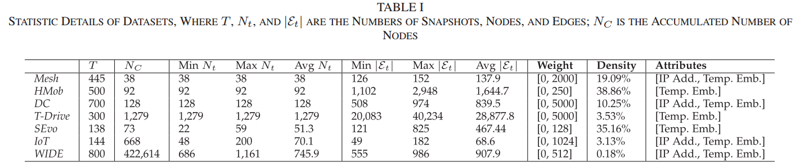
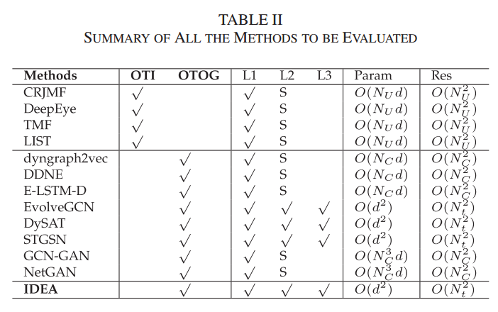
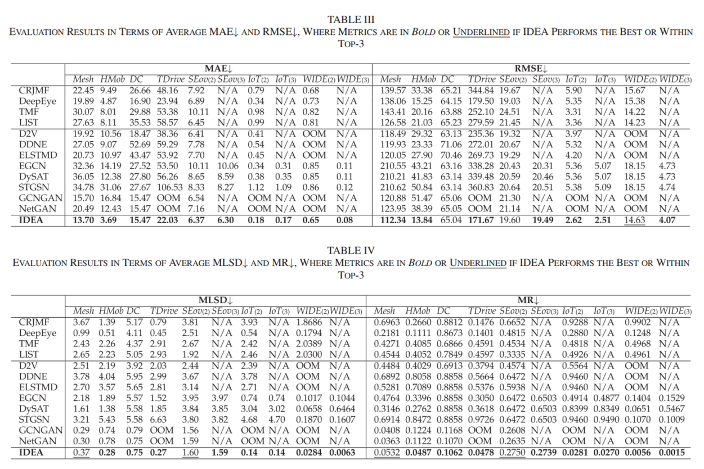
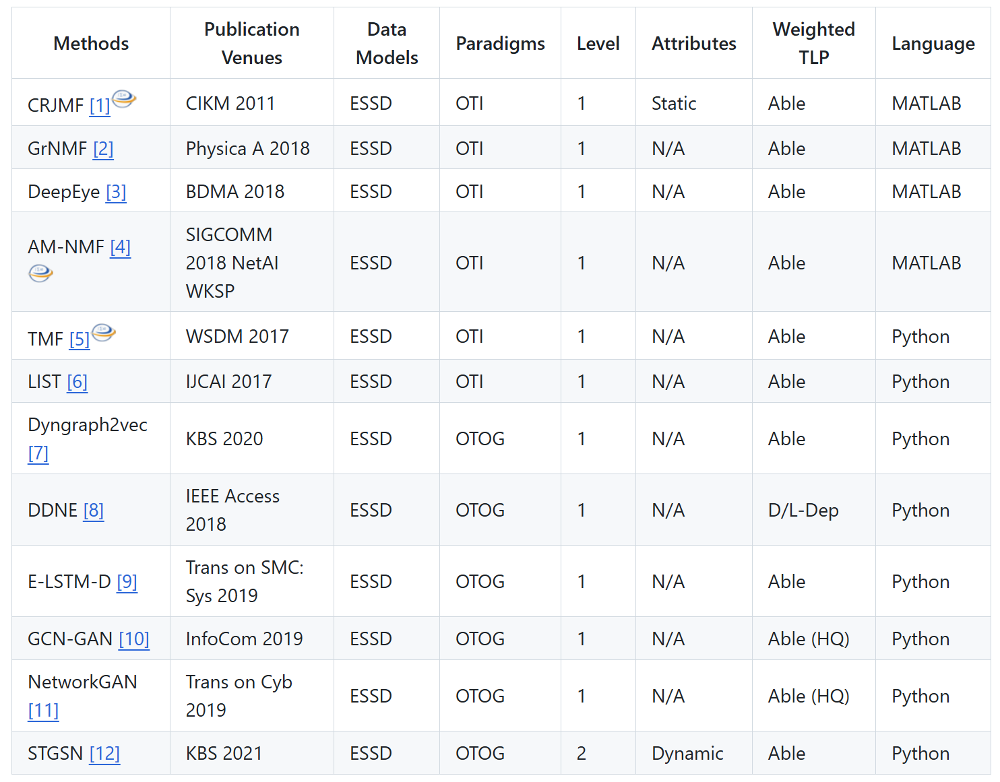
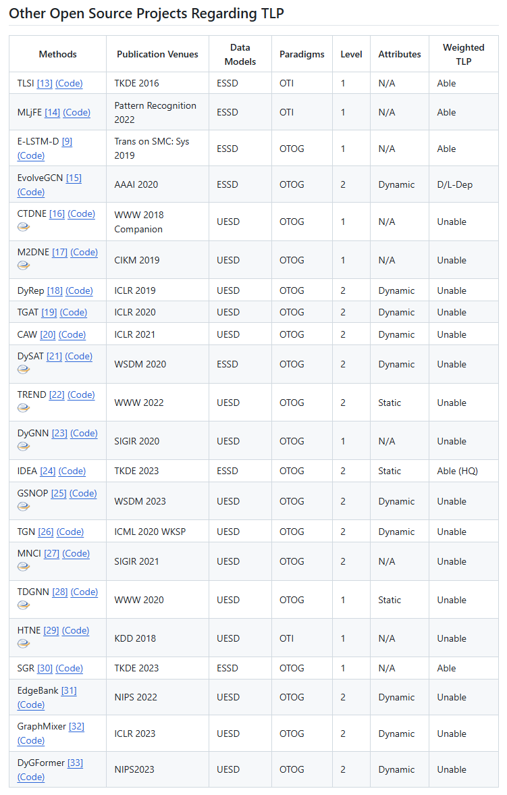
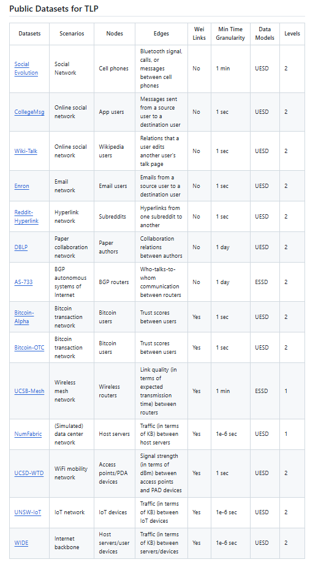
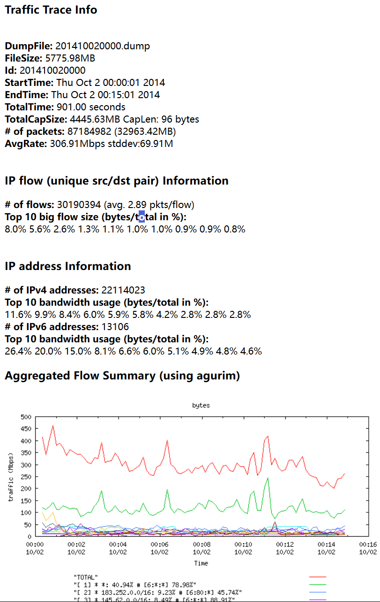
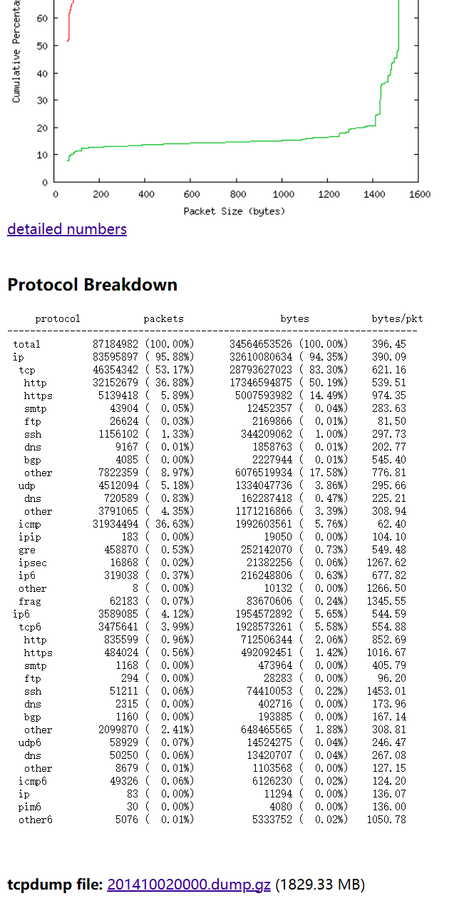

# 基线方法测试

## Datasets & Baseline论文内容
**Datasets**：
- Network dataset: 
  - [Mesh](https://crawdad.org/ucsb/meshnet/20070201/)
  - [Hmob(官方名mobilitymodels)](https://crawdad.org/ncsu/mobilitymodels/20090723/)
- Traffic dateset: 
  - [DC](https://github.com/shouxi/numfabric)
  - [T-Drive](https://www.microsoft.com/en-us/research/publication/t-drive-driving-directions-based-on-taxi-trajectories/ )
- Social dataset: 
  - [SEvo](http://realitycommons.media.mit.edu/socialevolution.html )
- Internet: 
  - [IoT](https://iotanalytics.unsw.edu.au/iottraces.html)
  - [WIDE](https://mawi.wide.ad.jp/mawi/)



- 使用具有固定节点集的 Mesh、HMob、DC 和 T-Drive 作为第一级 TLP 的基准
- 使用 SEvo、IoT 和 WIDE（节点集不固定）作为第 2 级和第 3 级的 TLP 基准
- 对于 Mesh、DC、IoT 和 WIDE，我们使用（32 位）IP 地址（数据集提供的每个节点）和（4）中定义的时态嵌入（temporal embedding）作为 IDEA 的属性输入
- 对于其他数据集，我们只使用了时态嵌入，因为它们没有提供可用的节点属性

**Baseline**：
- **OTI**: CRJMF, DeepEye, TMF, LIST
- **OTOG**: D2V, DDNE, E-LSTM-D, EvolveGCN(EGCN), DySAT, STGSN, GCN-GAN, NetGAN


其中：
- “L1”、“L2”和“L3”代表第III部分定义的TLP的三个级别
- “S”表示该方法只能处理级别2的特殊情况（即使用大型邻接矩阵表示可能包含孤立节点的快照）
- “Param”表示待优化模型参数的空间复杂度
- “Res”表示表示预测结果 $\tilde{A}_{\tau+1}$ 的空间复杂度
- $N_C$ 和 $N_t$ 与表I中的定义相同； $N_U = |]\mathcal{V}_{\cup(\tau−l:\tau)}|$ 是前 $l$ 个快照的累积节点数；d是潜在嵌入的维度。通常，我们有 $d < N_t \le N_U \le N_C$

**论文指标**：


---

## 官方实现情况
- **CRJMF**：
  - Temporal link prediction by integrating content and structure information
  - 无，"HighQuality..."作者使用Matlab，已发邮件
  - **OpenTLP库，matlab**
- **DeepEye**：
  - DEEPEYE: Link Prediction in Dynamic Networks Based on Non-negative Matrix Factorization
  - 无，"HighQuality..."作者使用Matlab，已发邮件
  - **OpenTLP库，matlab**
- **TMF**:
  - Temporally Factorized Network Modeling for Evolutionary Network Analysis
  - 无，已发邮件
  - **OpenTLP库，python**
- **LIST**：
  - Link prediction with spatial and temporal consistency in dynamic Networks
  - 无，已发邮件
  - **OpenTLP库，python**
- **D2V**:
  - **部分实现**，DynamicGEM
  - **OpenTLP库，python**
- **DDNE**：
  - Deep Dynamic Network Embedding for Link Prediction
  - 无，已发邮件
  - **OpenTLP库，python**
- **E-LSTM-D**：
  - E-LSTM-D: A Deep Learning Framework for Dynamic Network Link Prediction
  - **有实现**，tensorflow
  - **OpenTLP库，python**
- **EvolveGCN**:
  - **有实现**，能运行
  - 数据集：SBM, BC-OTC, BC-Alpha, UCI, AS, Reddit, Elliptic
  - [EvolveGCN](EvolveGCN.txt)
  - [EvolveGCN](EvolveGCN2.txt)
- **DySAT**:
  - Dysat: Deep neural representation learning on dynamic graphs via self-attention networks
  - **上古实现**，python2.7 + tensorflow，能运行
  - 数据集Enron, UCI, Yelp, ML-10M(MovieLens)
  - 新conda环境`DySAT`
  - [DySAT](DySAT.txt)
- **STGSN**：
  - STGSN — A Spatial–Temporal Graph Neural Network framework for time-evolving social networks
  - 无，已发邮件
  - **OpenTLP库，python**
- **GCN-GAN**：
  - GCN-GAN: A Non-linear Temporal Link Prediction Model for Weighted Dynamic Networks  
  - **民间实现**，报一堆错
  - **OpenTLP库，python**
- **NetGAN**：
  - An Advanced Deep Generative Framework for Temporal Link Prediction in Dynamic Networks
  - 无，已发邮件
  - **OpenTLP库，python**

---

## OpenTLP库

> Temporal Link Prediction: A Unified Framework, Taxonomy, and Review
> [github](https://github.com/KuroginQin/OpenTLP)
> [readme](OpenTLP_readme.md)





### 基于OpenTLP库的测试结果
[tmf_demo1](tmf_demo1.txt)
[list_demo1](list_demo1.txt)
[list_demo2](list_demo2.txt)
[E_LSTM_D_demo2](E_LSTM_D_demo2.txt)
[dyngraph2vec_demo2](dyngraph2vec_demo2.txt)
[ddne_demo2](ddne_demo2.txt)
[stgsn_demo2](stgsn_demo2.txt)
[gcn_gan_demo](gcn_gan_demo.txt)
[networkgan](networkgan.txt)

### OpenTLP数据格式
**文件格式**
- 数据集_edge.npy
  - 时间1快照：List(源节点，目标节点，边权重)
  - 时间2快照：List(源节点，目标节点，边权重)
  - ...
  - 无边权重时，边权重=1.0
  - 例如
    ```
    list([(0, 2, 4.388438), (0, 5, 19.666185), (0, 7, 266.816686)...
    list([(0, 2, 6.030252), (0, 5, 35.406095), (0, 7, 282.108981)...
    ```
- 数据集_feat.npy（如有）
  - 矩阵（疑似onehot向量，横向量，节点特征）

**Mesh-1**
[Mesh-1](Mesh-1.txt)
共计445个快照，38个节点，节点特征32维（疑似onehot向量）

**Mesh-2**
共计332个快照，38个节点，节点特征32维（疑似onehot向量）

**Enron**
无边权重
无节点特征
共计26个快照，184个节点，无节点特征

---

## 基线方法
- OpenTLP库
  - MATLAB
    - CRJMF
    - DeepEye
  - PyTorch
    - TMF
    - LIST
    - D2V
    - DDNE
    - E-LSTM-D
    - STGSN
    - GCN-GAN
    - NetGAN
- 官方实现
  - EvolveGCN
  - DySAT

### 不在库的方法的数据集
#### EvolveGCN
数据集格式：
- sbm
  ```
  source,target,weight,time
  0,2,1,0
  0,3,1,0
  ```
  没有权重，节点为整数代号，没有节点特征，时间为整数等间距时间步
- bitcoin alpha / bitcoin otc (BC-OTC, BC-Alpha)
  ```
  SOURCE, TARGET, RATING, TIME
  7188,1,10,1407470400
  430,1,10,1376539200
  ```
  权重为 $[-10,10]$ 整数，节点为整数代号，没有节点特征，时间为整数等间距时间步（unix时间戳，整数）

**注释**
**考虑加入**上面的两个数据集，因为不需要采样，格式很方便

#### DySAT

---

## 数据集
- 获取情况
  - Mesh（已获取）
  - Hmob（已获取，官方名mobilitymodels）
  - DC（一个很复杂的库，官方名numfabric）
  - T-Drive（已获取）
  - SEvo（没回邮件）
  - IoT（已获取）
  - WIDE（一个很复杂的网页，里面的数据内容很奇怪）
    - 
    - 

### 数据集结构

#### Mesh

**文件示例**
```
# Neighbor table generated by summarizer
# Creation date - Sat May 13 14:16:38 PDT 2006
10.1.1.2 10.1.1.106 36.28401 10.1.1.60 0.4560859 10.1.1.9 4.6353765 10.1.1.100 1.678032 10.1.1.25 316.12903 10.1.1.103 19.597902
10.2.1.2 10.2.1.60 0.18406816 10.2.1.100 1243.8635
```

**格式**
每个文件（无扩展名）是一个时间戳的图快照
- 源节点 目标节点1 权重1 目标节点2 权重2...
- 其中A->B和B->A会在各自为源节点时显示两次（权重相同）

**建议改为**
ip地址作为节点特征向量，直接转为onehot向量 -> _feat.npy
节点改为使用整数作为节点标识 -> _edge.npy

格式化的python程序的chatgpt**提示词**：

  编写python程序，完成以下功能：
  1. 从三个文件夹，每个文件夹中包含多个文件中按行读取信息；
  2. 每个文件的格式都相同，格式为（例如）
    ```
    # Neighbor table generated by summarizer
    # Creation date - Sat May 13 14:16:38 PDT 2006
    10.1.1.2 10.1.1.106 36.28401 10.1.1.60 0.4560859 10.1.1.9 4.6353765 10.1.1.100 1.678032 10.1.1.25 316.12903 10.1.1.103 19.597902
    10.2.1.2 10.2.1.60 0.18406816 10.2.1.100 1243.8635
    ...
    ```
  其中，以`#`开头的部分只有这两行，且不同文件的区别仅在于具体时间，也即格式为`f"Creation date - {星期} {月份} {日期} {时间} PDT {年份}"`；下面的格式会重复多行，具体格式为`f"{源节点} {目标节点} {边权重（将两个节点视为一条边）}..."`；
  3. 代码需要将上述全部文件中的信息改为以下格式，并保存到两个npy文件中，具体要求如下；
  4. 文件1，命名为`mesh_edge.npy`，内容为
