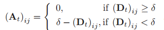

# 基线方法测试

## 注

**所有基线方法中，有一个`epsilon`参数，需要从`1e-2`修改到`1e-5`**
**权重归一化应该在边合并之后再做**

## Datasets & Baseline论文内容

**论文中的Datasets**：

- Network dataset: 
  - [Mesh](https://crawdad.org/ucsb/meshnet/20070201/)
  - [Hmob(官方名mobilitymodels)](https://crawdad.org/ncsu/mobilitymodels/20090723/)
- Traffic dateset: 
  - [DC](https://github.com/shouxi/numfabric)
  - [T-Drive](https://www.microsoft.com/en-us/research/publication/t-drive-driving-directions-based-on-taxi-trajectories/ )
- Social dataset: 
  - [SEvo](http://realitycommons.media.mit.edu/socialevolution.html )
- Internet: 
  - [IoT](https://iotanalytics.unsw.edu.au/iottraces.html)
  - [WIDE](https://mawi.wide.ad.jp/mawi/)

**选用的数据集**：
- Mesh
- Hmob
- T-Drive
- IoT
- sbm_50t_1000n_adj
- soc-sign-bitcoinalpha
- soc-sign-bitcoinotc

**获取情况**

- Mesh（已获取）
  - GCN-GAN也使用
- Hmob（已获取，官方名mobilitymodels）
- DC（一个很复杂的库，官方名numfabric）
- T-Drive（已获取）
- SEvo（没回邮件）
- IoT（已获取）
- WIDE（一个很复杂的网页，里面的数据内容很奇怪）
  - 
  - 


- 使用具有固定节点集的 Mesh、Hmob、DC 和 T-Drive 作为第一级 TLP 的基准
- 使用 SEvo、IoT 和 WIDE（节点集不固定）作为第 2 级和第 3 级的 TLP 基准
- 对于 Mesh、DC、IoT 和 WIDE，我们使用（32 位）IP 地址（数据集提供的每个节点）和（4）中定义的时态嵌入（temporal embedding）作为 IDEA 的属性输入
- 对于其他数据集，我们只使用了时态嵌入，因为它们没有提供可用的节点属性

**Baseline**：

- **OTI**: CRJMF, DeepEye, TMF, LIST
- **OTOG**: D2V, DDNE, E-LSTM-D, EvolveGCN(EGCN), DySAT, STGSN, GCN-GAN, NetGAN（弄不懂特征是啥，删去）


其中：

- “L1”、“L2”和“L3”代表第III部分定义的TLP的三个级别
- “S”表示该方法只能处理级别2的特殊情况（即使用大型邻接矩阵表示可能包含孤立节点的快照）
- “Param”表示待优化模型参数的空间复杂度
- “Res”表示表示预测结果 $\tilde{A}_{\tau+1}$ 的空间复杂度
- $N_C$ 和 $N_t$ 与表I中的定义相同； $N_U = |]\mathcal{V}_{\cup(\tau−l:\tau)}|$ 是前 $l$ 个快照的累积节点数；d是潜在嵌入的维度。通常，我们有 $d < N_t \le N_U \le N_C$

**论文指标**：


## 官方实现情况

- **CRJMF**：
  - Temporal link prediction by integrating content and structure information
  - 无，"HighQuality..."作者使用Matlab，已发邮件
  - **OpenTLP库，matlab**
- **DeepEye**：
  - DEEPEYE: Link Prediction in Dynamic Networks Based on Non-negative Matrix Factorization
  - 无，"HighQuality..."作者使用Matlab，已发邮件
  - **OpenTLP库，matlab**
- **TMF**:
  - Temporally Factorized Network Modeling for Evolutionary Network Analysis
  - 无，已发邮件
  - **OpenTLP库，python**
- **LIST**：
  - Link prediction with spatial and temporal consistency in dynamic Networks
  - 无，已发邮件
  - **OpenTLP库，python**
- **D2V**:
  - **部分实现**，DynamicGEM
  - **OpenTLP库，python**
- **DDNE**：
  - Deep Dynamic Network Embedding for Link Prediction
  - 无，已发邮件
  - **OpenTLP库，python**
- **E-LSTM-D**：
  - E-LSTM-D: A Deep Learning Framework for Dynamic Network Link Prediction
  - **有实现**，tensorflow
  - **OpenTLP库，python**
- **EvolveGCN**:
  - **有实现**，能运行
  - 数据集：SBM, BC-OTC, BC-Alpha, UCI, AS, Reddit, Elliptic
  - [EvolveGCN](EvolveGCN.txt)
  - [EvolveGCN](EvolveGCN2.txt)
- **DySAT**:
  - Dysat: Deep neural representation learning on dynamic graphs via self-attention networks
  - **上古实现**，python2.7 + tensorflow，能运行
  - 数据集Enron, UCI, Yelp, ML-10M(MovieLens)
  - 新conda环境`DySAT`
  - [DySAT](DySAT.txt)
- **STGSN**：
  - STGSN — A Spatial–Temporal Graph Neural Network framework for time-evolving social networks
  - 无，已发邮件
  - **OpenTLP库，python**
- **GCN-GAN**：
  - GCN-GAN: A Non-linear Temporal Link Prediction Model for Weighted Dynamic Networks  
  - **民间实现**，报一堆错
  - **OpenTLP库，python**
- **NetGAN**：
  - An Advanced Deep Generative Framework for Temporal Link Prediction in Dynamic Networks
  - 无，已发邮件
  - **OpenTLP库，python**


## OpenTLP库

> Temporal Link Prediction: A Unified Framework, Taxonomy, and Review
> [github](https://github.com/KuroginQin/OpenTLP)
> [readme](OpenTLP_readme.md)


### 基于OpenTLP库的测试结果

[tmf_demo1](tmf_demo1.txt)
[list_demo1](list_demo1.txt)
[list_demo2](list_demo2.txt)
[E_LSTM_D_demo2](E_LSTM_D_demo2.txt)
[dyngraph2vec_demo2](dyngraph2vec_demo2.txt)
[ddne_demo2](ddne_demo2.txt)
[stgsn_demo2](stgsn_demo2.txt)
[gcn_gan_demo](gcn_gan_demo.txt)
[networkgan](networkgan.txt)


|            | AUC                | RMSE               | MAE                | EW-KL              | MR       |
| ---------- | ------------------ | ------------------ | ------------------ | ------------------ | -------- |
|            | 不适用有边权重的图 | 不适用无边权重的图 | 不适用无边权重的图 | 不适用无边权重的图 |
| TMF        | 0.832443           |                    |                    |                    | 0.517933 |
| LIST       | 0.474523           |                    |                    |                    | 0.487071 |
| TMF        |                    | 190.536089         | 86.019119          | 2.955982           | 0.473089 |
| LIST       |                    | 162.454555         | 35.048849          | 2.349877           | 0.467354 |
| E-LSTM-D   |                    | 117.940271         | 25.193612          | 0.904897           | 0.724432 |
| D2V        |                    | 290.676621         | 122.438914         | 1.894586           | 0.772770 |
| DDNE       |                    | 123.494813         | 35.635798          | 1.015653           | 0.756981 |
| STGSN      |                    | 210.032088         | 35.511632          | 6.501578           | 0.779972 |
| GCN-GAN    |                    | 165.954824         | 25.339260          | 1.277723           | 0.034709 |
| NetworkGAN |                    | 237.580829         | 37.786860          | 2.428885           | 0.122327 |

### OpenTLP数据格式

**文件格式**

- 数据集_edge.npy
  - 时间1快照：List(源节点，目标节点，边权重)
  - 时间2快照：List(源节点，目标节点，边权重)
  - ...
  - 无边权重时，边权重=1.0
  - 例如

    ```text
    list([(0, 2, 4.388438), (0, 5, 19.666185), (0, 7, 266.816686)...
    list([(0, 2, 6.030252), (0, 5, 35.406095), (0, 7, 282.108981)...
    ```

- 数据集_feat.npy（如有）
  - 矩阵（疑似onehot向量，横向量，节点特征）

**Mesh-1**
[Mesh-1](Mesh-1.txt)
共计445个快照，38个节点，节点特征32维，只有9个bit有变化
```
0 0 0 0 1 0 1 0 0 0 0 0 0 0 0 1 0 0 0 0 0 0 0 1 0 0 0 0 0 0 1 0
0 0 0 0 1 0 1 0 0 0 0 0 0 0 1 0 0 0 0 0 0 0 0 1 0 0 0 0 0 0 1 0
0 0 0 0 1 0 1 0 0 0 0 0 0 0 0 1 0 0 0 0 0 0 0 1 0 0 1 1 1 1 0 0
```

**Mesh-2**
共计332个快照，38个节点，节点特征32维

**Enron**
无边权重
无节点特征
共计26个快照，184个节点，无节点特征


## 基线方法

- OpenTLP库
  - MATLAB
    - CRJMF
    - DeepEye
  - PyTorch
    - TMF
    - LIST
    - D2V
    - DDNE
    - E-LSTM-D
    - STGSN
    - GCN-GAN
    - NetGAN
- 官方实现
  - EvolveGCN
  - DySAT

### 不在库的方法的数据集

#### EvolveGCN

数据集格式：

- sbm

  ```
  source,target,weight,time
  0,2,1,0
  0,3,1,0
  ```

  没有权重，节点为整数代号，没有节点特征，时间为整数等间距时间步
- bitcoin alpha / bitcoin otc (BC-OTC, BC-Alpha)
  
  ```
  SOURCE, TARGET, RATING, TIME
  7188,1,10,1407470400
  430,1,10,1376539200
  ```

  权重为 $[-10,10]$ 整数，节点为整数代号，没有节点特征，时间为整数等间距时间步（unix时间戳，整数）

**注释**
**考虑加入**上面的两个数据集，因为不需要采样，格式很方便

#### DySAT


### 数据集结构

#### Mesh

**文件示例**
```
# Neighbor table generated by summarizer
# Creation date - Sat May 13 14:16:38 PDT 2006
10.1.1.2 10.1.1.106 36.28401 10.1.1.60 0.4560859 10.1.1.9 4.6353765 10.1.1.100 1.678032 10.1.1.25 316.12903 10.1.1.103 19.597902
10.2.1.2 10.2.1.60 0.18406816 10.2.1.100 1243.8635
```

**格式**
每个文件（无扩展名）是一个时间戳的图快照
- 源节点 目标节点1 权重1 目标节点2 权重2...
- 其中A->B和B->A会在各自为源节点时显示两次（权重相同）

**建议改为**
ip地址作为节点特征向量，直接转为onehot向量 -> _feat.npy
节点改为使用整数作为节点标识 -> _edge.npy

格式化的python程序的chatgpt**提示词**：

  编写python程序，完成以下功能：
  1. 从三个文件夹，每个文件夹中包含多个文件中按行读取信息；
  2. 每个文件的格式都相同，格式为（例如）
    ```
    # Neighbor table generated by summarizer
    # Creation date - Sat May 13 14:16:38 PDT 2006
    10.1.1.2 10.1.1.106 36.28401 10.1.1.60 0.4560859 10.1.1.9 4.6353765 10.1.1.100 1.678032 10.1.1.25 316.12903 10.1.1.103 19.597902
    10.2.1.2 10.2.1.60 0.18406816 10.2.1.100 1243.8635
    ...
    ```
  其中，以`#`开头的部分只有这两行，且不同文件的区别仅在于具体时间，也即格式为`f"Creation date - {星期} {月份} {日期} {时间} PDT {年份}"`；下面的格式会重复多行，具体格式为`f"{源节点} {目标节点} {边权重（将两个节点视为一条边）}..."`；
  3. 代码需要将上述全部文件中的信息改为以下格式，并保存到两个npy文件中，具体要求如下；
  4. 文件1，命名为`mesh_edge.npy`，内容为

### 其他论文对数据集的处理

**Mesh（GCN-GAN）**

- 对于UCSB和NumFabric，网络系统中的主机可以被描述为动态网络中的节点，并且在特定时间片内的链路质量或流量可以直接表示为特定快照中对应主机对之间的链路权重
- 对于位置数据集KAIST和BJ-Taxi，我们将每个用户（人或车辆）作为抽象动态网络中的节点，并计算所有时间片的每对节点之间的距离
- 构造了特定时间片 $t$ 的距离矩阵 $D_t$，其中 $（D_t）_{ij} =（D_t）_{ji}$ 表示节点i和j之间的距离
- 在人类移动性和车辆移动性的真实的网络系统中，相对于距离相对较大的用户对，彼此接近的用户对应该被给予更多的兴趣或关注
- 基于距离矩阵 $D_t$ 构造了一个抽象的加权网络，其中链接权重与相应的距离成反比。当预处理KAIST和BJ-Taxi数据集时，我们利用以下公式来构造时间片 $t$ 中的图快照的加权邻接矩阵 $A_t$ ：
  
  - 其中 $\delta$ 是网络的最大边权重
  - KASIT的 $\delta = 250$，BJ-Taxi的 $\delta = 2000$

**Hmob(官方名mobilitymodels)（GCN-GAN）**

**DC(官方名numfabric)(无)**

**T-Drive**
- Graph neural network for traffic forecasting: A survey
- Graph Neural Networks: Foundation, Frontiers and Applications

**IoT(无)**

**WIDE**

## baseline 原理

### 1. **CRJMF (Context-aware Regularized Joint Matrix Factorization)**
- **类型**：矩阵分解
- **原理**：将评分矩阵和社交网络信息联合建模，通过正则项引入上下文信息（如时间、地理等），同时学习用户和项目的潜在向量，提升推荐系统性能。
- **方法**：联合矩阵分解 + 正则项（建模上下文信息）。

### 2. **DeepEye**
- **类型**：动态图推荐/表示学习
- **原理**：融合了图结构和时间信息，采用卷积神经网络和注意力机制对时间序列数据建模，捕捉节点和边随时间演变的变化。
- **方法**：CNN + 时间感知注意力 + 图结构嵌入。

### 3. **TMF (Temporal Matrix Factorization)**
- **类型**：时序矩阵分解
- **原理**：将用户-物品交互建模为随时间演变的低维嵌入，通过Kalman滤波或时间正则项来捕捉用户和项目兴趣的动态变化。
- **方法**：动态潜在因子建模 + 时间序列正则化。

### 4. **LIST (Latent Interaction-based Self-supervised Temporal learning)**
- **类型**：动态图自监督学习
- **原理**：利用节点之间的隐式交互和时间信息进行自监督训练，通过时序对比损失提高节点表示的泛化能力。
- **方法**：自监督时序对比学习 + 节点交互建模。

### 5. **D2V (DeepWalk/Doc2Vec变体 - Dynamic2Vec)**
- **类型**：动态图嵌入
- **原理**：在DeepWalk/Node2Vec的基础上引入时间维度，学习节点随时间变化的表示，捕捉节点间的演化关系。
- **方法**：随机游走 + 时间滑窗 + Skip-gram。

### 6. **DDNE (Dynamic Deep Network Embedding)**
- **类型**：动态图嵌入
- **原理**：使用自编码器结合递归神经网络对动态图中的演化特性进行建模，学习连续时间步的节点表示。
- **方法**：自编码器 + RNN (GRU/LSTM) 结构。

### 7. **E-LSTM-D**
- **类型**：动态图嵌入（边演化建模）
- **原理**：通过LSTM结构建模节点对（边）出现的时间序列，预测未来图中的边结构变化。
- **方法**：边序列建模 + LSTM预测。

### 8. **EvolveGCN**
- **类型**：动态图卷积网络
- **原理**：引入“演化机制”对GCN的权重进行时间序列建模。模型有两种变体：EvolveGCN-H（权重随时间演化）和 EvolveGCN-O（输出状态随时间演化）。
- **方法**：GCN + RNN（GRU/LSTM）更新 GCN 参数或节点状态。

### 9. **DySAT (Dynamic Self-Attention Network)**
- **类型**：动态图表示学习
- **原理**：使用结构注意力 + 时序注意力，分别捕捉每一时间步内的图结构和不同时间步之间的动态变化。
- **方法**：多头注意力机制（结构 + 时间）。

### 10. **STGSN (Spatio-Temporal Graph Similarity Network)**
- **类型**：动态图相似性学习
- **原理**：用于预测图之间的相似性，通过空间图卷积和时间序列建模联合学习图的演化特征。
- **方法**：GCN + 时序网络（如LSTM）学习图间相似性分数。

### 11. **GCN-GAN**
- **类型**：动态图生成模型
- **原理**：利用GCN生成节点表示，GAN结构生成未来的图结构（如边），可用于动态图预测。
- **方法**：GCN (嵌入) + GAN (生成图结构)。

### 12. **NetGAN**
- **类型**：图生成模型
- **原理**：将图的随机游走序列作为输入，用GAN框架生成新的图结构，学习生成具有原图结构统计特性的图。
- **方法**：随机游走 + GAN 训练生成游走路径。

---

## **时间处理方式总览**

| 方法         | 时间建模方式       | 描述                                                         |
| ------------ | ------------------ | ------------------------------------------------------------ |
| RNN/GRU/LSTM | 显式时序建模       | 用循环神经网络处理连续时间步的状态演化（如 EvolveGCN, DDNE） |
| 注意力机制   | 时间步加权建模     | 用结构或时间注意力选择关键时间点（如 DySAT）                 |
| 时间戳正则   | 时间嵌入或正则项   | 在损失函数或嵌入中引入时间衰减/距离（如 TMF, CRJMF）         |
| 滑动窗口     | 局部时间上下文建模 | 限制观测窗口在最近的几个时间步内（如 D2V）                   |
| 图序列处理   | 图快照序列         | 将动态图建模为图快照序列逐步处理（如 NetGAN, GCN-GAN）       |
| 边序列建模   | 边事件驱动序列     | 将图建模为节点对发生的事件序列（如 E-LSTM-D）                |

---

### **1. CRJMF**
- **时间处理方式**：时间作为正则项引入，调整用户和项目表示随时间的变化。
- **技巧**：上下文感知时间权重（context-aware regularization），非深度学习。

---

### **2. DeepEye**
- **时间处理方式**：使用 **时间感知注意力机制**，聚焦在重要的时间点序列上。
- **技巧**：CNN 提取局部特征 + 时间序列注意力融合。

---

### **3. TMF**
- **时间处理方式**：使用 **时间正则项**或**Kalman滤波**对潜在向量序列建模。
- **技巧**：连续时间建模，强调兴趣演化的平滑性。

---

### **4. LIST**
- **时间处理方式**：使用自监督时序对比机制，构建时序正负样本。
- **技巧**：构建时序 pairs，通过对比损失学习时间相关性。

---

### **5. D2V**
- **时间处理方式**：滑动窗口内做随机游走，按时间顺序组织训练样本。
- **技巧**：动态版本的 Node2Vec，时间影响的是采样过程。

---

### **6. DDNE**
- **时间处理方式**：用 RNN（如 GRU）处理多时间步嵌入，学习节点随时间演变的轨迹。
- **技巧**：每个时间步用 autoencoder 生成表示，再用 RNN 串联。

---

### **7. E-LSTM-D**
- **时间处理方式**：构建边序列（节点对），用 LSTM 建模它们随时间的演变。
- **技巧**：以边为序列单位，不是节点。

---

### **8. EvolveGCN**
- **时间处理方式**：
  - **EvolveGCN-H**：RNN 用于更新 GCN 的权重。
  - **EvolveGCN-O**：RNN 用于更新节点嵌入状态。
- **技巧**：参数或状态随时间演化，结构优雅。

---

### **9. DySAT**
- **时间处理方式**：
  - **结构注意力**：处理每一时间点内的结构关系。
  - **时间注意力**：聚焦关键时间步。
- **技巧**：双重注意力机制，避免使用 RNN。

---

### **10. STGSN**
- **时间处理方式**：使用时序模块（LSTM/GRU）建模图的演化，图作为时间序列。
- **技巧**：图序列 -> 空间特征（GCN）+ 时间特征（RNN）。

---

### **11. GCN-GAN**
- **时间处理方式**：先用 GCN 获取当前图嵌入，再通过 RNN 模拟图的演化，GAN 生成未来图结构。
- **技巧**：序列 + 对抗学习，预测图的变化。

---

### **12. NetGAN**
- **时间处理方式**：隐含时间，通过生成随机游走序列捕捉演化特征。
- **技巧**：不建模真实时间戳，而是用序列统计近似演化。

---

## 常见时间建模策略

| 方法类型                         | 常用模型               | 描述                         |
| -------------------------------- | ---------------------- | ---------------------------- |
| **RNN系（显式时间建模）**        | EvolveGCN, DDNE, STGSN | 捕捉时间演化轨迹，强记忆性   |
| **注意力机制（选择性时间感知）** | DySAT, DeepEye         | 聚焦重要时间点，训练稳定     |
| **正则项（约束变化）**           | TMF, CRJMF             | 限制潜在空间的波动，简洁高效 |
| **滑动窗口**                     | D2V                    | 平滑建模，适合嵌入方法       |
| **边序列建模**                   | E-LSTM-D               | 适用于链接预测、事件驱动图   |


### baseline在新dataset上的结果

|                                     | Mesh  |                            bca                             |  bco  |  sbm  | Hmob  | T-Drive |  IoT  |
| ----------------------------------- | :---: | :--------------------------------------------------------: | :---: | :---: | :---: | :-----: | :---: |
| TMF                                 |   O   |                             O                              |
| LIST                                |   O   |                             O                              |
| E-LSTM-D                            |   O   |                          testing                           |
| D2V                                 |   O   |                          testing                           |
| DDNE                                |   O   |                          testing                           |
| STGSN                               |   O   |                            OOM                             |
| GCN-GAN                             |   O   |                          60G OOM                           |
| NetworkGAN<br/>弄不懂特征是啥，删去 |   O   | 节点数过多<br/>爆内存3.2TB<br/>需要正比于节点数4次方的内存 |

注：
1. 需要节点特征的模型使用随机向量作为模型
  例如：`feat = np.random.randn(num_nodes, feat_dim)`

**RMSE**

|          |   Mesh   |     bca      |   bco    |   sbm    |   IoT    |
| -------- | :------: | :----------: | :------: | :------: | :------: |
| TMF      | 0.098367 |   0.071864   | 0.078339 | 0.092746 | 0.012180 |
| LIST     | 0.083869 |   0.012625   | 4.052248 | 3.968031 | 4.045051 |
| E-LSTM-D | 0.060888 |   0.024261   | 0.031500 | 0.495248 | 0.000468 |
| D2V      | 0.150065 |   0.123365   | 0.157501 | 0.497467 | 0.000468 |
| DDNE     | 0.063756 |   0.029960   | 0.032322 | 0.501605 | 0.000468 |
| STGSN    | 0.108432 |   0.023577   | 0.030706 | 0.492034 | 0.093879 |
| GCN-GAN  | 0.085676 |   0.023534   | 0.043063 | 0.497642 | 0.000468 |
| random   | 0.56746  |   0.573290   | 0.573139 | 0.574525 | 0.572517 |
| HLGNN2   | 0.117428 |   0.070990   | 0.077648 | 0.074856 |          |
| 1        |          |   0.068400   |          |          |          |
| 2        |          |   0.067757   |          |          |          |
| 3        |          | **0.008192** |          |          |          |
OTI/OTOG

时间复杂度

1. 3倍训练
2. 10倍训练
3. 3倍训练，边预测和权重预测

**MAE**

|          |   Mesh   |   bca    |   bco    |   sbm    |   IoT    |
| -------- | :------: | :------: | :------: | :------: | :------: |
| TMF      | 0.044408 | 0.021084 | 0.022221 | 0.070981 | 0.005716 |
| LIST     | 0.018094 | 0.006052 | 2.086790 | 2.425441 | 2.080731 |
| E-LSTM-D | 0.013007 | 0.002865 | 0.004360 | 0.492358 | 0.000007 |
| D2V      | 0.063211 | 0.095795 | 0.129150 | 0.494501 | 0.000007 |
| DDNE     | 0.018397 | 0.014720 | 0.008427 | 0.498243 | 0.000007 |
| STGSN    | 0.018333 | 0.000968 | 0.001406 | 0.489512 | 0.021034 |
| GCN-GAN  | 0.013082 | 0.000832 | 0.002218 | 0.494954 | 0.000007 |
| random   | 0.48427  | 0.493700 | 0.493448 | 0.495130 | 0.492788 |
| HLGNN2   | 0.018328 | 0.010766 | 0.011600 | 0.019325 |          |
| 1        |          | 0.007876 |          |          |          |
| 2        |          | 0.007246 |          |          |          |
| 3        |          | 0.008192 |          |          |          |

**EW-KL**

|          |   Mesh   |   bca    |    bco    |   sbm    |   IoT    |
| -------- | :------: | :------: | :-------: | :------: | :------: |
| TMF      | 2.955982 | 6.946871 | 6.008011  | 0.006934 | 4.432768 |
| LIST     | 2.349877 | 7.185610 | 11.398714 | 5.408840 | 6.290664 |
| E-LSTM-D | 0.904897 | 8.723558 | 7.385842  | 0.009857 | 0.674026 |
| D2V      | 1.894586 | 6.141146 | 5.838528  | 0.010085 | 0.674026 |
| DDNE     | 1.015653 | 7.570736 | 7.162294  | 0.010777 | 0.674026 |
| STGSN    | 6.501578 | 9.202934 | 7.482417  | 0.009207 | 1.879664 |
| GCN-GAN  | 1.277723 | 6.866903 | 11.021100 | 0.009531 | 0.674026 |
| random   | 3.95294  | 5.379170 | 5.241986  | 0.312194 | 4.342598 |
| HLGNN2   | 3.677815 | 5.218623 | 5.095339  | 0.005374 |    x     |
| 1   *3   | 优化这个 | 5.126296 |           |          |          | 1-10 2-11 3-12 300 *3 -》 900 t(random) t-t+10 |
| 2   *10  |          | 5.106439 |           |          |          |
| 3        |          | 5.089180 |           |          |          |

**MR** weight > 0 有边 weight = 0 无边 +1/边数

|          |   Mesh   |   bca    |   bco    |   sbm    |   IoT    |
| -------- | :------: | :------: | :------: | :------: | :------: |
| TMF      | 0.473089 | 0.373576 | 0.360850 | 0.002605 | 0.279802 |
| LIST     | 0.467354 | 0.282907 | 0.493202 | 0.435350 | 0.495129 |
| E-LSTM-D | 0.724432 | 0.119204 | 0.165788 | 0.008948 | 0.026892 |
| D2V      | 0.772770 | 0.954572 | 0.987596 | 0.008948 | 0.026892 |
| DDNE     | 0.756981 | 0.672164 | 0.462276 | 0.008948 | 0.026892 |
| STGSN    | 0.779972 | 0.009600 | 0.005972 | 0.008948 | 0.216008 |
| GCN-GAN  | 0.034709 | 0.001088 | 0.003656 | 0.008948 | 0.026892 |
| random   | 0.93545  | 0.981085 | 0.980060 | 0.005255 | 0.965358 |
| HLGNN2   | 0.039072 | 0.035885 | 0.039809 | 0.005255 |          |
| 1        |          | 0.012661 |          |          |          |
| 2        |          | 0.009849 |          |          |          |
| 3        |          | 0.012283 |          |          |          |


| 权重范围   | 边数    | RMSE平均值 | MAE平均值 | EW_KL平均值 | MR平均值 |
| ---------- | ------- | ---------- | --------- | ----------- | -------- |
| [0.0, 0.1) | 3212134 | 0.003214   | 0.002790  | 0.000010    | 0.002024 |
| [0.1, 0.2) | 58      | 0.139882   | 0.139167  | 2.291328    | 0.000000 |
| [0.2, 0.3) | 4       | 0.260000   | 0.260000  | 4.439137    | 0.000000 |
| [0.3, 0.4) | 218     | 0.336515   | 0.336496  | 5.832775    | 0.000000 |
| [0.4, 0.5) | 104     | 0.460000   | 0.460000  | 8.116310    | 0.000000 |
| [0.5, 0.6) | 922     | 0.583088   | 0.582871  | 10.401080   | 0.994118 |
| [0.6, 0.7) | 22      | 0.653333   | 0.653333  | 11.756742   | 1.000000 |
| [0.7, 0.8) | 19506   | 0.741625   | 0.741017  | 13.405719   | 0.996687 |
| [0.8, 0.9) | 2368    | 0.860000   | 0.860000  | 15.712080   | 1.000000 |
| [0.9, 1.0) | 2070    | 0.964555   | 0.964207  | 17.716166   | 1.000000 |

**预测一步的时间**
使用数据集bca
| 模型     | 时间      |
| -------- | --------- |
| TMF      |           |
| LIST     |           |
| E-LSTM-D |           |
| D2V      |           |
| DDNE     |           |
| STGSN    |           |
| GCN-GAN  |           |
| a        |           |
| b        | 1.1443229 |
| c        | 1.14255   |
b：只预测边权重
1.071172+1.105967+1.166126+1.126250+1.159725+1.211214+1.154815+1.112218+1.148662+1.187080
c：分别预测边连接和边权重
0.99794+1.157559+1.424343+1.130599+1.108566+0.994662+1.146415+1.040789+1.100619+1.324008