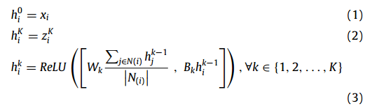
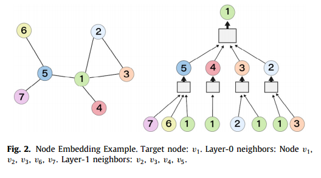

# 基线方法原理

**CRJMF**
**DeepEye**
**TMF**
**LIST**
**D2V**
**DDNE**
**E-LSTM-D**

---

**STGSN**
- 节点空间特征的嵌入过程
- 时间注意网络的构建算法
  - 表达能力
- 如何将这些部分组合在一起并进行最终预测的操作

**图空间卷积**

其中 $h_i^k $ 是节点i在第k层的表示， $N_{(i)}$ 是节点i的邻居节点集合 

K=2的例子如下：

节点i在全部时间上的表示写作 $h_i^{\text{total}}$ ，在某个时间 $t'$ 上的表示写作 $h_i^{t'}$

**时间注意神经网络**

---

**GCN-GAN**
**NetGAN**
**EvolveGCN**

**DySAT**
