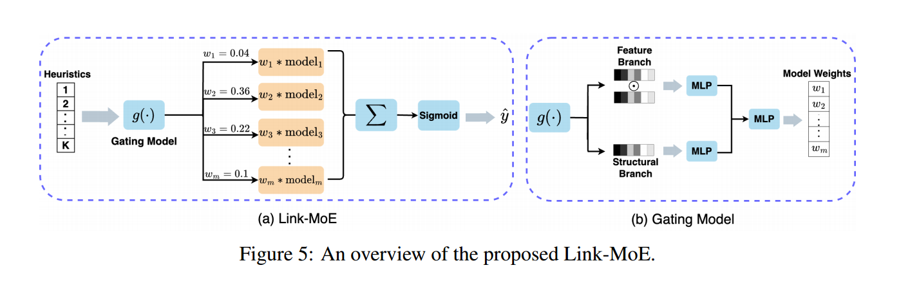
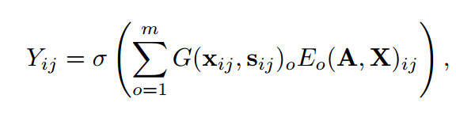
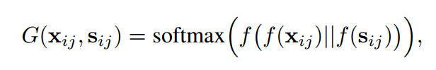

# Mixture of Link Predictors on Graphs

> NeurIPS 2024

## 简述
- 混合专家MoE
- 综合了多种启发式方法
- 模型：Link-MoE
- 使用门控函数为不同的方法加权
- 数据集 Cora, Citeseer, Pubmed, ogbl-collab, and ogbl-ppa
- 指标Hits@K

---
## 文章内容简述

这篇文章《Mixture of Link Predictors on Graphs》主要探讨了图中的链接预测问题，提出了一种新的模型Link-MoE（Mixture of Experts），旨在通过结合多种现有链接预测器的优势来提高预测准确性。

### 主要内容包括：

1. **链接预测背景**：
   - 链接预测是图分析中的一个核心任务，广泛应用于推荐系统、药物发现和知识图谱补全等领域。
   - 传统的启发式方法和图神经网络（GNNs）在链接预测中都有其优势，但通常采用“一刀切”的策略，对所有节点对使用相同的启发式信息，导致性能不佳。

2. **Link-MoE模型**：
   - Link-MoE模型通过使用多个GNN作为专家，并根据不同的节点对选择合适的专家，从而灵活地应用多种启发式信息。
   - 通过实验验证，Link-MoE在多个真实数据集上表现出显著的性能提升，特别是在Pubmed和ogbl-ppa数据集上达到了18.71%和9.59%的相对改进。

3. **实验结果**：
   - 文章展示了Link-MoE在不同数据集上的实验结果，强调了多种启发式信息的结合对提升链接预测性能的重要性。
   - 实验结果表明，Link-MoE模型不仅优于传统的启发式方法，还在大多数情况下超越了其他GNN4LP模型。

4. **未来工作**：
   - 文章指出，尽管Link-MoE展现了良好的性能，但仍有进一步改进的空间，未来的研究将探讨更多的启发式信息和模型组合，以适应不同的应用场景。

总的来说，这篇文章通过提出Link-MoE模型，展示了在链接预测任务中结合多种专家模型的有效性，为相关领域的研究提供了新的思路和方法。

---

## 文章方法简述

Link-MoE（Mixture of Experts）模型是一种针对链接预测任务的创新方法，它通过结合多个图神经网络（GNN）作为“专家”来提高预测的准确性。以下是对这一模型工作的详细解释：

### 1. **多个GNN作为专家**
- **专家模型**：Link-MoE模型利用多个不同的GNN作为专家，每个专家模型在特定的上下文或条件下表现良好。例如，一些GNN可能在处理具有大量公共邻居的节点对时表现最佳，而另一些则可能在处理特征相似性较高的节点对时更有效。
- **多样性**：通过组合不同的专家，Link-MoE能够从多种角度分析节点对的特征和结构信息，从而增强模型的表达能力。

### 2. **根据节点对选择合适的专家**
- **门控机制**：Link-MoE模型使用一个门控函数，根据节点对的特征和启发式信息来决定使用哪个专家。这个门控函数会分析每个节点对的特征，如它们的公共邻居数量、最短路径距离、特征相似性等，来生成每个专家的权重。
- **动态选择**：这种动态选择机制使得模型能够根据具体的节点对特征灵活应用不同的专家，而不是对所有节点对使用同一套规则。这种适应性可以显著提高预测的准确性，因为不同的节点对可能需要不同的策略和信息进行处理。

### 3. **灵活应用多种启发式信息**
- **启发式信息**：Link-MoE集成了多种启发式方法，如公共邻居、最短路径、Katz指数等，这些信息可以帮助模型更好地理解节点之间的潜在关系。
- **整合与优化**：通过将这些启发式信息与不同GNN的输出结合，Link-MoE能够利用多种信息源，进行更为全面和准确的链接预测。模型根据门控机制的输出，综合各个专家的预测结果，生成最终的链接预测。

### 总结
Link-MoE模型的核心思想是通过结合多个GNN专家和动态选择合适的专家，灵活地应用多种启发式信息，从而提高链接预测的准确性。这种方法充分利用了不同模型的优势，使得在面对复杂的图结构时，能够做出更加精确的预测。

---
## 文章内容

### 3 Preliminary

### 3.1 Exploring Heuristics in Link Prediction
三种重要的成对因子类型
1. 局部结构邻近度：公共邻居 (CN)
2. 全局结构邻近度：最短路径 (SP)
3. 特征邻近度：特征余弦相似度 (FCS)

**归一化**：
将上述评分按如下方式归一化至\( [0,1] \)：
$$
\frac{h-h_{min}}{h_{max}-h_{min}}
$$
对于最短路径 (SP)，由于路径越短越容易形成连接，故先计算\( \frac{1}{SP} \)，再使用上式归一化

**指标**：
Hits@3 作为较小数据集的指标，采用 Hits@20 作为较大 OGB 数据集的指标

**重叠率**：
使用 Jaccard 系数来计算每对启发式方法之间的重叠率

> Jaccard 系数是一种用于衡量两个集合相似度的统计量，通常用于比较有限样本集之间的相似性。其定义为两个集合的交集大小与它们的并集大小的比率。
> 
> 对于两个集合 \( A \) 和 \( B \)，Jaccard 系数 \( J(A, B) \) 可以用以下公式表示：
> 
> \[
> J(A, B) = \frac{|A \cap B|}{|A \cup B|}
> \]
> 
> - \( |A \cap B| \) 表示集合 \( A \) 和 \( B \) 的交集的大小，即两个集合中共同元素的数量。
> - \( |A \cup B| \) 表示集合 \( A \) 和 \( B \) 的并集的大小，即两个集合中所有独特元素的数量。

**将启发式结合会得到更好的性能，但相比GNN4LP还有差距**

### 3.2 Exploring GNN4LP Models and Heuristics
**注意到**：
- 不同 GNN4LP 模型之间的重叠率相对较低，这表明每个模型都能够预测一组独特的链接
- 不同的 GNN4LP 模型与不同的启发式方法的重叠程度不同

### 4 Method

### 4.1 Link-MoE – A General Framework

**Link-MoE整体结构**

两个**主要组成部分**：
1. **门控模型**，可以使用任何神经网络来实现，在预测节点对 (i, j) 是否链接时，门控函数利用它们的启发式信息为每个专家生成归一化权重
2. **多个专家模型**，可以是用于链接预测的任何方法

### 4.2 The Design of the Gating Model

**门控函数的结构**：

两节点结构 \( \to \) MLP \( \to \) \( \downarrow \)
两节点特征 \( \to \) MLP \( \to \) 拼接 \( \to \) MLP（softmax激活函数）

### 4.3 Optimization of Link-MoE

**混合专家的训练方式**
1. 使用各自的最佳超参数对每个专家进行单独训练，并对数据集进行推理以获得每个链接的预测分数
2. 专注于门控模型的训练，使用关于节点对是否形成连接的**交叉熵损失函数**

**好处**
1. 无需同时将每个专家加载到内存中，调整门控模型以确定最佳超参数更有效，因为它只涉及训练 MLP
2. 两步训练策略有助于避免 MoE 模型中经常遇到的“崩溃问题”。始终只选择一位专家，导致其他专家利用率不足和学习不足
3. 在将新专家引入 Link-MoE 时，只需训练这些新专家和门控模型，之前训练过的专家无需重新训练

### 5 Experiment

**数据集**：
- 同质图：Cora, Citeseer, Pubmed, ogbl-ppa, ogbl-collab, and ogbl-citation2
- 异质图：Chameleon and Squirrel

**基线方法**：
- 启发式方法、嵌入方法、GNN 和 GNN4LP 方法
- CNs [10], AA [18], RA [19], Shortest Path [43], Katz [11],
- Node2Vec [49], Matrix Factorization (MF) [50], MLP, GCN [23], GAT [51], SAGE [24], GAE [25],
- SEAL [15], BUDDY [26], Neo-GNN [14], NCN and NCNC [13], NBFNet [16], PEG [52], LPFormer [27]