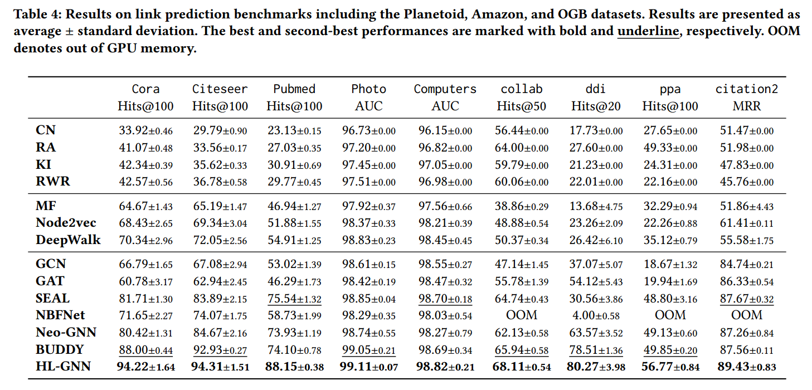

# HL-GNN学习笔记

> 作者：高铭辰
> 创建时间：2024/11/7
> 最后修改时间：2024/11/19

> 论文题目：Heuristic Learning with Graph Neural Networks: A Unified Framework for Link Prediction
> 代码地址：<https://github.com/LARS-research/HL-GNN>

---

## 论文

### 0 Abstract

**领域**：链接预测
**问题**：传统的启发式方法在跨不同图进行泛化时遇到了挑战；适应局部和全局启发式的统一公式尚未被发现
**灵感**：局部和全局启发式都可以用邻接矩阵乘法表示
**改进**：
- 提出了一种统一的矩阵公式来适应和概括各种启发式
- 提出启发式学习图神经网络（HL‑GNN）来有效地实现该公式

**优势**：
- 其能够以比GCN更低的时间复杂度达到约20层的深度
- 在预测性能方面远远优于现有方法
- HL‑GNN比启发式方法快几个数量级
- 广义启发式和学习权重是高度可解释的

### 1 INTRODUCTION

**领域**：链接预测
**图机器学习基本信息**：节点特征和图拓扑
**启发式**：
- 局部启发式，专注于相邻节点
- 全局启发式，专注于全局路径

**问题**：
- 捕获特定的拓扑模式，为泛化到不同图带来困难
- 无法利用节点特征，限制了它们在属性图上的功效

**先前的工作**：SEAL, NBFNet, Neo-GNN
**改进灵感**：局部启发式和全局启发式都可以通过邻接矩阵乘法来表示
**改进优势**：统一公式是通过直接矩阵运算开发的，在特定配置下与众多局部和全局启发式方法严格等价
**改进工作**：提出HL-GNN有效实现统一公式
**HL-GNN**：
- 包含层内传播和层间连接，但不包括变换和激活函数，使得有效地达到 20 层左右的深度
- 只需要训练一个全局 GNN，其时间复杂度甚至低于 GCN
- 自适应权重有助于整合多范围拓扑信息，并控制节点特征和拓扑信息之间的权衡

**数据集**：Planetoid, Amazon, OGB datasets
**本文贡献**：
- 将局部和全局启发式方法统一到一个矩阵表述中，从而促进了启发式方法的适应性和通用性。证明在特定配置下，许多传统启发式方法与我们的公式一致
- 提出了 HL-GNN 来有效地实现这一表述，其深度可达 20 层左右，时间复杂度低于 GCN。HL-GNN 可以自适应地平衡节点特征和拓扑信息之间的权衡
- HL-GNN 在性能和效率方面均优于现有方法。通过对广义启发式和学习权重的分析，突出了 HL-GNN 的可解释性

### 2 RELATED WORKS
#### 2.1 Graph Neural Networks
- 图卷积网络（GCN）
- Graph-SAGE
- 图注意力网络（GAT）

**传统启发式**
- 共同邻居（CN）
- 资源分配指数（RA）

#### 2.2 Link Prediction
**局部启发式**
- 基于整体的启发式
  - 共同邻居（CN）
  - 局部Leicht-Holme-Newman Index (LLHN)
- 基于个体的启发式
  - 资源分配指数（Resource Allocation Index， RA）

**全局启发式**
- 考虑节点对之间的所有可能路径
  - Katz Index (KI)
  - Global Leicht-Holme-Newman Index
- 基于随机行走概率评估两个节点之间的相似性
  - RWR (Random Walk with Restart)
- 针对特定路径长度量身定制
  - 局部路径索引（LPI）
  - 局部随机行走（LRW）

**嵌入方法**：将网络表示分解为低维节点嵌入
- Matrix Factorization
- DeepWalk
- LINE
- Node2vec

**最近的进展**：用有价值的拓扑信息增强gnn
- 围绕节点对编码子图
  - SEAL
  - GraIL
  - SUREL
- 采用特定于源的消息传递
  - nbnet
  - REDGNN
- 单个全局GNN来提高可扩展性和效率
  - Neo-GNN
  - SEG
  - BUDDY

### 3 UNIFIED HEURISTIC FORMULATION

**定义**：在图G中定义了邻接矩阵A及其不同的归一化变体；定义传播算子（代表各种归一化邻接矩阵之一）

**邻接矩阵**：二阶邻接矩阵代表（i,j）间长度为2的路径，也即共同邻居；更高阶邻接矩阵代表了更长的路径
**启发式公式定义**：

其中 $\mathbb{A}^{(m)} \in $ 四种传播算子之一
在不同的传播算子 $\mathbb{A}^{(m)}$ ，权重 $β^{(l)}$ ，最大阶 $L$ 的情况下广泛的适应全局和局部启发式
**传统启发式对应的传播算子和权重**：

### 4 HEURISTIC LEARNING GRAPH NEURAL NETWORK (HL-GNN)
#### 4.1 Heuristic Learning Graph Neural Network
**改进动机**：
- 时间复杂度O(L^2 \* N^3)，空间复杂度O(L \* N^2)
- 大型图的N很大，全局启发式的L很大

**架构**：
将 $\mathbb{A}^{(0)}$ 初始化为 $X$（节点特征矩阵）而不是 $I_N$，能将特征维度从N变为F
- 使启发式可以利用节点特征
- $X$既可以表示原始节点特征，也可以表示可学习的节点嵌入

**HLGNN**：

由于传播算子的离散性阻碍了反向传播，需将其转为连续形式：

**表示Z和启发式公式H的关系**：$Z=HX$

**时空复杂度**：
在稀疏图中，时间复杂度为O(LMF)（模型深度\*边数\*特征数），空间复杂度为O(NF)（节点数\*特征数）

**训练**：
- 通过表示Z来生成每个节点的表示 $z_i$
- 通过前馈神经网络 $f_\theta$ 预测链路的可能性 $s_{ij} = f_\theta(z_i \odot z_j)$
- 损失函数：AUC
  - 
  - α：每层的三种传播模式的占比
  - β：某一层占所有层的占比
  - θ：前馈网络的参数
- 在链路预测的标准评估中，并不会直接把正负样本标为1和0，而是通过排名指标如AUC（曲线下面积）来评估。AUC的目标是将正链路排在负链路之上
  
​
#### 4.2 Comparison with Existing Methods 
- SEAL专注于子图来学习局部启发式方法，需要为每个链接运行一个带有标记技巧的子图 GNN
- NBFNet则专注于路径来学习全局启发式方法，需要在训练和推理过程中为每个源节点运行一个全局 GNN
- Neo-GNN利用两个 MLP 进行局部启发式学习，从公共邻域中提取拓扑信息
- BUDDY则使用子图草图来表示局部启发式，从子图草图中提取拓扑信息

### 5 EXPERIMENTS
#### 5.1 Experiment Setup
**数据集**：
- Planetoid，包括Cora, Citeseer, and Pubmed
- Amazon，包括Photo and Computers
- OGB，包括ogbl-collab, ogbl-ddi, ogbl-ppa, and ogbl-citation2

**基准**：
- 启发式：CN,RA,KI,RWR
- 基于嵌入的传统方法：MF，Node2vec，DeepWalk
- 传统GNN：GCN，GAT
- 启发式 GNN 方法：SEAL，NBFNet，Neo-GNN，BUDDY

**实验设置**：

#### 5.2 Main Results
#### 5.3 Ablation Studies
#### 5.4 Efficiency Analysis
#### 5.5 Interpretability Analysis
#### 5.6 Case Study

### 6 CONCLUSION

---

## 代码
Python（3.8.20）环境：
[all_requirements.txt](..\all_requirements.txt)

### 结构

### 测试
- [cora数据集运行结果](test_cora.txt)
- [cora服务器测试](test_cora_linux.txt)
- [citeseer服务器测试](test_citeseer_linux.txt)
- [Pubmed服务器测试](test_pubmed_linux.txt)
- [Photo服务器测试](test_photo_linux.txt)
- [Computer服务器测试](test_computer_linux.txt)
- [cora_GCN](cora_GCN.txt)
- [cora_Buddy](cora_Buddy.txt)
- [citeseer_buddy](citeseer_buddy.txt)
- [pubmed_buddy](pubmed_buddy.txt)
- [collab_buddy](collab_buddy.txt)
- [collab_hlgnn](collab_hlgnn.txt)
- [ppa_buddy](ppa_buddy.txt) **超长训练时间**
- [ddi_neognns](ddi_neognns.txt)
- [ddi_buddy](ddi_buddy.txt)
- [ddi_hlgnn](ddi_hlgnn.txt)

|  数据集   |   指标   | hlgnn结果 测试/论文 | Buddy结果 测试/论文 | Neo-GNNs结果 测试/论文 |
| :-------: | :------: | :-----------------: | :-----------------: | :--------------------: |
|   Cora    | Hits@100 |    93.74 / 94.22    |  **84.30 / 88.00**  |                        |
| Citeseer  | Hits@100 |  **97.80 / 94.31**  |    89.52 / 92.93    |                        |
|  Pubmed   | Hits@100 |    86.87 / 88.15    |  **69.37 / 74.10**  |                        |
|   Photo   |   AUC    |    98.98 / 99.11    |       / 99.05       |                        |
| Computer  |   AUC    |    98.68 / 98.82    |       / 98.69       |                        |
|  collab   | Hits@50  |    67.43 / 68.11    |  **66.00 / 65.94**  |                        |
|    ppa    | Hits@100 |       / 56.77       |    45.19 / 49.85    |                        |
|    ddi    | Hits@20  |  **69.70 / 80.27**  |    75.36 / 78.51    |   **56.09 / 63.57**    |
| citation2 |   MRR    |       / 89.43       |                     |                        |

python main.py --data_name ogbl-ppa --emb_hidden_channels 256 --mlp_hidden_channels 256 --gnn_hidden_channels 256 --grad_clip_norm 2.0 --epochs 500 --eval_steps 1 --dropout 0.5 --use_node_feat True --alpha 0.5 --loss_func WeightedHingeAUC --batch_size 8192