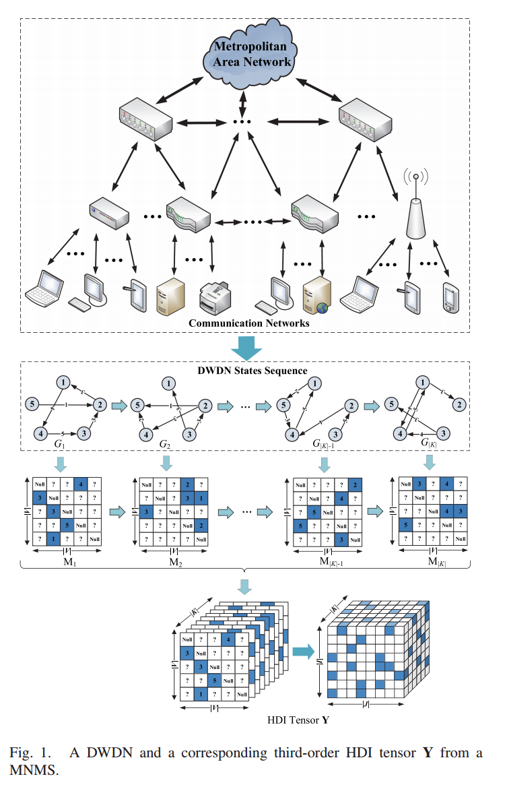
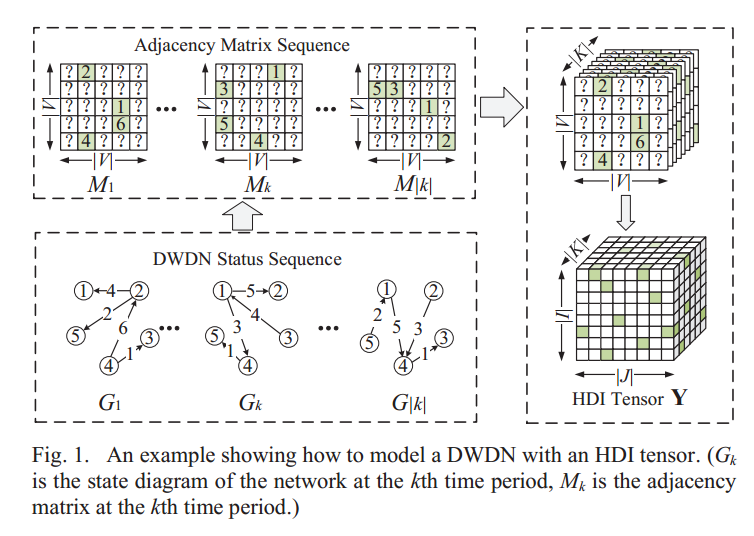

# High-Quality Temporal Link Prediction for Weighted Dynamic Graphs via Inductive Embedding Aggregation

这篇论文主要研究了加权动态图中的时间链接预测（TLP）问题。作者提出了一种新的方法，称为**IDEA**（Inductive Dynamic Embedding Aggregation），旨在解决现有方法在处理加权动态图时的局限性，如无法有效处理节点集的变化和边权重的广泛值范围。

### 主要内容包括：

1. **背景与动机**：动态图通过时间快照表示复杂系统的行为，TLP的目标是利用历史快照预测未来的拓扑结构。现有方法多针对无权重图，难以推广到加权图。

2. **问题分析**：
   - **加权图的挑战**：现有方法在处理边权重范围广、稀疏性、以及节点集变化时表现不佳。
   - **质量预测问题**：大部分方法只能生成低质量的预测结果，无法区分小权重和零权重。

3. **IDEA方法**：
   - 结合了误差最小化、对抗性学习（GAN）和规模差异最小化的混合目标，能够生成高质量的预测快照。
   - 采用了一个创新的堆叠结构（GR细胞），结合图神经网络（GNN）和递归神经网络（RNN），同时引入了注意力节点对齐单元，能够处理不同数量的节点。

4. **实验与结果**：
   - 在多个动态图数据集上进行实验，验证了IDEA在处理加权动态图时的有效性，能够在节点集变化的情况下仍然提供高质量的预测结果。
   - 提出了新的评估指标，以更全面地评价模型在处理广泛值范围和稀疏性问题上的能力。

5. **结论与未来工作**：IDEA方法在加权动态图的时间链接预测任务中表现优异，未来将探索动态节点属性和不均匀时间间隔快照的情况，扩展IDEA的应用范围。

这项研究为加权动态图中的时间链接预测提供了新的思路和方法，具有重要的理论和实践意义。

### **论文第三部分（问题描述）的详细解释**

论文的第三部分 **“问题描述”（Problem Statements）** 主要定义了**加权动态图的时间链路预测问题（TLP）**，并将其划分为三个不同的难度级别。以下是对这一部分内容的详细解释：

---

### **1. 研究对象：加权的无向动态图**
作者考虑的动态图可以用 **一系列快照（snapshots）** 来表示：
\[
G = (G_1, G_2, ..., G_T)
\]
其中，每个时间步 \( t \) 的快照 \( G_t \) 可以描述为：
\[
G_t = (V_t, E_t, A_t)
\]
- \( V_t \)：节点集合（nodes set），表示当前时间步存在的节点。
- \( E_t \)：加权边集合（weighted edges set），定义为：
  \[
  E_t = \{((v_i^t, v_j^t), w) | v_i^t, v_j^t \in V_t, w \in \mathbb{R}^+\}
  \]
  其中 \( w \) 代表边的权重。
- \( A_t \)：邻接矩阵（adjacency matrix），用于表示图的拓扑结构：
  \[
  (A_t)_{ij} = w > 0, \quad \text{如果 } ((v_i^t, v_j^t), w) \in E_t
  \]
  否则 \( (A_t)_{ij} = 0 \)。

此外，每个节点 \( v_i^t \) 还具有一个固定的属性向量，表示为：
\[
A_t = \{\phi(v_1^t), \phi(v_2^t), ..., \phi(v_{N_t}^t)\}
\]
其中 \( \phi(v_i^t) \) 映射每个节点到其属性。

---

### **2. 时间链路预测任务（TLP）**
TLP 任务的目标是：
**利用过去 \( l \) 个时间步的历史数据，预测未来时间步 \( \tau+1 \) 的图拓扑结构，即 \( A_{\tau+1} \)。**
\[
A_{\tau+1} = f_{TLP} (A_{\tau-\ell}, A_{\tau-\ell+1}, ..., A_{\tau}, X)
\]
其中 \( X \) 是所有时间步共享的节点属性矩阵。

根据节点集的变化情况，作者将 TLP 任务划分为 **三个不同的级别（levels）**。

---

### **3. TLP 的三个难度级别**

#### **(1) Level-1: 固定节点集（Fixed Node Set）**
**假设：** 
- 所有时间步 \( t \) 共享相同的节点集合，即：
  \[
  V_1 = V_2 = ... = V_T = V
  \]
- 所有节点属性矩阵相同：
  \[
  X_1 = X_2 = ... = X_T = X
  \]
- 目标是预测下一时间步的邻接矩阵 \( A_{\tau+1} \)：
  \[
  A_{\tau+1} = f_{TLP} (A_{\tau-\ell:\tau}, X)
  \]

**特点：**
- 这是最基础的 TLP 任务，不涉及节点的增减变化。
- 适用于节点集保持稳定的系统（如社交网络中的好友关系预测）。

---

#### **(2) Level-2: 可变节点集（Variable Node Set）**
**假设：** 
- 不同时间步的节点集可能不同：
  \[
  \exists t \neq s, \quad V_t \neq V_s
  \]
- 目标是在 **过去 \( l \) 个时间步观察到的所有节点**（\( V_{\cup(\tau-\ell:\tau)} \)）范围内进行链路预测：
  \[
  A_{\tau+1} = f_{TLP} (A_{\tau-\ell:\tau}, B_{\tau-\ell:\tau}, X_{\tau-\ell:\tau}, V_{\cup(\tau-\ell:\tau)}, X_{\cup(\tau-\ell:\tau)})
  \]
  其中：
  - \( B_{\tau-\ell:\tau} \) 是**对齐矩阵（alignment matrix）**，用于标识不同快照间节点的对应关系。

**特点：**
- 允许节点集变化，但只能预测**历史快照中曾出现过的节点之间的连接**。
- 适用于**动态网络**，如车辆轨迹网络、数据中心流量网络等。

---

#### **(3) Level-3: 预测新节点间的链路（Predicting Links for New Nodes）**
**假设：** 
- 不仅允许节点集变化，还需要预测：
  1. 先前观察到的节点与**新节点**之间的边。
  2. **两个新节点**之间的边。

**数学表达：**
\[
A_{\tau+1} = f_{TLP} (A_{\tau-\ell:\tau}, B_{\tau-\ell:\tau}, X_{\tau-\ell:\tau}, V_{\tau+1}, X_{\tau+1})
\]

**特点：**
- 这是**最具挑战性**的场景，现有的大多数方法难以处理此问题。
- 适用于物联网（IoT）网络、社交网络中新用户的关系预测等。

---

### **4. 现有方法的局限性**
论文指出，现有的 TLP 方法主要基于 **Level-1 的假设（即固定节点集）**，很少能够扩展到 Level-2 或 Level-3：
- **Level-1 方法：** 只能处理固定节点的情况，无法适应节点变化。
- **Level-2 方法：** 通过使用较大的邻接矩阵（包括所有可能节点）来表示动态变化的拓扑，但这种方法会带来**高计算复杂度**，并且存在许多**孤立节点（isolated nodes）**。
- **Level-3 方法：** 只有少数**归纳式动态嵌入（inductive dynamic embedding）方法**可以处理 **无权图** 的 Level-3 TLP，但**无法应用于加权图**。

为了解决这些问题，作者提出了新的 **IDEA 方法**，它能够在 **加权动态图的所有三种级别上进行高质量预测**。

---

### **5. 关键挑战**
作者进一步定义了**高质量 TLP（High-Quality TLP）**的三个关键挑战：
1. **宽值范围问题（Wide-Value-Range Issue）**：
   - 许多现有方法在预测链路时，只能正确预测大权重边，而无法区分小权重边。
   - 例如，在网络流量预测中，无法准确预测小流量的连接，可能导致带宽资源分配不合理。

2. **稀疏性问题（Sparsity Issue）**：
   - 许多现实世界的动态图是**稀疏的**，即大多数边的权重接近零。
   - 现有方法在误差最小化时，往往对大权重敏感，而不能有效区分**小权重边**和**不存在的边（权重为 0）**。

3. **高质量预测标准（High-Quality TLP）**：
   - 一个高质量的 TLP 方法应能够同时解决 **宽值范围** 和 **稀疏性** 问题，使得预测结果更加精确。

---

## 谁引用了这篇文章
1. Hao Wu, Yan Qiao, Xin Luo, "A Fine-Grained Regularization Scheme for Non-negative Latent Factorization of High-Dimensional and Incomplete Tensors", IEEE Transactions on Services Computing, vol.17, no.6, pp.3006-3021, 2024.
   - 2024 IEEE International Conference on Systems, Man, and Cybernetics (SMC)
   - 不完整向量，动态加权有向图（DWDN）
   - 给定动态加权图$G$在时间$K$内的快照序列$G_1, G_2, ..., G_K$
   - 高维不完整向量（HDI）：
     - 时间$k$时的有权重有向邻接矩阵$M_k$，时间$k\in\{0, 1, ..., K\}$内的$M_k$按顺序排列成高维不完整向量$Y^{|I|×|J|×|K|}$
     - 已知连接$|\Lambda|\ll$未知连接$|\Gamma|$
   - 预测一个接近$Y$的低秩$\hat{Y}$
   - **内插**
2. Hao Wu, Weiling Li, "Link Prediction for Dynamic Weighted Graph via Adaptive Nonnegative Tensor CP Decomposition", 2024 IEEE International Conference on Systems, Man, and Cybernetics (SMC), pp.3462-3466, 2024.
   - IEEE TRANSACTIONS ON SERVICES COMPUTING, VOL. 17, NO. 6, NOVEMBER/DECEMBER 2024
   - 动态加权图
     
   - 给定动态加权图 $G$ 在时间 $K$ 内的快照序列 $G_1, G_2, ..., G_K$ 
   - 预测 $G_k \quad k\in\{0, 1, ..., K\}$ 中缺失的有权重有向链接
   - **内插**
3. Tingxuan Chen, Jun Long, Zidong Wang, Shuai Luo, Jincai Huang, Liu Yang, "THCN: A Hawkes Process Based Temporal Causal Convolutional Network for Extrapolation Reasoning in Temporal Knowledge Graphs", IEEE Transactions on Knowledge and Data Engineering, vol.36, no.12, pp.9374-9387, 2024.
   - IEEE TRANSACTIONS ON KNOWLEDGE AND DATA ENGINEERING, VOL. 36, NO. 12, DECEMBER 2024
   - 时间知识图谱（TKG）
   - **外推**
   - TKG：有向无加权图 $G_{(1,\tau)} = \{G_1, G_2, ..., G_{\tau}\}$
      每个子图 $G_t = \{\mathcal{V}_t, \mathcal{E}_t, \mathcal{F}_t\}$ 定义在离散时间上
      $\mathcal{F}$ 集合的结构为 $(s,r,o,t)$ （源，关系，目标，时间）
   - 预测任务：
     1. 实体预测： $(?,r,o,t)$ $(s,r,?,t)$
     2. 关系预测： $(s,?,o,t)$
4. Mengyu Shi, Jun Li, "Comprehensive Optimization Training Framework for TSK Fuzzy Systems: Applications of MBGD, AMPO, and RDA", 2024 9th International Symposium on Computer and Information Processing Technology (ISCIPT), pp.70-75, 2024.
   - 2024 9th International Symposium on Computer and Information Processing Technology (ISCIPT)
   - 完全无关，似乎是为了凑数引用这篇😅
5. Qu Wang, Hao Wu, "Dynamically Weighted Directed Network Link Prediction Using Tensor Ring Decomposition", 2024 27th International Conference on Computer Supported Cooperative Work in Design (CSCWD), pp.2864-2869, 2024.
   - Proceedings of the 2024 27th International Conference on Computer Supported Cooperative Work in Design
   - 动态加权有向网络（DWDN）
     
   - $Y^{|I|×|J|×|K|}$，其中 $y_{ijk}$ 代表在时间点 $k \in K$ 从节点 $i \in I$ 指向节点 $j \in J$ 的有向加权连接 已知的元素集 $|\Lambda| \ll$ 未知的元素集 $|\Gamma|$
   - 预测 $Y$ 的低秩近似向量 $\hat{Y}$
   - **内插**
6. Akshi Kumar, Abhishek Mallik, Sanjay Kumar, "TLP-NEGCN: Temporal Link Prediction via Network Embedding and Graph Convolutional Networks", IEEE Transactions on Computational Social Systems, vol.11, no.3, pp.4454-4464, 2024.
   -  IEEE TRANSACTIONS ON COMPUTATIONAL SOCIAL SYSTEMS, VOL. 11, NO. 3, JUNE 2024
   -  
7. Fateme Mohamady, Sina Dami, "Link Prediction in Dynamic Social Networks Using Deep Learning", 2024 20th CSI International Symposium on Artificial Intelligence and Signal Processing (AISP), pp.1-5, 2024.
8. Yanting Yin, Yajing Wu, Xuebing Yang, Wensheng Zhang, Xiaojie Yuan, "Super Resolution Graph With Conditional Normalizing Flows for Temporal Link Prediction", IEEE Transactions on Knowledge and Data Engineering, vol.36, no.3, pp.1311-1327, 2024.
9.  Yu Gao, Meng Qin, Yibin Ding, Li Zeng, Chaorui Zhang, Weixi Zhang, Wei Han, Rongqian Zhao, Bo Bai, "RaftGP: Random Fast Graph Partitioning", 2023 IEEE High Performance Extreme Computing Conference (HPEC), pp.1-7, 2023.
10. Yinuo Qian, Fuzhong Nian, Zheming Wang, Yabing Yao, "Research on the Influence of Information Iterative Propagation on Complex Network Structure", Big Data, 2024.
11. Minwei Wen, Hongyan Mei, Wei Wang, Xiaorong Xue, Xing Zhang, "Multi-task recommendation based on dynamic knowledge graph", Applied Intelligence, 2024.
12. Meng Qin, Dit-Yan Yeung, "Temporal Link Prediction: A Unified Framework, Taxonomy, and Review", ACM Computing Surveys, vol.56, no.4, pp.1, 2024.
13. Yabing Yao, Yangyang He, Zhentian Huang, Zhipeng Xu, Fan Yang, Jianxin Tang, Kai Gao, "Deep non-negative matrix factorization with edge generator for link prediction in complex networks", Applied Intelligence, 2023.
14. Meng Qin, Chaorui Zhang, Bo Bai, Gong Zhang, Dit-Yan Yeung, "Towards a Better Tradeoff between Quality and Efficiency of Community Detection: An Inductive Embedding Method across Graphs", ACM Transactions on Knowledge Discovery from Data, vol.17, no.9, pp.1, 2023.
