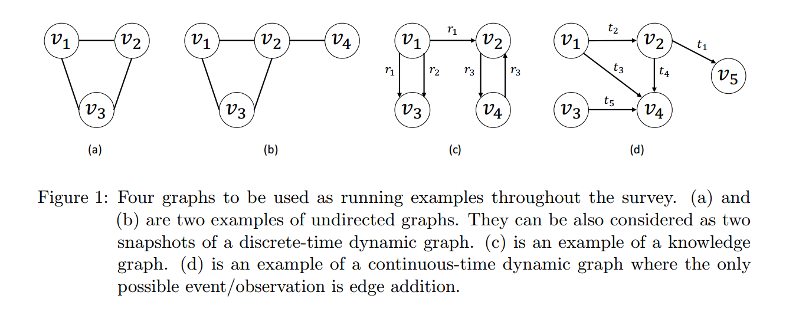
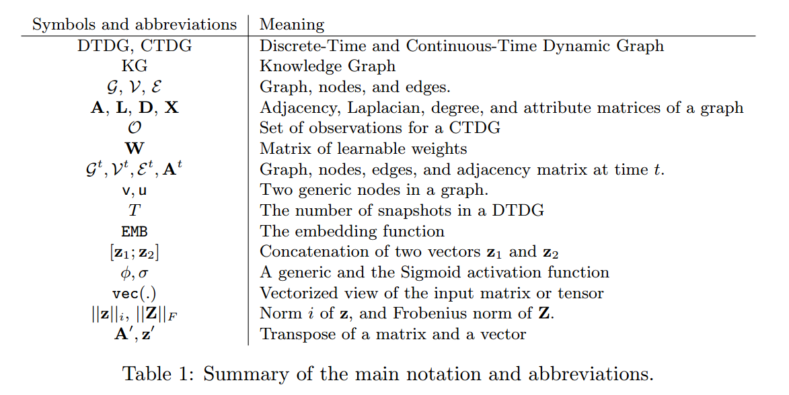
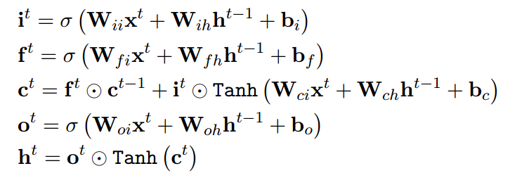
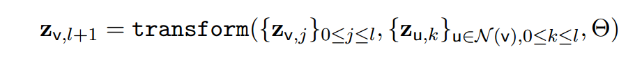
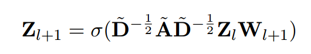

# Representation Learning for Dynamic Graphs: A Survey

### **文章概述：《动态图的表征学习：综述》**
这篇文章由 **Seyed Mehran Kazemi** 等人撰写，发表于 **《Journal of Machine Learning Research》**，系统性地回顾了**动态图（Dynamic Graphs）**的表征学习（Representation Learning）的研究进展。

#### **1. 研究背景**
图（Graph）是一种重要的数据结构，在社交网络、推荐系统、生物信息学、计算金融等领域具有广泛应用。传统的图学习方法主要针对**静态图（Static Graphs）**，但在许多实际应用中，图的结构会随时间变化，即**动态图**。动态图带来了新的挑战，例如：
- **节点、属性和边的变化**（例如社交网络中新用户的加入、交易网络中新交易的生成）。
- **时间依赖性**（需要在时间序列中学习长期和短期模式）。
- **数据规模大、计算复杂度高**（需要高效的算法来处理流式更新）。

#### **2. 综述目标**
该综述聚焦于**动态图的表征学习**，特别是**时间依赖嵌入（time-dependent embedding）**，包括：
- **编码器-解码器框架**（Encoder-Decoder Framework）：分析现有方法如何将动态图信息编码成嵌入，并进行预测任务。
- **离散时间动态图（DTDG）和连续时间动态图（CTDG）**：介绍这两种主流动态图建模方式及其应用。
- **主要学习任务**：包括**节点分类（Node Classification）**、**边预测（Link Prediction）**和**事件预测（Event Prediction）**。
- **常见数据集**：提供常用的动态图数据集概述，以帮助研究者选择合适的实验数据。

#### **3. 文章结构**
- **第 2 章**：介绍静态图和动态图的基本概念、数学表示及符号定义。
- **第 3 章**：回顾静态图的表征学习方法，包括**图神经网络（GCN）**、**随机游走（Random Walks）**、**矩阵分解（Matrix Factorization）**等。
- **第 4 章**：介绍动态图的编码方法，如基于**时间聚合（Temporal Aggregation）**、**随机游走**、**递归神经网络（RNN）**等。
- **第 5 章**：讨论动态图的解码方式，分为**时间预测解码器（Time-Predicting Decoder）**和**时间条件解码器（Time-Conditioned Decoder）**。
- **第 6 章**：总结非编码器-解码器框架的方法，如**统计关系学习（Statistical Relational Learning）**。
- **第 7 章**：探讨动态图的应用，包括社交网络分析、推荐系统、金融市场分析等。
- **第 8 章**：讨论当前研究的挑战和未来发展方向。

#### **4. 关键方法**
- **图神经网络（GNNs）**：如 GCN、GAT、GraphSAGE，利用邻居信息更新节点表示。
- **时序模型（Temporal Models）**：
  - **递归神经网络（RNNs）**：如 LSTMs、GRUs 处理时间序列数据。
  - **注意力机制（Attention Mechanism）**：如 Transformer 处理长期依赖关系。
  - **时间点过程（Temporal Point Processes，TPPs）**：如霍克斯过程（Hawkes Process）建模事件发生的时间模式。
- **随机游走（Random Walks）**：如 DeepWalk、Node2Vec 进行图嵌入学习。
- **矩阵分解（Matrix Factorization）**：如 SVD、Laplacian Eigenmaps 进行维度压缩。
- **图自编码器（Graph Autoencoders）**：学习无监督图表示。

#### **5. 研究展望**
作者指出，**动态图表征学习**仍有许多挑战：
- 如何提高**模型的可扩展性**，处理更大规模的动态图。
- 如何结合**物理世界的约束**，提升预测的解释性和鲁棒性。
- 如何设计更高效的**流式学习（Streaming Learning）**方法，实现实时更新和推理。

---

## **文章结构概述**

### **第 2 章：背景与符号定义**  
介绍静态图与动态图的基本概念，推理任务，以及相关的学习技术，并定义本文所使用的符号和术语。  

### **第 3 章：静态图的表征学习**  
概述静态图的表征学习方法，主要用于引入动态图相关概念，而非详尽综述静态图方法。  

### **第 4 章：动态图的编码技术**  
讨论动态图的编码方法，包括：
- **时间信息的聚合**（Temporal Aggregation）
- **时间正则化**（Time Regularization）
- **矩阵分解**（Matrix Decomposition）
- **随机游走**（Random Walks）
- **时序建模**（如递归神经网络 RNNs）

### **第 5 章：动态图的解码技术**  
将动态图解码器分为两类：
- **时间预测解码器（Time-Predicting Decoders）**
- **时间条件解码器（Time-Conditioned Decoders）**  
并对各类解码器进行详细讨论。  

### **第 6 章：非编码器-解码器框架的方法**  
介绍其他不属于编码器-解码器框架的方法，例如：
- **统计关系学习**（Statistical Relational Learning）
- **时空图（Spatiotemporal Graphs）**
- **从文本构建动态知识图谱**（Dynamic Knowledge Graph Construction from Text）

### **第 7 章：动态图的应用与数据集**  
回顾动态图的主要应用场景，并列举多个静态与动态图数据集，概述其特点。  

### **第 8 章：总结与研究展望**  
讨论动态图表征学习领域的未解问题，并提出未来研究方向。

---

## 论文内容

### 2.1 Static Graphs

**图的定义，分类**

- (a) 和 (b) 是两个无向图的例子。它们也可视为离散时间动态图的两个快照
- (c) 是知识图谱的一个示例
- (d) 是连续时间动态图的一个例子，其中唯一可能的事件/观测是边的添加

**知识图谱**
- 边=（源，关系，目标）
- 一对节点可以有多个边
- 相关概念：异构信息网络（HIN）

### 2.2. Dynamic Graphs

**连续时间动态图（CTDG）的定义**：
**连续时间动态图（Continuous-Time Dynamic Graph, CTDG）** 由一个 **静态图 \( G \) 和事件集 \( O \)** 组成，即 **\( (G, O) \)**。  

- **\( G \)**：表示动态图在初始时间 \( t_0 \) 的静态状态。  
- **\( O \)**：事件集合，其中每个事件由 **(事件类型, 事件, 时间戳)** 三元组表示。  

**事件类型** 可以包括：
- **边的添加/删除**（Edge Addition/Deletion）
- **节点的添加/删除**（Node Addition/Deletion）
- **节点拆分/合并**（Node Splitting/Merging）

在任意时间 \( t \geq t_0 \)，可以根据时间 \( t \) 之前或同时发生的事件 \( O \) 逐步更新 \( G \)，从而得到时间 \( t \) 的图快照 \( G_t \)（对应于一个静态图）。某些情况下，更新可能需要对多个边进行聚合。

**离散时间动态图（DTDG）的定义**：  
**离散时间动态图（Discrete-Time Dynamic Graph, DTDG）** 由**定期采样的动态图快照序列** 组成，形式化定义为：  

\[
\{ G_1, G_2, \dots, G_T \}
\]

其中：
- **\( G_t = (V_t, E_t) \)**：表示时间 \( t \) 处的图快照。  
- **\( V_t \)**：时间 \( t \) 处的节点集合。  
- **\( E_t \)**：时间 \( t \) 处的边集合。  

**DTDG 与 CTDG 的对比**：
- DTDG 仅在**离散时间点**采样，因此可能丢失部分动态图的演变信息。  
- **DTDG 的建模通常比 CTDG 更简单**，但 DTDG 模型不一定适用于 CTDG，而 CTDG 模型可用于 DTDG。  
- **DTDG 和 CTDG 统称为动态图（Dynamic Graphs）**。

### 2.3. Prediction Problems

**符号表**：

**动态图的三个一般问题**：
- 节点分类，从一组预定义的类别中将每个节点归为一类的问题
- 边预测，预测节点之间新链接的问题
- 图分类，将整个图从一组预定义类中归入一类的问题

**动态图推理分为两种情况**
- 内插任务
  - 主要用于完成（动态）KG 
- 外推任务

**流场景**：
通常由 CTDGs 处理得最好，而且经常会产生外推法问题

### 2.4. The Encoder-Decoder Framework

- 定义**嵌入**（包括**节点**和**关系**，文章基于KG讨论）
- 定义**编码器**为原图\( \to \)嵌入
- 定义**解码器**为嵌入\( \to \)预测

**训练**：
- 编码器和解码器端到端训练
- 分类问题

### 2.5. Expressivity

定义**模型的表现力**:

**节点分类的完全表达能力**：

一个具有参数 \( \Theta \) 的模型 \( M \) 在**节点分类（Node Classification）** 任务上是**完全表达的（Fully Expressive）**，当且仅当：  

对于任意给定的图 \( G = (V, E) \) 和任意将节点映射到类别的函数 \( \Omega: V \to C \)（其中对称节点必须映射到相同类别），存在一个参数 \( \Theta \) 的实例，使得 \( M \) 能够根据 \( \Omega \) 对 \( V \) 中的所有节点进行正确分类。

**链路预测的完全表达能力**  

一个具有参数 **\( \Theta \)** 的模型 **\( M \)** 在**链路预测（Link Prediction）**任务上是**完全表达的（Fully Expressive）**，当且仅当：  

对于任意给定的图 **\( G = (V, E) \)** 和任意**指示边是否存在**的函数 **\( \Omega: E \to \{ \text{True}, \text{False} \} \)**（即判断所有节点对之间是否存在标记边），存在一个参数 **\( \Theta \)** 的实例，使得 **\( M \)** 能够根据 **\( \Omega \)** 对 **\( E \)** 中的所有边进行正确分类。  

**图分类的完全表达能力**  

一个具有参数 **\( \Theta \)** 的模型 **\( M \)** 在**图分类（Graph Classification）**任务上是**完全表达的（Fully Expressive）**，当且仅当：  

对于任意给定的一组**非同构图（Non-Isomorphic Graphs）** **\( S = \{ G_1, G_2, \dots, G_n \} \)** 和任意将图映射到类别的函数 **\( \Omega: S \to C \)**，存在一个参数 **\( \Theta \)** 的实例，使得 **\( M \)** 能够根据 **\( \Omega \)** 对 **\( S \)** 中的所有图进行正确分类。

### 2.6. Sequence Models

- **循环神经网络（RNN）**：
  $$
    h^t = \Phi(W_ix^t + W_hh^{t-1} + b_i) \\
    h^t = \text{RNN}(h^{t−1}; x^t)
  $$

- **长短期记忆（LSTM）**:
  

- **门控递归单元（GRUs）**

- **注意力机制**  

  注意力机制（Attention Mechanism）是一种**基于自注意力（Self-Attention）**的计算方法，不依赖于递归（Recurrence），在多个任务上表现优于传统的 RNN 变体（Vaswani et al., 2017）。  

  1. 计算流程
  设输入矩阵 **\( X_{\text{in}} \in \mathbb{R}^{T \times d} \)**，包含 \( T \) 个元素，每个元素具有 \( d \) 维特征。注意力机制的核心思想是**让序列中的每个元素关注自身及其他所有元素**，通过加权求和更新自身表示。  

    计算步骤如下：
    1. **位置编码（Positional Encoding）**  
      - 由于自注意力**不考虑序列顺序**，需要加入**位置编码矩阵** \( P \in \mathbb{R}^{T \times d} \) 来嵌入位置信息：
        \[
        \bar{X}_{\text{in}} = X_{\text{in}} + P
        \]
      
    2. **计算查询（Query）、键（Key）和值（Value）矩阵**  
      - 通过可学习的权重矩阵将输入映射到不同的子空间：
        \[
        Q = \bar{X}_{\text{in}} W_Q, \quad K = \bar{X}_{\text{in}} W_K, \quad V = \bar{X}_{\text{in}} W_V
        \]
      - 其中：
        - \( Q \in \mathbb{R}^{T \times d_k} \)：查询矩阵（Queries）
        - \( K \in \mathbb{R}^{T \times d_k} \)：键矩阵（Keys）
        - \( V \in \mathbb{R}^{T \times d_v} \)：值矩阵（Values）
        - \( W_Q, W_K \in \mathbb{R}^{d \times d_k}, W_V \in \mathbb{R}^{d \times d_v} \) 是可学习参数。

    3. **计算注意力权重（Attention Weights）**
      - 通过**点积注意力（Scaled Dot-Product Attention）**计算注意力分数：
        \[
        \text{Attention}(Q, K, V) = \text{softmax} \left( \frac{QK^T}{\sqrt{d_k}} \right) V
        \]
      - 其中：
        - **\( QK^T \)** 计算查询与键的相似度，生成注意力分数矩阵。
        - **\( \sqrt{d_k} \) 归一化**，避免梯度过大导致训练不稳定。
        - **softmax 归一化**，使权重和为 1，形成概率分布。
        - **加权求和**：将权重作用到值矩阵 \( V \) 以获取最终的注意力输出 \( X_{\text{out}} \)。

    4. **掩码机制（Masking）**
      - 在时间序列任务中，可以添加 **Mask** 确保时间步 \( t \) 只关注其之前的信息，防止未来信息泄露。

    5. **多头注意力（Multi-Head Attention）**
      - **多个独立的注意力头（Attention Heads）** 并行计算不同的注意力模式：
        \[
        \text{MultiHead}(Q, K, V) = \text{Concat} (\text{head}_1, ..., \text{head}_h) W_O
        \]
      - 其中，每个 **head** 是独立的注意力计算，最后通过矩阵 \( W_O \) 进行映射。
    
  2. 在动态图中的应用
  - **静态图（Static Graphs）**：\( X_{\text{in}} \) 可表示节点邻居的信息。
  - **动态图（Dynamic Graphs）**：\( X_{\text{in}} \) 可表示**同一节点在不同时间点的表示**，从而建模节点随时间的变化。

  3. 关键优势
  - **并行计算**：不同于 RNN 需要逐步计算，注意力机制可**同时处理所有时间步**，计算效率更高。
  - **长距离依赖**：相比 RNN 更容易捕捉**远距离依赖关系**。
  - **适用于动态图**：可灵活应用于**随时间演化的图结构**，提升信息传播的效果。

### 2.7. Temporal Point Processes

**时间点过程（TPPs）** 是一种**随机过程（Stochastic Process）**，用于建模**连续时间**（Continuous Time）中**异步离散事件**（Asynchronous Discrete Events）的序列

**1. 事件序列表示**
一个典型的时间点过程可以表示为一系列**离散时间点**上的事件：  

\[
t_1, t_2, t_3, \dots, t_n, \quad \text{其中 } t_i \leq T
\]

其中，\( T \) 是时间范围的上限。  

**2. 条件强度函数（Conditional Intensity Function）**
TPP 主要通过**条件强度函数（\( \lambda(t) \)）** 来建模事件的发生概率：
- \( \lambda(t)dt \) 表示在时间区间 \( [t, t + dt] \) 内发生事件的概率，**给定历史** \( (t_1, t_2, ..., t_n) \) 且在 \( t_n < t \leq T \) 之间没有发生事件。

**3. 事件发生的概率密度函数（Density Function）**
下一个事件在时间 \( t \) 发生的**概率密度函数**为：  

\[
f(t) = \lambda(t) S(t)
\]

其中，**存活函数（Survival Function）** \( S(t) \) 定义如下：

\[
S(t) = \exp \left( -\int_{t_n}^{t} \lambda(\tau) d\tau \right)
\]

表示在 \( (t_n, t] \) 时间区间内**没有事件发生的概率**。  

**4. 关键特点**
- 适用于**建模不定时发生的事件**（如社交网络中的交互、金融交易、网络流量）。
- 通过**强度函数 \( \lambda(t) \)** 预测未来事件的发生时间。
- 结合**生存分析**（Survival Analysis）计算事件间隔分布。

**5. 典型模型**
- **泊松过程（Poisson Process）**：假设事件发生的概率**与时间无关**（\( \lambda(t) \) 为常数）。
- **霍克斯过程（Hawkes Process）**：**自激励**模型，事件发生后会临时提高未来发生新事件的概率。
- **神经 TPP（Neural TPPs）**：使用神经网络自适应学习 \( \lambda(t) \) 的复杂模式。  

### 3. Representation Learning for Static Graphs

### 3.1. Encoders

#### 3.1.1. High-Order Proximity Matrices

高阶邻接矩阵（High-Order Proximity Matrices）编码器利用图的**全局结构信息**，超越普通**邻接矩阵**（Adjacency Matrix）仅描述局部邻接关系的局限性。这类编码器**无需学习参数**，仅依赖于矩阵计算，并用于衡量图中节点之间的相似性。常见的高阶邻接矩阵编码器包括以下几种：  

**1. 共同邻居矩阵（Common Neighbors Matrix, \( S_{CN} \)）**  
\[
S_{CN} = A A
\]  
- **原理**：衡量两个节点共享的邻居数量。  
- **解释**：如果两个节点有很多共同的邻居，那么它们在网络中可能是相似的。  
- **适用于**：无向图和有向图（有向图中，计算的是同时作为目标和源的邻居数量）。  

**2. 杰卡德系数（Jaccard’s Coefficient, \( S_{JC} \)）**  
\[
S_{JC}[i][j] = \frac{S_{CN}[i][j]}{\sum_{k} (A[i][k] + A[k][j]) - S_{CN}[i][j]}
\]  
- **原理**：衡量两个节点的共同邻居占其所有邻居的比例，类似于 Jaccard 相似度。  
- **解释**：与共同邻居矩阵不同，杰卡德系数**归一化**了共同邻居数量，避免因节点度数不同导致的影响。  
- **适用于**：有向图和无向图，适合衡量不同规模节点间的相似性。  

**3. Adamic-Adar 指数（\( S_{AA} \)）**  
\[
S_{AA} = A D^{-1} A
\]  
其中：
\[
D[i][i] = \frac{1}{\sum_{k} (A[i][k] + A[k][i])}
\]  
- **原理**：对共同邻居的贡献进行加权，邻居度数越大，贡献越小（低度数的共同邻居更重要）。  
- **解释**：低度数的共同邻居提供了更有价值的信息，因此给予较高权重。  
- **适用于**：推荐系统、社交网络分析，适合发现罕见但重要的连接。  

**4. Katz 指数（Katz Index, \( S_{Katz} \)）**  
\[
S_{Katz} = \sum_{k=1}^{\infty} (\beta A)^k = (I - \beta A)^{-1} \beta A
\]  
- **原理**：考虑**所有可能路径**（不仅是直接邻居），并给予**较短路径更高的权重**。  
- **解释**：
  - 如果两个节点之间有很多短路径，则它们可能更相关。  
  - \( \beta \) 控制路径的权重，值越接近 1，则考虑的路径越长。  
- **适用于**：网络影响力分析、社交网络中的隐式关系挖掘。  

**5. 偏好连接（Preferential Attachment, \( S_{PA} \)）**  
\[
S_{PA}[i][j] = \left( \sum_{k} A[i][k] \right) \times \left( \sum_{k} A[k][j] \right)
\]  
- **原理**：基于**节点的度数**，认为高度数节点更可能连接在一起。  
- **解释**：
  - 该方法基于“**富者愈富**”原则，高度节点更容易形成连接。  
  - 例如，在社交网络中，知名博主更容易互相关注。  
- **适用于**：无标度网络、互联网拓扑分析，适合预测基于**流行度**的新连接。  

**总结**
| 方法                    | 公式                 | 关键特点             | 适用场景             |
| ----------------------- | -------------------- | -------------------- | -------------------- |
| **共同邻居矩阵（SCN）** | \( S_{CN} = A A \)   | 仅考虑直接共同邻居   | 适用于密集社交网络   |
| **杰卡德系数（SJC）**   | 归一化共同邻居比例   | 适用于不同规模节点   | 适合推荐系统         |
| **Adamic-Adar（SAA）**  | 低度数共同邻居更重要 | 发现罕见但重要的关系 | 适用于社交网络分析   |
| **Katz 指数（SKatz）**  | 计算所有路径并赋权   | 考虑全局结构信息     | 社交网络、影响力分析 |
| **偏好连接（SPA）**     | 基于度数的连接概率   | 适用于无标度网络     | 互联网拓扑、连接预测 |

这些编码器在图学习任务中**无需训练参数**，但可以作为**输入特征**，帮助机器学习模型更好地学习图的结构信息。

#### 3.1.2. Shallow Encoders
- 浅编码器首先决定**节点和关系嵌入的向量和矩阵的数量和形状**
- 然后将这些向量和矩阵中的每个元素视为可以**直接从数据中学到的参数**。可以将浅编码器视为**查找函数**，该函数找到了对应于节点的隐藏表示形式或给定ID的关系
- 浅编码器通常用于**KG嵌入**

#### 3.1.3. Decomposition Approaches

**分解方法（Decomposition Approaches）**  

分解方法是一种**无监督学习**（Unsupervised Learning）技术，通过矩阵分解（Matrix Factorization）来学习节点的低维表示。其核心思想是**让连接的节点在嵌入空间中相互接近**，即优化一个目标函数，使得节点的嵌入能够尽可能地重构图的邻接关系。  

**1. 目标函数**  
对于一个无向图 \( G = (V, E) \)，我们希望学习每个节点 \( v_i \) 的嵌入表示 \( z_{v_i} \in \mathbb{R}^d \)（\( d \) 远小于节点数 \( |V| \)），使得相连的节点在嵌入空间中的距离尽可能接近。该优化问题可以表示为：  

\[
\min_{\{z_{v_i}\}} \sum_{i,j} A[i][j] \|z_{v_i} - z_{v_j}\|^2
\]

其中：
- \( A[i][j] \) 是**邻接矩阵**，如果节点 \( v_i \) 和 \( v_j \) 之间有边，则 \( A[i][j] = 1 \)，否则为 0。
- 该目标函数确保相连节点的嵌入表示尽可能接近。  

为了避免**尺度问题**，通常会添加约束，例如使用**归一化约束**：
\[
Y^T D Y = I
\]
其中：
- \( Y \) 是嵌入矩阵，每行对应一个节点的嵌入。  
- \( D \) 是度矩阵，\( D[i][i] \) 表示节点 \( v_i \) 的度数。  

**2. 拉普拉斯特征分解（Laplacian Eigenmaps）**  
上述优化问题的解与**拉普拉斯矩阵的特征分解**（Laplacian Eigenmaps）相关，其核心思想是：  

\[
L y = \lambda D y
\]

其中：
- \( L = D - A \) 是**图拉普拉斯矩阵**。  
- 选择最小的 \( d \) 个特征向量作为节点的低维表示，即 \( Y = [y_1, ..., y_d] \)。  

这种方法保证了相连的节点在嵌入空间中保持接近，从而能很好地捕捉图的局部几何结构。  

**3. 邻接矩阵特征分解（Adjacency Spectral Embedding）**  
另一种方法是直接对邻接矩阵 \( A \) 进行特征分解：  
\[
A = U \Sigma U^T
\]
然后选取最大的 \( d \) 个特征值对应的特征向量，构造节点嵌入：  
\[
Z = U_d \sqrt{\Sigma_d}
\]  
其中：
- \( U_d \) 是前 \( d \) 个特征向量组成的矩阵。  
- \( \Sigma_d \) 是对应的特征值矩阵。  

这种方法适用于无向图，并能保留图的整体拓扑信息。  

**4. 高阶近邻矩阵分解（Singular Value Decomposition, SVD）**  
在有向图中，直接对邻接矩阵分解可能无法捕获方向性。因此，通常使用**高阶相似性矩阵**（如 Katz 矩阵 \( S \)）：  
\[
S = \sum_{k=1}^{\infty} (\beta A)^k
\]
然后使用**奇异值分解（SVD）**：  
\[
S = U_s \Sigma V^T
\]
并构造两个嵌入矩阵：
\[
Z_s = U_s \sqrt{\Sigma}, \quad Z_t = V \sqrt{\Sigma}
\]
这样，每个节点 \( v_i \) 既有**源向量（source embedding）** \( Z_s[i] \)，也有**目标向量（target embedding）** \( Z_t[i] \)，从而能更好地处理有向图。  

**5. 方法对比**
| **方法**                                             | **核心思想**                                          | **适用情况** |
| ---------------------------------------------------- | ----------------------------------------------------- | ------------ |
| **拉普拉斯特征分解（Laplacian Eigenmaps）**          | 通过拉普拉斯矩阵的特征向量来最小化相连节点的距离      | 适用于无向图 |
| **邻接矩阵特征分解（Adjacency Spectral Embedding）** | 直接分解邻接矩阵，保留全局拓扑信息                    | 适用于无向图 |
| **SVD 分解（Singular Value Decomposition）**         | 对高阶邻接矩阵 \( S \) 进行 SVD 分解，获得源/目标嵌入 | 适用于有向图 |

#### 3.1.4. Random Walk Approaches

定义**图上的随机游走**：
从一个节点开始走连续的l个边，l是随机游走的长度

**随机游走（Random Walks）** 是一种常见的图嵌入学习方法，核心思想是**在图上模拟随机漫步**，并利用**自然语言处理（NLP）**中的**词向量训练方法**（如 Word2Vec）学习节点的低维表示。  

**1. 随机游走的定义**  
**随机游走** 是一个在图上生成节点序列的过程，定义如下：  
\[
v_1, v_2, \dots, v_l
\]
其中：
- 每个 \( v_i \) 是图中的一个节点。  
- \( (v_i, v_{i+1}) \) 代表从 \( v_i \) 到 \( v_{i+1} \) 的跳转，必须是图中的一条边。  
- \( l \) 是游走长度（walk length）。  

**不同的随机游走策略** 会影响最终的节点嵌入质量。  

**2. 典型的随机游走策略**  

**（1）DeepWalk（Perozzi et al., 2014）**
- **方法**：在图中进行**均匀随机游走**，然后利用 **Word2Vec** 训练节点嵌入。  
- **核心思想**：将随机游走生成的序列视为“句子”，节点视为“单词”，学习节点的上下文关系。  
- **适用场景**：适用于无权图（Unweighted Graphs），能够较好地捕捉局部结构信息。  

**（2）Node2Vec（Grover & Leskovec, 2016）**
- **方法**：引入**超参数 \( p \) 和 \( q \)**，在深度优先（DFS）和广度优先（BFS）之间平衡，动态调整游走策略。  
- **超参数解析**：
  - **\( p \)** 控制回溯概率（是否倾向于返回上一个节点）。
  - **\( q \)** 控制探索模式（倾向于局部/全局探索）。
- **优点**：比 DeepWalk 更具灵活性，可适用于不同类型的网络结构。  

**（3）Metapath2Vec（Dong et al., 2017）**
- **方法**：在**异构信息网络（Heterogeneous Information Network, HIN）**上进行随机游走，并**限制游走路径必须遵循指定的元路径（Meta-Path）**。  
- **优点**：
  - 保证不同类型的节点之间的关系能够正确建模。  
  - 适用于包含多种实体（如学术网络中的论文、作者、机构）的复杂图。  

**（4）其他变种**
- **Shi et al. (2018)** 提出了基于随机游走的推荐系统嵌入方法。  
- **Chen & Sun (2017)** 设计了自动选择最佳元路径的策略，而不是手工指定。  
- **Zhang et al. (2018a)** 进一步引入**元图（Meta-Graph）**，允许游走在更复杂的关系模式中进行选择。  

**3. 训练过程**
1. **进行随机游走**：在图上执行多次随机游走，生成多个节点序列。  
2. **利用 Word2Vec 训练嵌入**：
   - 设定窗口大小 \( k \)（即一个节点的邻居范围）。  
   - 采用 Skip-Gram 或 CBOW 训练节点的嵌入向量。  
3. **获得最终节点表示**：训练完成后，每个节点 \( v \) 都有一个低维向量表示 \( z_v \)。  

**4. 方法对比**
| **方法**             | **主要特点**            | **适用场景**       |
| -------------------- | ----------------------- | ------------------ |
| **DeepWalk**         | 均匀随机游走 + Word2Vec | 适用于无权图       |
| **Node2Vec**         | 平衡局部 & 全局探索     | 适用于复杂网络结构 |
| **Metapath2Vec**     | 遵循特定元路径          | 适用于异构图       |
| **Meta-Graph Walks** | 灵活选择游走路径        | 适用于多关系网络   |

**5. 总结**
- **随机游走是一种无监督学习方法**，可以学习图中节点的分布式表示，适用于节点分类、链接预测等任务。  
- **不同的随机游走策略会影响嵌入结果**：
  - **DeepWalk 适用于无权图**，捕捉局部信息。
  - **Node2Vec 可灵活调整局部-全局搜索模式**，适用于更复杂的网络。  
  - **Metapath2Vec 针对异构图**，确保不同类型节点的关系能够正确建模。  
- **计算效率较高**，但需要**调节超参数（如游走长度、窗口大小等）**以获得最优效果。

[Word2Vec](Word2Vec.md)

### 3.1.5. Autoencoder Approaches

**自动编码器（Autoencoder, AE）** 是一种**无监督学习**方法，通过学习一个**压缩表示**来重构输入数据。它通常用于**降维、异常检测和特征学习**。在图表示学习中，自动编码器可以用来生成节点的嵌入，使得嵌入能够尽可能地保留原始图的结构信息。  

**1. 自动编码器的基本结构**  
- **编码器（Encoder）**：将输入数据映射到低维潜在空间（即嵌入）。  
- **解码器（Decoder）**：从低维嵌入中重构原始输入数据。  

在图数据上，自动编码器通常被设计为：
\[
z_v = \text{Encoder}(v)
\]
\[
\hat{A} = \text{Decoder}(Z)
\]
其中：
- **\( z_v \)** 是节点 \( v \) 的低维嵌入。  
- **\( \hat{A} \)** 是重构的邻接矩阵，表示解码器试图还原原始图结构。  
- 目标是最小化重构误差，使得：
  \[
  \min || A - \hat{A} ||^2
  \]
  其中 \( A \) 是原始邻接矩阵。

---

**2. 变种与具体方法**

**（1）经典自动编码器（Graph Autoencoder, GAE）**
- 采用**两层神经网络**作为编码器，将输入映射到低维空间。
- **解码器**通过计算节点之间的**点积相似性**来重建邻接矩阵：
  \[
  \hat{A} = \sigma(Z Z^T)
  \]
  其中 \( \sigma \) 是激活函数。

**（2）变分自动编码器（Graph Variational Autoencoder, GVAE）**
- **相比 GAE，GVAE 引入概率建模**，可以生成更加稳健的嵌入表示。
- **编码器输出的是分布参数**（均值 \( \mu \) 和方差 \( \sigma^2 \)）：
  \[
  q(Z | X) = \mathcal{N}(\mu, \sigma^2)
  \]
- 采用**Kullback-Leibler（KL）散度**正则化，以确保嵌入分布符合高斯分布：
  \[
  \mathcal{L} = || A - \hat{A} ||^2 + D_{KL}(q(Z|X) || p(Z))
  \]
  其中：
  - 第一项是重构损失，确保邻接矩阵能被正确重建。
  - 第二项是 KL 散度，确保隐变量分布尽可能接近标准正态分布。

**（3）正则化自编码器（Regularized Autoencoder）**
- 通过添加额外的正则项来增强模型的**鲁棒性**，例如：
  - **稀疏性（Sparsity）**：鼓励稀疏编码，提高可解释性。
  - **平滑性（Smoothness）**：减少嵌入向量的变化幅度，使相似节点的嵌入更加接近。

**3. 训练目标**
- **最小化重构误差**：使得从嵌入重构的邻接矩阵 \( \hat{A} \) 与原始邻接矩阵 \( A \) 之间的差距最小。
- **正则化学习**：对于 GVAE，还要考虑 KL 散度，使得隐变量分布合理。

**4. 方法对比**
| **方法**                                      | **特点**                                       | **适用场景**                 |
| --------------------------------------------- | ---------------------------------------------- | ---------------------------- |
| **GAE（Graph Autoencoder）**                  | 直接学习节点嵌入并重建邻接矩阵                 | 适用于结构化图嵌入           |
| **GVAE（Graph Variational Autoencoder）**     | 生成式模型，隐变量服从高斯分布，增强鲁棒性     | 适用于生成任务，如合成图预测 |
| **正则化自编码器（Regularized Autoencoder）** | 增加稀疏性、平滑性等正则项，提高嵌入的泛化能力 | 适用于大规模图的无监督学习   |

**5. 总结**
- **图自动编码器（GAE）** 是无监督学习节点嵌入的有效方法，通过**重构邻接矩阵**来学习低维表示。
- **变分自编码器（GVAE）** 进一步引入了概率建模，增强了泛化能力和稳定性。
- **自动编码器可用于节点分类、链接预测、图聚类等任务**，在无标签数据下表现优越。

**SDNE**:
输入$A[i] \in \mathbb{R}^{|V|}$
输出$z[i]$作为$v[i]$的嵌入表示

如果$v[i]$和$v[j]$连接，则其嵌入表示$z[i]$和$z[j]$在欧几里得空间上接近

对于有属性的图，输入$[x[i]; A[i]]$

**RDNG**：
基于随机游走计算高阶邻近矩阵$S \in \mathbb{R}^{|V|*|V|}$
输入$S[i]$

### 3.1.6. Graph Convolutional Network Approaches

- 空间结构（消息传递）
- 谱结构

**常见的GCN**

其中$z_{v,l}$表示节点$v$在GCN中传递$l$层的表示
$z_{v,0}$可以初始化为节点特征$x_v$或者节点的one-hot编码
L层的GCN中，节点最多从L跳以外的节点接收信息

**变换函数**

其中$\tilde{A}=A+I_N$是考虑到自环的邻接矩阵

自适应关注机制，该机制在聚合来自邻居的信息时，会根据邻居的重要性来给邻居节点加权

多头注意力机制

**对邻居进行均匀采样**
原因：大量邻居节点导致变换函数计算量过大
节点 v 的邻域是通过重复从 v 开始截断随机游走，并选择这些截断随机游走最频繁命中的节点形成的
一个节点的邻域就由与其最相关的节点组成，而不管这些节点是否与边相连。

**表现力**

---

## 谁引用了这篇文章
1. Temporal Graph Benchmark for Machine Learning on Temporal Graphs
   - 外延
   - 时间戳
   - **TGB数据集**
2. Dynamic Graph Neural Networks for Sequential Recommendation
   - 序列推荐
     - 对每一个用户 $u\in \mathcal{U}$，有用户的交互序列 $S^u=(i_1, i_2, ..., i_k)\quad i_k\in \mathcal{I}$ 及其对应的时间戳 $T^u=(t_1, t_2, ..., t_k)$ 
     - 给定长度为 $n$ 的 $S^u$ 序列，预测 $S^u$ 的下一个项目
   - 外延
   - 时间戳
3. Provably expressive temporal graph networks
   - 时间图网络（TGN）
   - 