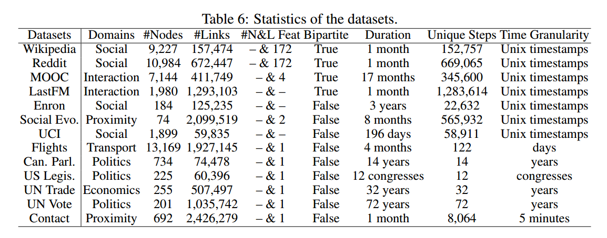

# Problem Setup

> Towards Better Evaluation for Dynamic Link Prediction
> Towards Better Dynamic Graph Learning: New Architecture and Unified Library
> Parameter-free Dynamic Graph Embedding for Link Prediction
> Dynamic Group Link Prediction in Continuous-Time Interaction Network
> Co-Neighbor Encoding Schema: A Light-cost Structure Encoding Method for Dynamic Link Prediction

## 内插还是外延
外延

## 任务类型
未来的项目推荐任务
下一个交互预测任务

| 特点                 | 未来项目推荐任务                    | 下一次交互预测任务                   |
| -------------------- | ----------------------------------- | ------------------------------------ |
| **任务目标**         | 预测用户未来感兴趣的项目            | 预测用户或节点的下一次交互           |
| **数据特征**         | 用户-项目的历史交互数据（静态为主） | 用户行为或节点交互的时序数据（动态） |
| **时间维度的关注点** | 可能涉及时间，但不是核心特征        | 时间是核心特征，需要建模时序性       |
| **用户行为模式**     | 长期偏好建模                        | 短期行为链条的预测                   |
| **示例数据集**       | Amazon (Video, Game), MovieLens     | Wikipedia, Last.fm                   |
| **应用场景**         | 商品推荐、电影推荐                  | 动态网络建模、用户行为预测           |

## 任务描述
下面列出了可选做的任务类型

### 1. 推荐系统
简述：**给定先前图的全部信息 \( \to \) 预测下一步的链接变化（传导设置）**，具体来说：
- 划分离散时间规则
  - 将时间等间隔划分为\( t_0=0, t_1, t_2, t_3...t_n \)，并对第n段时间\( t_{n-1} \le t < t_n \)标注为\( t=n \)
  - 在时间\( t_{n-1} \le t < t_n \)内产生的链接视为在\( t=n \)产生的链接
- 给定图\( G \)从\( [0,t) \)的全部信息，按需要可以给连续或离散时间上的信息
  - 输入图：连续数据集，数据以\( (u, v, t), t \le T \in \mathbb{R} \)的指定了发生时间\( t \)和交互的节点对\( (u,v) \)格式输入
  - 离散：按上述规则生成等距离散时间上的图数据\( G_{t=0}, G_{t=1}, G_{t=2}, G_{t=3}... G_{t=n} \)
  - 连续：直接输入\( (u, v, t), t \le T \in \mathbb{R} \)格式的数据
- 预测\( G_{t=n+1} \)中链接的变化（无节点变化）
  > 注：如果给定区间\( [0,t) \)内的全部图信息，预测时间\( t \)的链接情况，考虑到模型可能难以区分\( t \)和\( t+\delta \)（对足够小的\( \delta \)），故设定一个合理的时间区间长度的阈值\( \Delta \)，并认为预测时间\( t_{prev} \)和事件的发生时间\( t_{event} \)满足\( t_{prev}-t_{event} < \Delta \)算作预测正确。这种设定等效于预测下一步\( t_{n+1} \)，其中\( t_{i+1}-t_{i} = \Delta \)

#### 新节点（进一步的任务）
简述：**根据先前完整图的训练和少量新节点的数据预测新节点在下一步的链接情况（归纳设置）**，具体来说：
- 给定图\( G \)从\( [0,t) \)的全部信息（此时图中不包含新节点），新节点在时间\( t \)加入图，给定图\( G \)从\( [t, t+\Delta), \Delta<<t \)
- 预测图在\( t+\Delta \)时刻中链接的变化（尤其是关于加入的新节点的链接）

> 上述两种任务训练只进行下一步预测
> 对于\( G_{t=n+2} \)等两步以后的预测，将第一步预测作为已知加到模型中，进行对已知\( 0 < t \le n+1 \)预测\( t=n+2 \)的任务
> 对于新节点预测，若是没有历史记录的纯新节点，则模型只能根据节点特征向量预测，和上述训练的基于网络拓扑的模型关联不大

### 2. 下一次交互时间预测
简述：**给定先前图的全部信息 \( \to \) 预测下一个链接变化的时间和发生连接变化的节点对**，具体来说：
- 给定图\( G \)和连续时间上的交互时间戳\( (u, v, t) (0 < t \le T)\)
- 预测\( t > T\)开始的第一次交互的连续时间戳\( t_{pred} \)和交互的节点对\( (u, v) \)（无节点变化）
- 设定阈值\( \sigma \)，当事件发生时间\( t_{event} \)满足\( |t_{pred}-t_{event}| < \sigma \)认为预测正确

> 注：上述两个问题可能是十分不同的方法

### 3. 可扩展性
可能的方法：
- 给定固定时间窗口\( t_{window} \)，在预测\( t=n \)时，给模型输入\( [t_n-t_{window}, t_n] \)的数据
- 对于空间窗口，HLGNN可以处理很长的链接，但若出现计算量过大的问题，可以考虑对每个节点只考虑k步以内链接的办法
- 这样将每个节点需要的节点量限制在\( t_{window} * k \)

## 动态图数据的要求
- 表示方式
  - 链接改变事件和连续时间戳（DyGLib使用的方法）
    \( (u, v, t) (0 < t \le T)\)
  - 等距离散时间点上的快照
    将时间等间隔划分为\( t_0=0, t_1, t_2, t_3...t_n \)，在每个离散时间上有图\( G_{t=0}, G_{t=1}, G_{t=2}, G_{t=3}... G_{t=n} \)
  - 对于“推荐系统”任务，可按需使用两种之一的数据
  - 对于“下一次交互时间预测”任务，使用“链接改变事件和连续时间戳”的方法
- 节点特征
  - 有无均可
  - 节点特征在启发式传播信息时会一起带上
- 边特征
  - 对于边的权重，在启发式传播信息时会一起带上
  - 对于边的属性，可以考虑1.不考虑 2.生成属性的嵌入向量 3.one hot向量（推测）
- 有/无向图
  - 有无均可
  - 启发式应该没要求边是否双向

## 数据集

| **数据集**                   | **适用场景**                                   | **适合任务**                             |
| ---------------------------- | ---------------------------------------------- | ---------------------------------------- |
| **AmazonGame**               | 在线购物，用户对游戏商品的动态交互             | 游戏推荐、用户兴趣建模、商品关系预测     |
| **AmazonVideo**              | 在线购物，用户对视频商品的动态交互             | 视频推荐、用户偏好建模                   |
| **CanParl**                  | 加拿大议员动态政治网络，基于共同投票的互动     | 政治互动预测、议员关系分析、投票行为建模 |
| **CiaoDVD**                  | 用户对DVD商品的评分网络                        | 用户-商品推荐、评分预测                  |
| **Contact**                  | 大学生间物理接触的动态网络，描述接触时间和强度 | 传播路径分析、接触强度预测、疫情传播建模 |
| **Enron**                    | Enron公司内部员工邮件通信网络                  | 邮件互动预测、社交网络建模               |
| **SocialEvo**                | 大学生手机接触网络，描述人际互动               | 人际关系预测、传播路径分析               |
| **Flights**                  | 航空网络，描述机场之间的动态航班关系           | 航班流量预测、机场枢纽分析、交通网络优化 |
| **LastFM**                   | 用户与歌曲的动态收听关系                       | 音乐推荐、用户兴趣建模                   |
| **USLegis**                  | 美国参议院的联合提案图，描述议员间的合作关系   | 政治互动预测、议员社交关系建模           |
| **MOOC**                     | 在线学习平台，学生与课程内容的动态交互         | 学生行为建模、课程推荐、学习路径优化     |
| **MovieLens-1M (ML-1M)**     | 用户对电影的评分网络，包含约 100 万条评分      | 电影推荐、用户偏好分析                   |
| **MovieLens-100K (ML-100K)** | 用户对电影的评分网络，包含约 10 万条评分       | 电影推荐、用户兴趣预测                   |
| **MovieLens-25M (ML25M)**    | 用户对电影的评分网络，包含约 2500 万条评分     | 大规模电影推荐、复杂用户兴趣建模         |
| **Reddit**                   | 用户与帖子之间的动态交互网络，基于发布行为     | 用户兴趣分析、社交动态建模               |
| **UNTrade**                  | 国家间的动态农产品贸易网络，基于进出口数据     | 贸易关系预测、国际合作分析               |
| **UCI**                      | 加州大学学生之间的在线通信网络                 | 学生社交网络建模、通信关系预测           |
| **UNVote**                   | 联合国大会投票网络，描述国家间的合作关系       | 投票行为建模、国家联盟预测               |
| **Wikipedia**                | 编辑者与页面的动态交互网络                     | 用户兴趣建模、知识传播预测               |

### 划分数据集
通常的数据集划分方式为：
训练集\( [0,T_{train}) 80\% \), 
验证集\( [T_{train},T_{val}) 10\% \), 
测试集\( [T_{val},T]10\% \)

> 可能存在的问题：
> 验证集紧挨着训练集，因此验证的是短时预测性能，而测试集远离训练集，测试的是长时预测性能
> 
> 可以考虑的解决办法（推测）：
> 1. 设定\( t_1=T/10 \) 按上述划分方式划分\( [0,t_1] \)
> 2. 设定\( t_2=2*T/10 \) 按上述划分方式划分\( [0,t_2] \)
> 3. 依此类推划分

## 基线方法

| **方法**                  | **基于**                  | **主要特点**                                                                         | **适用任务类型**                         |
| ------------------------- | ------------------------- | ------------------------------------------------------------------------------------ | ---------------------------------------- |
| **JODIE**                 | RNN-based                 | 使用耦合的RNN更新用户和物品状态，结合投影操作学习未来表示轨迹。                      | 动态双向图用户-物品交互建模              |
| **DyRep**                 | RNN-based                 | 自定义RNN结合时间注意力机制，捕捉动态图中节点的时间演化信息。                        | 时间敏感动态图链接预测和结构变化建模     |
| **TGAT**                  | Transformer-based         | 自注意力机制结合时间编码函数，捕捉节点时间-拓扑邻居特征。                            | 动态图节点表示生成，时间模式学习         |
| **TGN**                   | Memory-based              | 动态记忆模块结合消息函数和聚合器，捕捉长期依赖，生成时间嵌入。                       | 动态图节点表示学习与链接预测             |
| **CAWN**                  | 因果匿名游走              | 通过因果匿名游走探索网络动态，结合RNN编码游走信息生成节点表示。                      | 动态网络因果关系建模                     |
| **EdgeBank**              | Memory-based              | 无需训练，基于记忆单元存储和更新边信息，根据边保留与否决定预测结果。                 | 无需训练的动态链接预测                   |
| **TCL**                   | Transformer-based         | 基于广度优先搜索生成交互序列，使用图Transformer结合时间和拓扑信息学习节点表示。      | 跨时间复杂交互建模与动态图预测           |
| **GraphMixer**            | Fixed Time Encoding       | 结合固定时间编码和MLP-Mixer链接编码器，生成节点表示。                                | 适合固定时间间隔交互的动态图分析         |
| **DyGFormer**             | Transformer-based         | 基于Transformer和邻居共现编码，探索节点交互序列关联性并捕捉复杂时间模式。            | 动态链接预测，跨时间复杂交互建模         |
| **NAT**                   | 字典式邻居表示法          | 使用字典式邻居聚合时序信息，结合RFF时间嵌入递归学习节点表示，降低计算成本。          | 动态图节点表示学习                       |
| **LightGCN**              | GNN-based                 | 静态图表示学习方法，结合轻量化聚合策略，适用于推荐任务。                             | 静态图的未来物品推荐                     |
| **TimeLSTM**              | RNN-based                 | 使用时间感知机制结合LSTM，捕捉时间动态和序列依赖性。                                 | 动态图的未来物品推荐和下一次交互预测     |
| **RRN**                   | RNN-based                 | 使用递归神经网络建模时间依赖性，捕捉动态图交互特征。                                 | 动态图的未来物品推荐和下一次交互预测     |
| **DeepCoevolve**          | RNN-based                 | 模拟用户和物品的联合演化过程，结合时间建模动态交互。                                 | 动态图的未来物品推荐和下一次交互预测     |
| **CoPE**                  | TPP-based                 | 时间点过程建模动态交互，结合时间强度函数捕捉时间和节点关系。                         | 动态图的未来物品推荐和下一次交互预测     |
| **LatentCross**           | RNN-based                 | 利用潜在交叉表示捕捉动态图中节点间的关系。                                           | 动态图的下一次交互预测                   |
| **CTDNE**                 | TPP-based                 | 基于时间点的深度网络嵌入，捕捉时间依赖性和邻居关系。                                 | 动态图的下一次交互预测                   |
| **AA (Adamic-Adar)**      | Heuristic-based           | 通过计算节点间重叠邻域的相关系数衡量相似性。                                         | 启发式动态图链接预测                     |
| **CN (Common Neighbors)** | Heuristic-based           | 通过公共邻居数量衡量节点间相似性，用于链接预测。                                     | 启发式动态图链接预测                     |
| **DeepWalk**              | Embedding-based           | 使用随机游走生成节点嵌入，捕捉图的全局结构特征。                                     | 静态图和动态图的节点表示生成             |
| **node2vec**              | Embedding-based           | 结合有偏随机游走学习节点嵌入，兼顾局部和全局结构特性。                               | 静态图和动态图的节点表示生成             |
| **HTNE**                  | Embedding-based           | 融合霍克斯过程和注意力机制，学习时间相关的节点表示。                                 | 动态图的时间依赖性建模                   |
| **DyGFormer**             | Transformer-based         | 通过邻居共现编码和补丁技术捕捉节点关联性和长期时间依赖，简化历史交互学习过程         | 动态链接预测和动态节点分类               |
| **CNE-N**                 | Hashtable-based           | 采用哈希表压缩邻接矩阵，利用并行计算生成共邻居编码，支持长短期结构编码。             | 动态链接预测                             |
| **FreeGEM**               | Embedding-based, 参数无关 | 采用增量图嵌入引擎和个性化动态交互模式建模，无需时间消耗的参数学习，并集成属性信息。 | 链接预测（未来项目推荐、下一个交互预测） |
| **CTGNN**                 | GNN-based                 | 采用连续时间邻居采样策略，通过偏置聚合函数学习个体的潜在表示，捕捉细粒度时间信息。   | 连续时间组链接预测                       |

## 训练流程
可以使用DyGLib

## 指标
现有文献将动态链接预测任务建模为二元分类问题。因此，为了评估不同方法的性能，更鼓励使用基于阈值曲线的指标，例如 ROC 曲线下面积 (AU-ROC) 和平均精度 (AP) 

其他性能指标（如准确度、准确率、召回率或 F1 分数）需要适当的置信度阈值来进行决策。由于阈值的确切值在文献中通常定义不明确，因此利用这些指标会导致不同方法之间的不公平比较