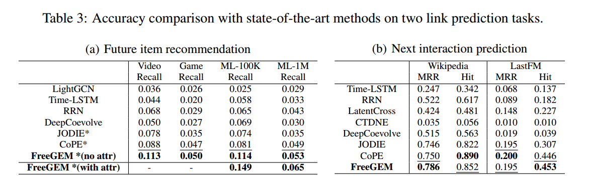
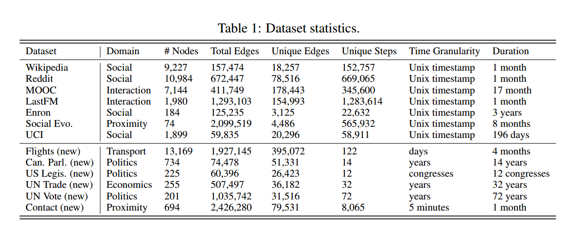
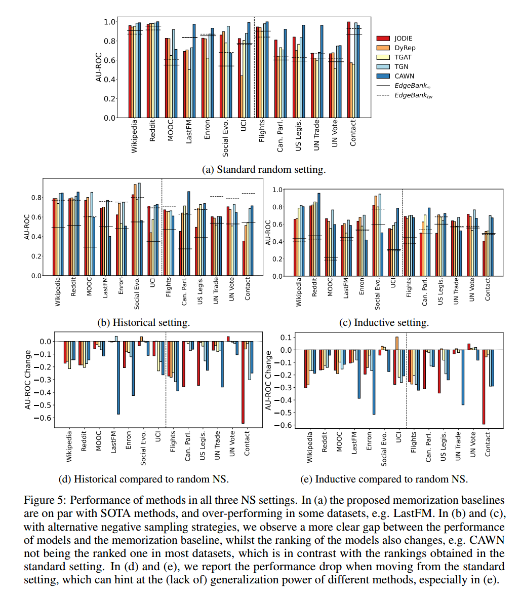
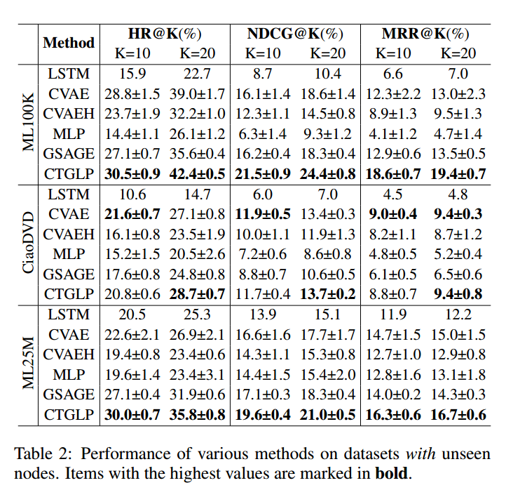
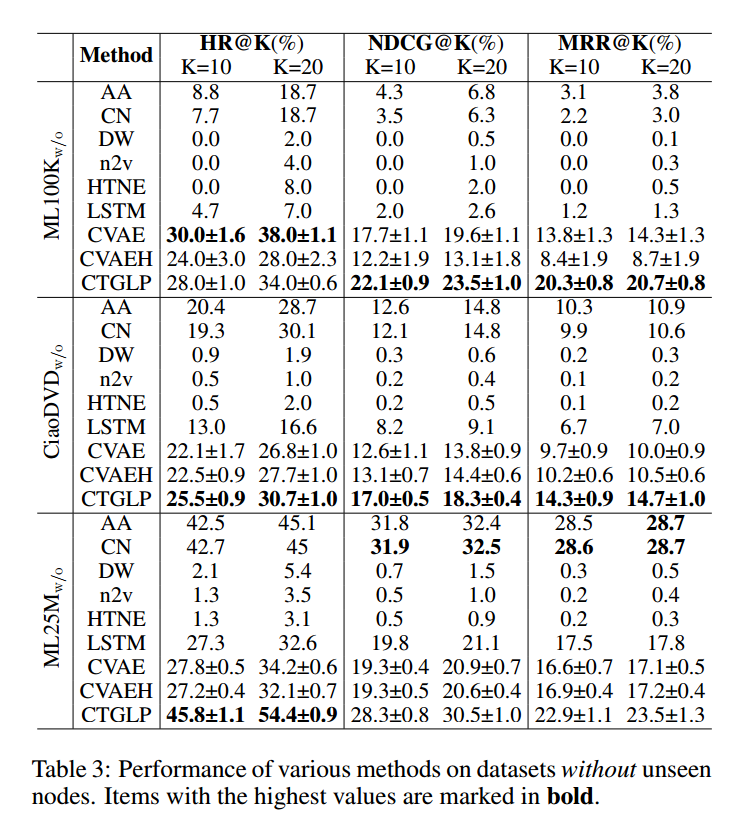
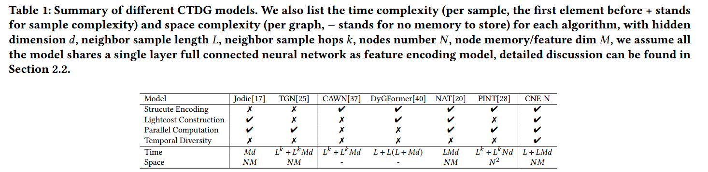
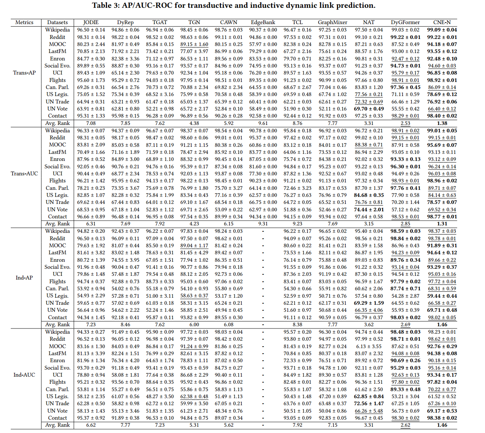
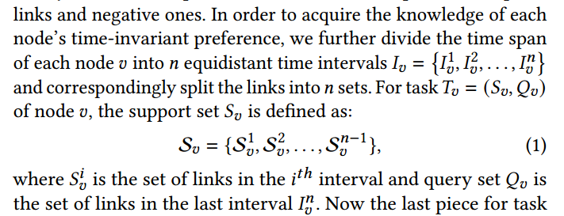

# 信息收集

## Parameter-free Dynamic Graph Embedding for Link Prediction

> NeurIPS 2022

- 任务类型
  - [未来项目推荐任务和下一次交互预测任务](未来项目推荐任务和下一次交互预测任务.md)
  - 外延
- 数据集
  - 对于未来的项目推荐任务，我们使用 Amazon Video、Amazon Game、MovieLens-1M (ML-1M) 和 MovieLens-100K (ML-100K)
  - 对于下一个交互预测任务，我们使用 Wikipedia 和 LastFM 
  - 对于所有数据集，我们使用前 80% 交互作为训练集，接下来的 10% 交互作为验证集，最后 10% 交互作为测试集
- 指标
  - 对于未来项目推荐任务，我们使用 Recall@10 来评估模型
  - 对于下一个交互预测任务，我们使用 MRR 和 Hit@10 来评估模型
  - 对于所有实验，当模型在验证集上达到最优结果时，我们会报告测试集上的结果
- 基线
  - 对于未来项目推荐任务，我们与 LightGCN [10]、TimeLSTM [40]、RRN [32]、DeepCoevolve [6]、JODIE [14] 和 CoPE [37] 进行了比较
  - 对于下一次交互预测任务，我们与 Time-LSTM [40]、RRN [32]、LatentCross [1]、CTDNE [17]、DeepCoevolve [6]、JODIE [14] 和 CoPE [37] 进行了比较
  - 在所有基线中，LightGCN [10] 是唯一用于推荐任务的静态图表示学习方法。这些基线包括基于 TPP、基于 RNN 和基于 GNN 的方法
  - 

## Towards Better Evaluation for Dynamic Link Prediction

> NeurIPS 2022
> our code repository is available at https://github.com/fpour/DGB.git
> All datasets can be accessed at https://zenodo.org/record/7008205#.Yv_a_3bMJPZ

- 任务类型
  - 外延
- 
  - [对不同数据集的描述](数据集描述.md)
  - 对数据集的指标
    - 新颖性、重现性和意外指数
- 动态图可视化技术（即 TEA 和 TET 图）
  - [TEA图和TET图的区别](TEA图和TET图的区别.md)
- 基线
  - EdgeBank（本文提出的纯依靠记忆的方法）
  - JODIE DyRep TGAT TGN CAWN（下述论文方法）
  - S. Kumar, X. Zhang, and J. Leskovec. Predicting dynamic embedding trajectory in temporal interaction networks. In Proceedings of the 25th ACM SIGKDD International Conference on Knowledge Discovery & Data Mining, 2019.
  - R. Trivedi, M. Farajtabar, P. Biswal, and H. Zha. Dyrep: Learning representations over dynamic graphs. In International conference on learning representations, 2019.
  - Y. Wang, Y.-Y. Chang, Y. Liu, J. Leskovec, and P. Li. Inductive representation learning in temporal networks via causal anonymous walks. In International Conference on Learning Representations, 2020.
  - E. Rossi, B. Chamberlain, F. Frasca, D. Eynard, F. Monti, and M. Bronstein. Temporal graph networks for deep learning on dynamic graphs. arXiv preprint arXiv:2006.10637, 2020.
  - D. Xu, C. Ruan, E. Korpeoglu, S. Kumar, and K. Achan. Inductive representation learning on temporal graphs. arXiv preprint arXiv:2002.07962, 2020.
  - 
- 新的负边采样方法
  - 历史负采样
  - 归纳负采样
  - [两种方法的特点](历史负采样和归纳负采样的特点.md)

## Dynamic Group Link Prediction in Continuous-Time Interaction Network

> IJCAI 2023

- 任务类型
  - 外延
- 数据集
  - MovieLens-100K（简称 ML100K）
  - MovieLens-25M（简称 ML25M）包含用户对电影的评分数据
  - CiaoDVD 包含 DVD 评分数据
- 指标
  - 命中率@K、归一化折扣累积增益@K和平均倒数排名@K（分别表示为HR@K、NDCG@K和MRR@K）
  - HR@K衡量找到目标的能力并强调预测的准确性
  - NDCG@K和MRR@K衡量对目标进行排序的能力并强调目标的排序
- 基线
    | **方法类别**       | **方法名称**      | **特点**                                                                               |
    | ------------------ | ----------------- | -------------------------------------------------------------------------------------- |
    | **组链接预测方法** | LSTM              | 使用LSTM结合组的历史信息，输出链接概率。                                               |
    |                    | CVAE              | 基于CVAE，通过向量表示整个组和已知成员重构组的成员关系。                               |
    |                    | CVAEH             | 在CVAE基础上增加历史信息向量，用于更精确地预测。                                       |
    | **神经网络方法**   | MLP               | 使用小批量梯度下降策略更新模型参数。                                                   |
    |                    | GraphSAGE (GSAGE) | 基于多层聚合函数学习节点表示，生成组向量用于预测。                                     |
    | **启发式方法**     | AA                | 基于重叠邻居的相关系数衡量节点间相似性，高相似性节点更可能链接到组。                   |
    |                    | CN                | 基于共同邻居数量衡量节点相似性，高相似性节点更可能链接到组。                           |
    | **网络嵌入方法**   | DeepWalk (DW)     | 使用随机游走生成节点向量表示。                                                         |
    |                    | node2vec (n2v)    | 使用有偏随机游走学习节点表示。                                                         |
    |                    | HTNE              | 结合Hawkes过程和注意力机制学习节点的时间相关表示，通过聚合个体间相似性获得组链接分数。 |

    - 
    - 

## Co-Neighbor Encoding Schema: A Light-cost Structure Encoding Method for Dynamic Link Prediction

> KDD 2024
> https://github.com/ckpassenger/DyGLib_CNEN/tree/CNEN

- 基线方法
  - 
  - 两个基于记忆的模型，JODIE[17] 和 DyRep[16]
  - 两个基于图卷积的模型，TGAT[37] 和 TGN[25]
  - 四个基于序列的模型，EdgeBank[22]、TCL[35]、GraphMixer[9] 和 DyGFormer[40]
  - 两个基于结构编码的模型，NAT 和 CAWN[36]
  - Le Yu, Leilei Sun, Bowen Du, and Weifeng Lv. 2023. Towards Better Dynamic Graph Learning: New Architecture and Unified Library. arXiv preprint
arXiv:2303.13047 (2023).
- 数据集
  - Wikipedia、Reddit、MOOC、LastFM、Enron、Social Evo.、UCI、Flights、Can. Parl.、US Legis.、UN Trade、UN Vote 和 Contact
  - 这些数据集由 Edgebank 收集
- [TransductiveSetting和InductiveSetting的区别](TransductiveSetting和InductiveSetting的区别.md)
- 指标
  - 平均精度 (AP) 和接收者操作特征曲线下面积 (AUC-ROC) 
  - 

## Towards Better Dynamic Graph Learning: New Architecture and Unified Library

> NeurIPS 2023
> https://github.com/yule-BUAA/DyGLib.

- 统一的连续时间动态图学习库 (DyGLib)
- 基线方法
  - [基线方法列表](extracted_references.txt)
  - JODIE [28], DyRep [55], TGAT [64], TGN [45], CAWN [60], EdgeBank [44], TCL [57], and GraphMixer [12].
- 数据集
  - Wikipedia, Reddit, MOOC, LastFM, Enron, Social Evo., UCI, Flights, Can. Parl., US Legis., UN Trade, UN Vote, and Contact
- 可以基于论文给出的方法编写

---

其他文章使用的基线方法
AA; CAWN; CN; CTDNE; CVAE; CVAEH; CoPE; DW; DeepCoevolve; DeepWalk; DyGFormer; DyRep; EdgeBank; GraphMixer; GraphSAGE; HTNE; JODIE; LatentCross; LightGCN; MLP; NAT; RRN; TCL; TGAT; TGN; TimeLSTM;
其他文章的方法
CNE-N; CTGLP; CTGNN; DyGFormer; FreeGEM;

数据集
AmazonGame; AmazonVideo; CanParl; CiaoDVD; Contact; Enron; SocialEvo; Flights; LastFM; USLegis; MOOC; MovieLens-1M (ML-1M); MovieLens-100K (ML-100K); MovieLens-25M (ML25M); Reddit; UNTrade; UCI; UNVote; Wikipedia;

动态链接预测任务
某条边是否形成/消失预测
边形成时间点预测
下一次交互预测
新节点预测

长期链接预测
边的强度预测

---

其他文章怎么定义的问题

Nonparametric Link Prediction in Dynamic Networks 
- 0~T -> T+1
- 输入数据集和处理过程有离散时间步

Few-shot Link Prediction in Dynamic Networks
- 把时间分成有离散时间步的段
- 

A Deep Learning Approach to Link Prediction in Dynamic Networks
- 1~T -> T+1