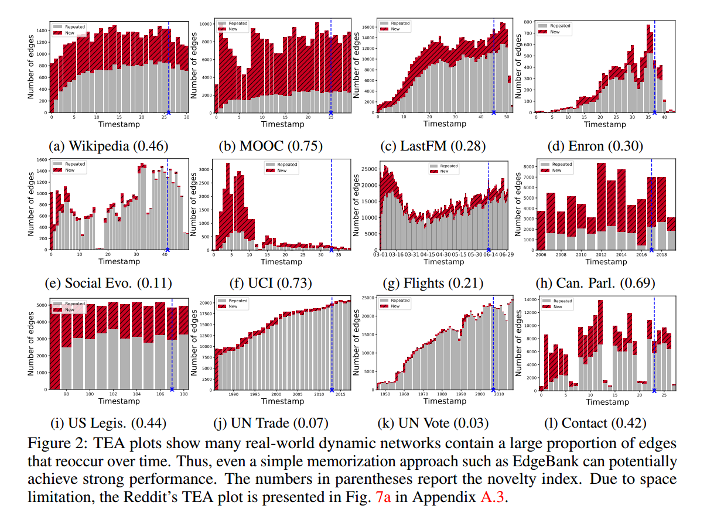

• Wikipedia [18]: consists of edits on Wikipedia pages over one month. Editors and Wiki pages
are modelled as nodes, and the timestamped posting requests are edges. Edge features are LIWCfeature vectors [27] of edit texts with a length of 172.
• Reddit [18]: models subreddits’ posted spanning one month, where the nodes are users or posts
and the edges are the timestamped posting requests. Edge features are LIWC-feature vectors [27]
of edit texts with a length of 172.
• MOOC [18]: is a student interaction network formed from online course content units such as
problem sets and videos. Each edge is a student accessing a content unit and has 4 features.
• LastFM [18]: is an interaction network where users and songs are nodes and each edge represents
a user-listens-to-song relation. The dataset consists of the relations of 1000 users listening to the
1000 most listened songs over a period of one month. The dataset contains no attributes.
• Enron [34]: is an email correspondence dataset containing around 50K emails exchanged among
employees of the ENRON energy company over a three-year period. This dataset has no attributes.
• Social Evo. [24]: is a mobile phone proximity network which tracks the everyday life of a whole
undergraduate dormitory from October 2008 to May 2009. Each edge has 2 features.
• UCI [26]: is a Facebook-like, unattributed online communication network among students of the
University of California at Irvine, along with timestamps with the temporal granularity of seconds.
• Flights (new) [31]: is a directed dynamic flight network illustrating the development of the air
traffic during the COVID-19 pandemic. It was extracted and cleaned for the purpose of this study.
Each node represents an airport and each edge is a tracked flight. The edge weights specify the
number of flights between two given airports in a day.
• Can. Parl. (new) [13]: is a dynamic political network documenting the interactions between
Canadian Members of Parliaments (MPs) from 2006 to 2019. Each node is one MP representing
an electoral district and each edge is formed when two MPs both voted "yes" on a bill. The edge
weights specify the number of times that one MP voted "yes" for another MP in a year.
• US Legis. (new) [7, 13]: is a senate co-sponsorship graph which documents social interactions
between legislators from the US Senate. The edge weights specify the number of times two
congress persons have co-sponsored a bill in a given congress.
• UN Trade (new) [23]: is a weighted, directed, food and agriculture trading graph between 181
nations and spanning over 30 years. The edge weights specify the total sum of normalized
agriculture import or export values between two countries.
• UN Vote (new) [39]: is a dataset of roll-call votes in the United Nations General Assembly from
1946 to 2020. If two nations both voted "yes" for an item, then the edge weight between them is
incremented by one.
• Contact (new) [30]: is a dataset describing the temporal evolution of the physical proximity around
700 university students over a period of four weeks. Each participant is assigned an unique ID and
edges between users indicate that they are within close proximity of each other. The edge weights
indicate the physical proximity between participants.

