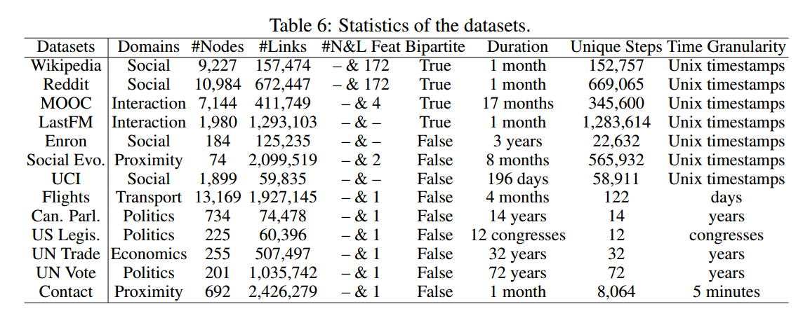
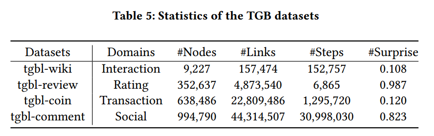
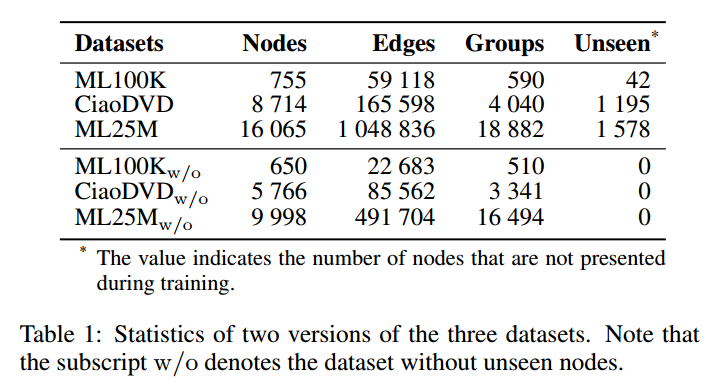

### 数据集特点与任务适用性表

| **数据集**                   | **适用场景**                                   | **适合任务**                             |
| ---------------------------- | ---------------------------------------------- | ---------------------------------------- |
| **AmazonGame**               | 在线购物，用户对游戏商品的动态交互             | 游戏推荐、用户兴趣建模、商品关系预测     |
| **AmazonVideo**              | 在线购物，用户对视频商品的动态交互             | 视频推荐、用户偏好建模                   |
| **CanParl**                  | 加拿大议员动态政治网络，基于共同投票的互动     | 政治互动预测、议员关系分析、投票行为建模 |
| **CiaoDVD**                  | 用户对DVD商品的评分网络                        | 用户-商品推荐、评分预测                  |
| **Contact**                  | 大学生间物理接触的动态网络，描述接触时间和强度 | 传播路径分析、接触强度预测、疫情传播建模 |
| **Enron**                    | Enron公司内部员工邮件通信网络                  | 邮件互动预测、社交网络建模               |
| **SocialEvo**                | 大学生手机接触网络，描述人际互动               | 人际关系预测、传播路径分析               |
| **Flights**                  | 航空网络，描述机场之间的动态航班关系           | 航班流量预测、机场枢纽分析、交通网络优化 |
| **LastFM**                   | 用户与歌曲的动态收听关系                       | 音乐推荐、用户兴趣建模                   |
| **USLegis**                  | 美国参议院的联合提案图，描述议员间的合作关系   | 政治互动预测、议员社交关系建模           |
| **MOOC**                     | 在线学习平台，学生与课程内容的动态交互         | 学生行为建模、课程推荐、学习路径优化     |
| **MovieLens-1M (ML-1M)**     | 用户对电影的评分网络，包含约 100 万条评分      | 电影推荐、用户偏好分析                   |
| **MovieLens-100K (ML-100K)** | 用户对电影的评分网络，包含约 10 万条评分       | 电影推荐、用户兴趣预测                   |
| **MovieLens-25M (ML25M)**    | 用户对电影的评分网络，包含约 2500 万条评分     | 大规模电影推荐、复杂用户兴趣建模         |
| **Reddit**                   | 用户与帖子之间的动态交互网络，基于发布行为     | 用户兴趣分析、社交动态建模               |
| **UNTrade**                  | 国家间的动态农产品贸易网络，基于进出口数据     | 贸易关系预测、国际合作分析               |
| **UCI**                      | 加州大学学生之间的在线通信网络                 | 学生社交网络建模、通信关系预测           |
| **UNVote**                   | 联合国大会投票网络，描述国家间的合作关系       | 投票行为建模、国家联盟预测               |
| **Wikipedia**                | 编辑者与页面的动态交互网络                     | 用户兴趣建模、知识传播预测               |

### 分类与详细说明

#### **1. 用户-内容交互场景**
这些数据集关注用户与内容（商品、电影、音乐、课程等）的动态交互，适用于推荐系统和用户兴趣分析任务。
- **代表数据集**：AmazonGame、AmazonVideo、CiaoDVD、MovieLens-1M、MovieLens-100K、MovieLens-25M、LastFM、MOOC。

#### **2. 社交互动场景**
这些数据集描述人际间的交互，适用于社交关系建模和传播路径分析。
- **代表数据集**：Contact、SocialEvo、UCI、Reddit。

#### **3. 政治与立法场景**
这些数据集专注于议会、投票等政治互动场景，适用于政治关系预测和投票行为建模。
- **代表数据集**：CanParl、USLegis、UNVote。

#### **4. 商业与通信场景**
这些数据集描述企业或国家间的动态交互，适用于贸易关系预测或通信行为建模。
- **代表数据集**：Enron、UNTrade。

#### **5. 交通与物流场景**
这些数据集关注动态交通网络，适用于流量预测与优化任务。
- **代表数据集**：Flights。

#### **6. 知识传播与编辑场景**
这些数据集涉及用户对知识或内容的编辑与传播，适用于知识传播建模与分析。
- **代表数据集**：Wikipedia。

---

| **数据集**      | **领域** | **节点数量** | **边数量** | **特征维度**     | **双向图** | **时间跨度** | **时间粒度** |
| --------------- | -------- | ------------ | ---------- | ---------------- | ---------- | ------------ | ------------ |
| **Wikipedia**   | 社交     | 9,227        | 157,474    | 边特征：172维    | 是         | 1个月        | Unix时间戳   |
| **Reddit**      | 社交     | 10,984       | 672,447    | 边特征：172维    | 是         | 1个月        | Unix时间戳   |
| **MOOC**        | 交互     | 7,144        | 411,749    | 边特征：4维      | 是         | 17个月       | Unix时间戳   |
| **LastFM**      | 交互     | 1,980        | 1,293,103  | 无特征           | 是         | 1个月        | Unix时间戳   |
| **Enron**       | 社交     | 184          | 125,235    | 无特征           | 否         | 3年          | Unix时间戳   |
| **Social Evo.** | 物理接触 | 74           | 2,099,519  | 边特征：2维      | 否         | 8个月        | Unix时间戳   |
| **UCI**         | 社交     | 1,899        | 59,835     | 无特征           | 否         | 196天        | Unix时间戳   |
| **Flights**     | 运输     | 13,169       | 1,927,145  | 边权重：航班数量 | 否         | 4个月        | 天           |
| **Can. Parl.**  | 政治     | 734          | 74,478     | 边权重：投票次数 | 否         | 14年         | 年           |
| **US Legis.**   | 政治     | 225          | 60,396     | 边权重：提案次数 | 否         | 12届会议     | 届会议       |
| **UN Trade**    | 经济     | 255          | 507,497    | 边权重：贸易总额 | 否         | 32年         | 年           |
| **UN Vote**     | 政治     | 201          | 1,035,742  | 边权重：投票次数 | 否         | 72年         | 年           |
| **Contact**     | 物理接触 | 692          | 2,426,279  | 边权重：接触强度 | 否         | 1个月        | 5分钟        |

### 特点总结
1. **社交领域**：如Wikipedia、Reddit、UCI等，适合研究用户行为和社交关系。
2. **交互领域**：如MOOC、LastFM，专注于用户与内容的交互建模。
3. **政治领域**：如Can. Parl.、US Legis.、UN Vote，适用于议员合作或国家投票分析。
4. **经济与交通**：如UN Trade、Flights，分别适合贸易关系和交通网络建模。
5. **物理接触**：如Social Evo.、Contact，专注于物理接触和传播路径的研究。

