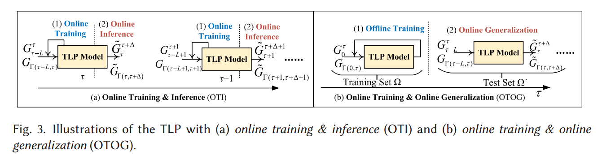
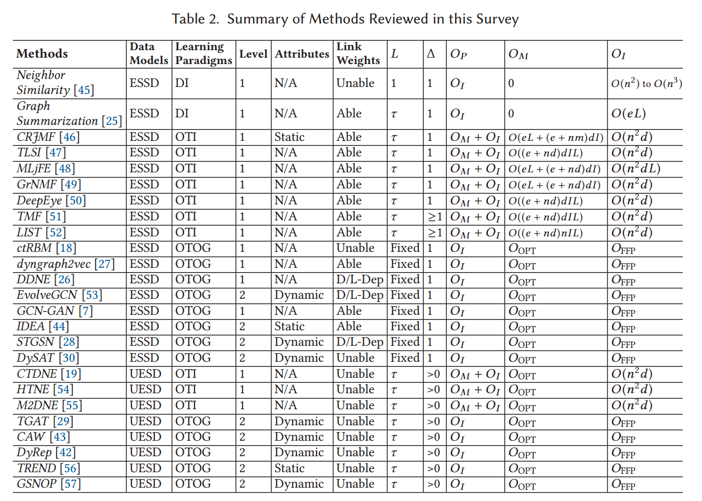
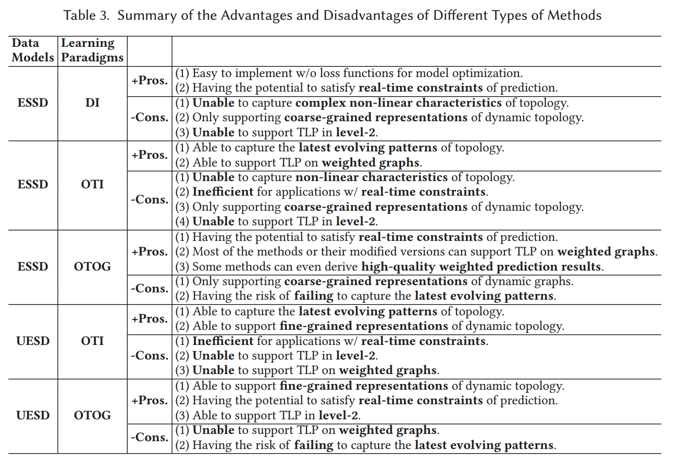
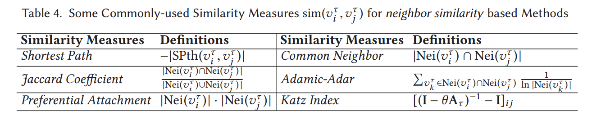
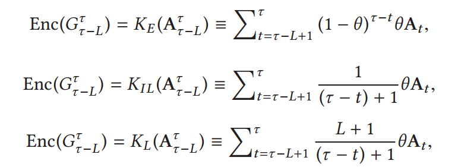

# Temporal Link Prediction: A Unified Framework, Taxonomy,and Review

> https://github.com/KuroginQin/OpenTLP
> 发表时间 2023-11

## 目录

**Temporal Link Prediction: A Unified Framework, Taxonomy, and Review**

1. **Introduction**  
   - 动态图的定义和应用场景  
   - 时序链接预测的挑战与意义  
   - 现有研究的不足和本文贡献  

2. **Problem Statements & Preliminaries**  
   - 数据模型：等间隔快照描述（ESSD）和非等间隔边序列描述（UESD）
   - 任务设置：Level-1（固定节点集）和 Level-2（可变节点集）  
     - 还划分了一阶预测和多阶预测（下一个时间或下多个时间）
   - 质量评估标准：准确率、AUC、加权图的特定指标  
   - 学习范式：直接推理（DI）、在线训练与推理（OTI）、离线训练与在线泛化（OTOG）  
   - 统一编码器-解码器框架  

3. **Review of Temporal Link Prediction Methods**  
   - **ESSD-Based Methods**  
     - DI方法（邻域相似性、图摘要）  
     - OTI方法（基于矩阵分解、时间平滑等）  
     - OTOG方法（图神经网络、动态嵌入等）  
   - **UESD-Based Methods**  
     - OTI方法（基于连续时间的推断模型）  
     - OTOG方法（结合动态演化和深度学习技术）  
   - 方法比较与总结  

4. **Advanced Topics and Future Directions**  
   - 高阶任务与复杂数据集  
   - 实时性与高效性优化  
   - 跨领域的应用与启发  

5. **Conclusion**  
   - 文章总结与对领域发展的展望  

---

## 论文内容

### 2.1 Data Models

**1. 等间隔快照描述（ESSD）**
**定义**：
- ESSD 将动态图表示为一系列按照固定时间间隔采样的静态图快照序列。
- 每个快照是一个独立的图，包含节点集合和边集合，用以描述某时间点的系统状态。

**表示形式**：
- 动态图表示为 \( G = (G_1, G_2, ..., G_T) \)，其中 \( G_t = (V_t, E_t) \)。  
  - \( V_t \)：节点集合，表示在时间 \( t \) 存在的节点。  
  - \( E_t \)：边集合，表示在时间 \( t \) 存在的链接。  
- 节点和边可以附加权重或属性。

**特点**：
1. **固定时间间隔**：
   - 快照之间的时间间隔是预先确定的（如 1 秒或 1 小时）。
2. **适用于粗粒度描述**：
   - 多用于研究变化较慢或低频率交互的系统。
3. **冗余数据**：
   - 在系统变化较快的情况下，可能需要较短的采样间隔，导致数据冗余和存储压力。

**典型应用**：
- 描述社交网络中的好友关系随时间的变化。
- 分析通信网络中特定时间段的流量。

**2. 非等间隔边序列描述（UESD）**
**定义**：
- UESD 将动态图表示为一个包含时间戳的边序列，捕捉每次交互的时间和强度，而不是基于固定间隔的快照。

**表示形式**：
- 动态图表示为 \( G_{\Gamma} = (V_{\Gamma}, E_{\Gamma}, \Gamma) \)，其中：  
  - \( \Gamma = \{t_1, t_2, ...\} \)：记录交互发生时间的集合，时间间隔不固定。  
  - \( V_{\Gamma} \)：节点集合，包含所有可能出现的节点。  
  - \( E_{\Gamma} = \{((v_i, v_j), w, t_e)\} \)：记录每条边 \( (v_i, v_j) \) 的权重 \( w \) 和时间 \( t_e \)。  

**特点**：
1. **不规则时间间隔**：
   - 每次交互记录一个边，采样时间由事件驱动而非固定设定。
2. **精细粒度描述**：
   - 对于快速变化的系统（如即时通信网络），提供高效的描述。
3. **计算复杂性**：
   - 需要处理边的连续时间属性，导致传统基于矩阵的图算法难以直接应用。

**典型应用**：
- 描述即时通信网络中消息的发送时间及频率。
- 分析社交媒体中用户之间的互动序列。

**比较与适用场景**
| 特性             | ESSD                       | UESD                                     |
| ---------------- | -------------------------- | ---------------------------------------- |
| **时间间隔**     | 固定                       | 不固定                                   |
| **描述粒度**     | 粗粒度                     | 精细粒度                                 |
| **存储效率**     | 较低（可能含冗余）         | 较高（无冗余）                           |
| **适用场景**     | 变化缓慢的系统             | 快速变化或事件驱动的系统                 |
| **典型算法支持** | 矩阵分解、图嵌入等传统方法 | 基于时间序列的随机过程（如 Hawkes 过程） |

---

### 2.2 Task Settings

当前时间戳 $\tau$ 
考虑的历史时间步长数或历史时间间隔（窗口大小） $L$
未来时间步长数或用于预测的未来时间间隔 $\Delta$ 
$ \mathcal{U}^d_s = (\mathcal{U}_{s+1}, \mathcal{U}_{s+2}, ..., \mathcal{U}_{d}), \ G_{r-L}^{r}, \  \mathcal{A}_{r-L}^{r+\Delta}$ 同理
$ \Gamma(s,d) = \{t\ |\  s<t\le d\}$

1. **TLP Level-1**
- **假设**：节点集在所有时间步中都是已知且固定的，即随着拓扑结构的演化，节点集不会发生变化（没有节点的增加或删除）。
- **输入**：
  - 对于ESSD（均匀采样的快照序列描述），输入是前L个时间步的快照 \(G_{r-L}^{r}\) 和属性 \(\mathcal{A}_{r-L}^{r+\Delta}\)（如果可用）
  - 对于UESD（非均匀采样的边序列描述），输入是历史拓扑 \(G_{\Gamma(\tau-L,\tau)}\) 和属性 \(\mathcal{A}_{\Gamma(\tau-L,\tau+\Delta)}\)（如果可用）。
- **输出**：预测未来 \(\Delta\) 个时间步的拓扑结构 \(\tilde{G}_{r}^{r+\Delta}\) 或 \(\tilde{G}_{\Gamma(\tau,\tau+\Delta)}\)。

1. **TLP Level-2**
- **假设**：节点集可以是非固定的，并且可以随时间演化，允许节点的增加和删除。预测不仅包括由旧节点（即之前观察到的节点）引起的未来拓扑，还包括（i）旧节点与新节点之间的边，或（ii）两个新节点之间的边。
- **输入**：
  - 对于ESSD，输入是历史快照 \(G_{r-L}^{r}\)、未来 \(\Delta\) 个时间步的节点集 \(V_{r}^{r+\Delta}\) 和属性 \(\mathcal{A}_{r-L}^{r+\Delta}\)（如果可用）
  - 对于UESD，输入是历史拓扑 \(G_{\Gamma(\tau-L,\tau)}\)、未来节点集 \(V_{\Gamma(\tau,\tau+\Delta)}\) 和属性 \(\mathcal{A}_{\Gamma(\tau-L,\tau+\Delta)}\)（如果可用）。
- **输出**：预测由 \(V_{r}^{r+\Delta}\) 或 \(V_{\Gamma(\tau,\tau+\Delta)}\) 引起的未来拓扑结构 \(\tilde{G}_{r}^{r+\Delta}\) 或 \(\tilde{G}_{\Gamma(\tau,\tau+\Delta)}\)。

**其他相关设置**
- **Transductive vs. Inductive**：
  - Transductive设置仅考虑由旧节点引起的边的预测
  - Inductive设置考虑旧节点与新节点之间或两个新节点之间的边的预测。
- **One-step vs. Multi-step Prediction**：对于ESSD，\(\Delta = 1\) 和 \(\Delta > 1\) 分别定义为**一步预测**和**多步预测**。大多数相关方法专注于一步预测。

---

### 2.3 Quality Evaluation

#### **1. 无权图的评估标准**
无权图的预测任务是判断未来某时间步中任意两个节点之间是否存在边，即一个 **二分类问题**。

**常用评估标准**：
1. **准确率（Accuracy）**：
   - 衡量预测边的整体正确率，适合当正负样本分布均衡时使用。
   - 计算公式：  
     \[
     \text{Accuracy} = \frac{\text{TP + TN}}{\text{TP + TN + FP + FN}}
     \]  
     其中，TP 为真正例数，TN 为真负例数，FP 和 FN 分别为假正例和假负例数。

2. **F1分数（F1-Score）**：
   - 综合考虑精确率（Precision）和召回率（Recall），适用于类别分布不平衡的情况。
   - 计算公式：  
     \[
     \text{F1} = 2 \cdot \frac{\text{Precision} \cdot \text{Recall}}{\text{Precision + Recall}}
     \]  
     其中，  
     \[
     \text{Precision} = \frac{\text{TP}}{\text{TP + FP}}, \quad
     \text{Recall} = \frac{\text{TP}}{\text{TP + FN}}
     \]

3. **ROC曲线（Receiver Operating Characteristic）及AUC值（Area Under Curve）**：
   - ROC曲线表示不同阈值下的真阳性率和假阳性率之间的关系，AUC为曲线下的面积。
   - AUC值越接近1，模型区分正负样本的能力越强。
   - 适用于需要综合评估不同阈值下模型性能的场景。

#### **2. 有权图的评估标准**
有权图的预测任务不仅需要判断边的存在性，还需预测边的权重，属于 **回归问题**。

**常用评估标准**：
1. **均方根误差（Root Mean Square Error, RMSE）**：
   - 测量预测值与真实值之间的偏差大小，较敏感于较大偏差。
   - 计算公式：  
     \[
     \text{RMSE} = \sqrt{\frac{1}{n} \sum_{i=1}^n (\hat{y}_i - y_i)^2}
     \]  
     其中，\(\hat{y}_i\) 为预测权重，\(y_i\) 为真实权重。

2. **平均绝对误差（Mean Absolute Error, MAE）**：
   - 衡量预测值与真实值之间的平均绝对差距，更注重预测值的整体准确性。
   - 计算公式：  
     \[
     \text{MAE} = \frac{1}{n} \sum_{i=1}^n |\hat{y}_i - y_i|
     \]

3. **平均对数尺度差异（Mean Logarithmic Scale Difference, MLSD）**：
   - 针对加权图提出的新指标，用于更准确地评估预测权重的质量。
   - 解决传统 RMSE 和 MAE 在捕捉加权图预测能力时的局限。
   - **定义**：
      MLSD 用于测量预测权重与真实权重之间的比例偏差，尤其关注在对数尺度上的相对误差。
   - **计算方法**：
      假设真实权重为 \(w_i\)，预测权重为 \(\hat{w}_i\)，MLSD 的计算公式为：
      \[
      \text{MLSD} = \frac{1}{n} \sum_{i=1}^n \left| \log\left(\frac{\hat{w}_i}{w_i}\right) \right|,
      \]
      其中 \(n\) 是边的总数。
   - **特点**：
      - 强调预测值与真实值之间的相对比例关系，而非绝对差异。
      - 对预测值较大的偏差（特别是数量级的错误）更加敏感。
      - 适用于有权图的场景，特别是当**权重值跨度较大时（例如从小数到大数级别的权重）**。
   - **适用场景**：
      适合评估权重预测的整体质量，尤其在权重值差异明显时。

4. **失配率（Mismatch Rate, MR）**：
   - 也是针对加权图提出的新指标，专注于评估预测结果中错误匹配的比例。
   - 适用于更加细粒度的权重误差分析。
   - **定义**：
   MR 用于量化预测结果中错误匹配的比例，特别关注预测结果中链接（边）的误分类。
   - **计算方法**：
   假设真实边集合为 \(E\)，预测边集合为 \(\hat{E}\)，MR 的计算公式为：
   \[
   \text{MR} = \frac{|E \oplus \hat{E}|}{|E \cup \hat{E}|},
   \]
   其中 \(E \oplus \hat{E}\) 表示真实边集合和预测边集合之间的对称差集（即错误预测的边数），\(|E \cup \hat{E}|\) 是两个集合的并集大小。
   - **特点**：
     - 直接衡量预测边的正确性和匹配程度。
     - 适用于评估整体预测质量，包括边的存在性和权重是否合理。
     - 更关注预测的**准确性**而非偏差大小。
   - **适用场景**：
   适合需要严格控制预测错误的场景，例如边的预测错误可能带来较大系统影响时（如网络路由规划）。

#### **3. 不同评估标准的适用条件**
| **评估标准**  | **适用场景**                                                                       |
| ------------- | ---------------------------------------------------------------------------------- |
| **Accuracy**  | 无权图；正负样本分布均衡的情况下；简单场景下的整体表现衡量。                       |
| **F1-Score**  | 无权图；正负样本分布不均衡，强调对稀有类别的预测性能时。                           |
| **ROC和AUC**  | 无权图；需要分析模型在不同阈值下的性能，尤其在分类任务需调节阈值时。               |
| **RMSE和MAE** | 有权图；预测权重的误差整体性或局部性分析，适合大多数有权回归任务。                 |
| **MLSD和MR**  | 有权图；需对加权图的高质量预测进行细粒度评估时，特别是边权重在任务中起重要作用时。 |

---

### 2.4 Learning Paradigms

1. **直接推理（Direct Inference, DI）**  
   - **概念**：直接从历史拓扑中提取手动设计的或启发式的特征，直接用于预测操作。该方法没有训练过程，因此没有模型参数需要优化。推理过程是通过手动设计的特征直接进行的。在新时间步到来时，重复推理过程以生成预测结果。
   - **优点**：实现简单，适用于对实时性有要求的系统，因为没有时间消耗的模型优化过程。
   - **缺点**：基于简单的启发式方法，无法捕捉动态拓扑的复杂和非线性特征。
   - **数学表示**：
     \[
     \hat{G}_{\tau + \Delta \tau} = f(\text{features extracted from } G_{\tau - L}^{\tau})
     \]
     其中，\( \hat{G}_{\tau + \Delta \tau} \) 表示对时间步 \( \tau + \Delta \tau \) 的预测结果，\( f \) 是手动设计的推理函数。

2. **在线训练与推理（Online Training & Inference, OTI）**  
   - **概念**：每个时间步都包括训练阶段和推理阶段。对于当前的时间步，首先根据历史拓扑和属性优化模型，然后进行推理操作。新时间步到来时，必须从头开始重新训练和推理。
   - **优点**：能够根据最新的动态拓扑信息优化模型，捕捉到最新的演化模式。
   - **缺点**：效率较低，尤其是在面对高复杂度的在线训练时，不适合实时性要求严格的系统。
   - **数学表示**：
      - 训练过程的公式为：
      \[
      \theta_{\tau} = \arg \min_{\theta} \mathcal{L}(G_{\tau - L}^{\tau}, A_{\tau - L}^{\tau}; \theta)
      \]
      其中，\( \theta_{\tau} \) 是当前时间步 \( \tau \) 的模型参数，\( \mathcal{L} \) 是损失函数，\( G_{\tau - L}^{\tau} \) 和 \( A_{\tau - L}^{\tau} \) 分别是当前时间步之前的拓扑和属性数据。推理过程为：
      \[
      \hat{G}_{\tau + \Delta \tau} = g(G_{\tau - L}^{\tau}, A_{\tau - L}^{\tau}; \theta_{\tau})
      \]
      其中，\( g \) 是推理函数，生成预测结果 \( \hat{G}_{\tau + \Delta \tau} \)。
      - 在新的时间步 \( \tau + 1 \) 到来时，需要重新进行训练和推理，即：
      \[
      \theta_{\tau + 1} = \arg \min_{\theta} \mathcal{L}(G_{\tau + 1 - L}^{\tau + 1}, A_{\tau + 1 - L}^{\tau + 1}; \theta)
      \]
      然后进行推理：
      \[
      \hat{G}_{\tau + 1 + \Delta \tau} = g(G_{\tau + 1 - L}^{\tau + 1}, A_{\tau + 1 - L}^{\tau + 1}; \theta_{\tau + 1})
      \]

3. **离线训练与在线泛化（Offline Training & Online Generalization, OTOG）**  
   - **概念**：将动态图的快照或边缘分为训练集和测试集，首先在训练集上进行离线训练，然后将训练好的模型直接泛化到测试集进行推理，不再进行额外的优化。
   - **优点**：离线训练过程可以在没有时间限制的情况下完成，推理过程只需通过在线泛化，因此具有较高的实时性。
   - **缺点**：可能无法及时捕捉到动态图的最新变化，尤其是在训练集和测试集差异较大时，泛化效果可能较差。
   - **数学表示**：
     先将动态图的快照或边缘分为训练集 \( \Omega \) 和测试集 \( \Omega' \)。在训练集 \( \Omega \) 上进行离线训练：
     \[
     \theta_{\text{offline}} = \arg \min_{\theta} \mathcal{L}(G_{\Omega}, A_{\Omega}; \theta)
     \]
     然后，将训练好的模型用于测试集 \( \Omega' \) 上进行在线泛化，而不再进行额外的优化：
     \[
     \hat{G}_{\tau + \Delta \tau} = g(G_{\Omega'}, A_{\Omega'}; \theta_{\text{offline}})
     \]
     其中，\( \theta_{\text{offline}} \) 是离线训练得到的模型参数，\( g \) 是用于在线泛化的推理函数。

---

### 3 REVIEW OF TEMPORAL LINK PREDICTION METHODS

### 3.1 Overview of the Hierarchical Fine-Grained Taxonomy

**本文涉及的模型**

**不同方法优缺点总结**

---

### 3.2 ESSD-Based DI Methods
- Neighbor Similarity
  - 比较两个节点的相似性来确定连接关系
  - 使用的相似性评分方式：
- Graph Summarization
  - 对过去所有时间的连接情况加权求和，直接得到下一步的预测结果
  - 不同的加权方式包括：

---

### 3.3 ESSD-Based OTI Methods
- 将邻接矩阵A（n\*n）分解为U（n\*d）V（d\*n），其中d<<n
- 引入假设
  - 非负约束
  - 正则化项：平滑性、稀疏性
- 基于矩阵分解的方法解码器都差不多，区别在于编码器和损失函数

这篇文章《Temporal Link Prediction: A Unified Framework, Taxonomy, and Review》系统地回顾了动态图上的时序链接预测（TLP）问题。其核心内容包括以下几个方面：

1. **动态图与TLP简介**：
   - 动态图是描述复杂系统（如社交网络、通信网络）随时间演化行为的重要工具。
   - 时序链接预测任务旨在通过历史图结构预测未来时间的链接，为系统优化（如资源预分配）提供支持。

2. **统一框架和分类体系**：
   - 提出了一个统一的编码器-解码器框架，将所有TLP方法归纳为输入（历史图结构与属性）到输出（预测结果）的映射过程，不同方法在编码器、解码器和损失函数上有所不同。
   - 构建了一个细粒度分层分类体系，根据数据模型（如等间隔快照、非等间隔边序列）和学习范式（如直接推理、在线训练）等对现有方法进行分类。

3. **TLP方法综述**：
   - 对现有方法进行分类与总结，涵盖传统方法（如邻域相似性、图摘要）和现代方法（如基于图嵌入、深度学习的技术）。
   - 强调了一些方法的优缺点及适用场景，比如是否支持预测权重链接、是否适用于实时系统。

4. **开源项目与资源汇总**：
   - 提议了一个名为“OpenTLP”的开源项目，旨在实现和改进具有代表性的TLP方法，同时总结了其他公开资源以供研究者参考。

5. **未来研究方向**：
   - 探讨了当前研究中的挑战和空白，如对动态异质图的推断、实时预测的效率优化，以及高质量数据集的缺乏。

---

## 备注

1. **无向、有向，同构、异构**
- 无向图的边是双向的，若a->b则有b->a，有向图的边只指向一个方向
- 同构图的边和节点没有类型，异构图的边和节点有类型，如：节点可能代表不同的实体（如用户、商品、类别），边则可能表示不同的关系（如购买、评价、属于关系）
- 本文只讨论**无向同构图**

2. **概念解释**
   时序链路预测（Temporal Link Prediction）是图学习领域的重要任务，其目标是在动态图中预测未来某个时间点可能出现的链接（边）。动态图是指节点和边会随时间变化的图，其广泛应用于社交网络、通信网络、生物网络等场景。

   **核心任务**：
   - 给定一段时间内的图的演化历史（节点和边的变化记录），预测未来是否会产生新的链接或现有链接是否会消失。

3. **与普通链路预测的不同点**
   - **图的性质**：  
     - 普通链路预测基于静态图，仅依赖固定的图结构和属性。  
     - 时序链路预测处理动态图，需要考虑时间维度及随时间变化的结构。

   - **时序依赖性**：  
     - 普通链路预测仅依赖节点的局部或全局拓扑特性。  
     - 时序链路预测需捕捉节点或边随时间变化的动态模式。

   - **预测目标**：  
     - 普通链路预测通常针对静态环境中的潜在连接。  
     - 时序链路预测注重时间信息，需预测特定时间点的连接关系。

4. **主要方法**
   时序链路预测的方法可分为以下几类：

   **基于快照的静态方法（Snapshot-based Methods）**  
   - 将动态图按时间切分成多个快照，利用传统静态链路预测方法逐个处理。  
   - 适合短时间预测，但难以捕捉复杂的时序依赖。

   **基于时序特征的传统方法**  
   - **时间衰减模型**：利用时间距离对边权重进行加权，最近的边影响更大。  
   - **时序随机游走**：模拟节点间的动态交互过程，生成时间敏感的节点表示。

   **基于图神经网络（GNN）的方法**  
   - **动态图嵌入**：使用动态图嵌入方法（如DynamicNode2Vec、CTDNE）生成随时间变化的节点表示。  
   - **时序图神经网络（Temporal GNNs）**：结合时间信息与图结构，利用时序注意力机制或递归网络（如TGAT、DySAT）。  
   - **时序编码器-解码器**：通过编码节点间的时序关系并解码未来的链接。

   **基于事件序列的方法（Event-based Methods）**  
   - 模型输入为时间戳标记的事件序列（如边的添加或移除）。  
   - 常用连续时间模型（如Hawkes Process）捕捉事件间的因果关系。

5. **领域难点**
   1. **时序信息的建模**：  
      - 如何有效捕捉图中节点和边随时间变化的模式。  
      - 动态图可能包含复杂的时序依赖关系，如短期与长期依赖。

   2. **数据的稀疏性和噪声**：  
      - 动态图中的边往往较为稀疏，预测信号可能不足。  
      - 数据中可能包含大量噪声（如随机事件或异常链接）。

   3. **实时性要求**：  
      - 在某些场景（如推荐系统、网络安全）中，预测需满足实时性要求，如何在大规模图上高效计算是关键。

   4. **多尺度依赖**：  
      - 动态图中可能存在多个时间尺度的依赖关系（如日周期、月周期），难以通过单一方法全面捕捉。

   5. **模型的可解释性**：  
      - 动态预测需要解释哪些时序模式驱动了链接的产生，这在某些应用（如金融风控）中尤为重要。

6.
   | 方法类别               | 示例方法                      |
   | ---------------------- | ----------------------------- |
   | 基于快照的静态方法     | 静态图的链路预测方法          |
   | 基于时序特征的传统方法 | 时间衰减模型、时序随机游走    |
   | 基于图神经网络的方法   | 动态图嵌入、动态图上的GNN模型 |
   | 基于事件序列的方法     | 时间戳标记的事件序列分析      |

   | 分类维度             | 类型               |
   | -------------------- | ------------------ |
   | 动态图数据的描述方式 | 等间隔快照描述     |
   |                      | 非等间隔边序列描述 |
   | 训练方式             | 直接推理           |
   |                      | 在线训练与推理     |
   |                      | 离线训练与在线泛化 |
   | 动态图的变化程度     | 固定节点集         |
   |                      | 可变节点集         |
   | 预测时间长度         | 一阶预测           |
   |                      | 多阶预测           |
