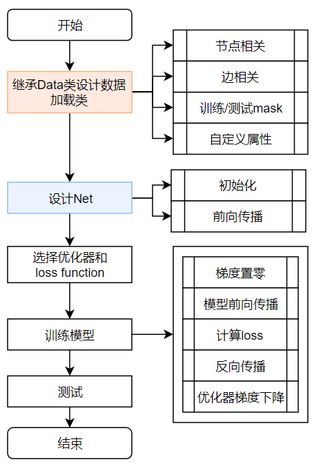
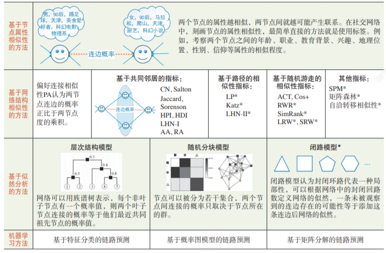
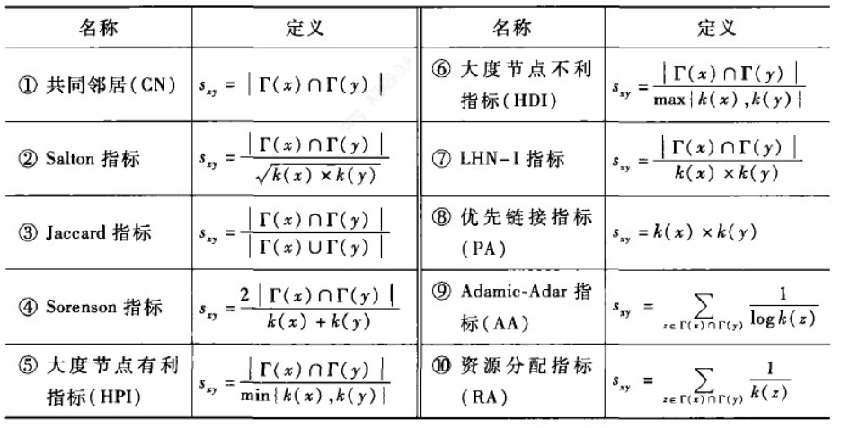

# 博客学习 链路预测和PyG

**链路预测的目标**
链路预测的目标大体上可以分为两类：
- 一类是预测真实存在但我们还不知道的边（missing links），多与生物网络相关
- 另一类是预测现在尚未存在但未来很可能出现的边（future links），多与社交网络和技术网络相关
- 合理推测第一类的边的影响已经蕴含在网络内，而第二类只能通过节点特征来预测

**PyG**
- 单张图被PyG表示为torch_geometric.data.Data类型
  - 有节点特征，边连接关系等属性
- 常用的数据集
- Mini-Batches
  - DataLoader与普通torch类似
- 模型编写和训练同普通torch

---

**最简单的GNN**

```python
import torch
from torch_geometric.datasets import Planetoid
import torch.nn.functional as F
from torch_geometric.nn import GCNConv

#定义网络结构
class Net(torch.nn.Module):
    def __init__(self):
        super(Net, self).__init__()
        self.conv1 = GCNConv(dataset.num_node_features, 16)
        self.conv2 = GCNConv(16, dataset.num_classes)

    def forward(self, data):
        x, edge_index = data.x, data.edge_index

        x = self.conv1(x, edge_index)
        x = F.relu(x)
        x = F.dropout(x, training=self.training)
        x = self.conv2(x, edge_index)

        return F.log_softmax(x, dim=1)

if __name__ == '__main__':
    #加载数据，以自带的Cora数据集为例
    dataset = Planetoid(root='G:/GNN/dataset/Cora', name='Cora')
    device = torch.device('cuda' if torch.cuda.is_available() else 'cpu')
    #将数据和模型放到GPU或CPU上
    model = Net().to(device)
    data = dataset[0].to(device)
    #优化器
    optimizer = torch.optim.Adam(model.parameters(), lr=0.01, weight_decay=5e-4)

    #训练
    model.train()
    for epoch in range(200):
        optimizer.zero_grad()
        out = model(data)
        loss = F.nll_loss(out[data.train_mask], data.y[data.train_mask]) #loss function
        loss.backward()
        optimizer.step()

    #测试
    model.eval()
    _, pred = model(data).max(dim=1)
    correct = float(pred[data.test_mask].eq(data.y[data.test_mask]).sum().item())
    acc = correct / data.test_mask.sum().item()
    print('Accuracy: {:.4f}'.format(acc))
```

---

**链路预测：将复杂网络与信息科学联系起来的重要桥梁之一**

**研究方法**
- 基于相似性的链路预测
  - 基于局部信息的相似性指标
    - 
  - 基于路径的相似性指标
    - 局部路径指标
    - Katz指标
    - LHN-II指标
  - 基于随机游走的节点相似性指标
    - 平均通勤时间 ACT
    - 余弦相似性指标 Cos+指标
    - 重启的随机游走 RWR
    - SimRank指标 SimR
    - 局部随机游走指标 LRW
    - 叠加的局部随机游走指标 SRW
- 基于似然分析的链路预测
  - 层次结构模型 HSM
  - 随机分块模型 SBM
  - 闭路模型 Loop model
- 基于机器学习的链路预测
  - 基于特征分类方法
  - 基于概率图模型
  - 基于矩阵分解

---

**基于图表示学习的方法**
- 基于图嵌入技术的方法
  - Node2vec(2018)
  - 先从网络中学习每个节点的特征表示
  - 在一对节点(u,v)上，可以根据节点的特征通过一个二元操作o(u,v)得到边的特征
  - 对边特征应用各种分类方法来进行关联预测
- 基于图深度学习技术的方法
  - 通过图卷积等图深度学习方法来进行节点的特征表示
  - 学到的节点对特征直接在模型中进行拼接、相加等融合操作操作

---

“**似然分析**”和“**基于相似性的分析**”是链路预测中的两类不同方法，它们在方法论、假设、适用场景和实现方式上有显著区别。以下是对它们的详细对比和解释：

---

### 1. **基本原理的不同**

- **似然分析**  
  - 基于**概率模型**，从全局角度对网络进行建模，描述网络生成的机制。  
  - 通过计算某条边（链接）在当前网络中出现的概率（即**似然值**），来预测未来可能的链接。  
  - 核心是最大化网络的整体生成似然，以发现潜在的链接关系。  
  - **示例**：随机分块模型（SBM）通过节点块划分和连接概率推断出潜在链接。

- **基于相似性的分析**  
  - 直接计算两个节点间的**相似性**，相似性越高，越可能形成链接。  
  - 依赖局部拓扑信息（例如邻居重叠程度、路径长度等），不对网络整体建模。  
  - **示例**：  
    - **Common Neighborhood (CN)**：共享邻居数量多的节点更可能连接。  
    - **Jaccard系数**：考虑邻居的相似性比例，而不是简单数量。  
    - **资源分配指标**：通过已有链接的权重传播潜在关系。

---

### 2. **假设的不同**

- **似然分析**：  
  假设网络的生成过程可以通过某种概率模型（如随机图模型、层次模型）来描述。这种方法适合复杂网络，能够捕捉网络的全局属性，如模块化、层次性或闭路结构。

- **基于相似性**：  
  假设节点的连接倾向于与其相似的节点。它更依赖局部信息，通常忽略了网络的全局特性。

---

### 3. **实现方式的不同**

- **似然分析**：
  - 需要构建并拟合复杂的概率模型（如随机分块模型SBM或层次结构模型HSM），涉及优化问题和参数估计。  
  - 算法复杂度较高，但能够提供理论支持，解释网络生成的潜在机制。

- **基于相似性**：
  - 算法实现较为简单，直接基于网络拓扑的局部特征计算相似性指标。  
  - 计算效率高，适用于大规模网络的快速预测，但通常缺乏深层机制的解释能力。

---

### 4. **适用场景的不同**

- **似然分析**：
  - 适合具有复杂结构或明显全局特性的网络，例如：  
    - 社交网络中的社群与层次分析  
    - 生物网络中的蛋白质交互分析  
    - 学术网络中的合作模式预测  
  - 更适合需要解释网络生成机制或发现隐藏模式的场景。

- **基于相似性**：
  - 适合局部结构占主导的网络，例如：  
    - 社交网络中的好友推荐（基于共同好友）  
    - 商品推荐系统中的协同过滤  
  - 更适合需要高效、简洁计算的场景。

---

### 5. **优缺点对比**

| 方法           | 优点                                                     | 缺点                                                             |
| -------------- | -------------------------------------------------------- | ---------------------------------------------------------------- |
| **似然分析**   | 1. 捕捉全局特性，适合复杂网络<br>2. 理论支撑强，解释力高 | 1. 实现复杂，计算成本较高<br>2. 依赖模型假设，可能不适应局部特性 |
| **基于相似性** | 1. 实现简单，高效<br>2. 易于理解，便于应用               | 1. 忽略全局特性<br>2. 在复杂网络中预测能力有限                   |

---

### 6. **总结**
- **似然分析**：通过构建概率模型，对网络的整体结构和潜在规律进行建模，适用于复杂、全局化特征显著的场景。  
- **基于相似性**：通过简单的相似性指标预测潜在链接，适用于局部特性主导、需要快速计算的场景。

两种方法各有适用领域，可以根据具体问题的需求进行选择或结合使用。


---

以下是对**基于机器学习的链路预测**中三种常见方法的解释：

---

### 1. **基于特征分类方法**  
#### 核心思想：  
- 将链路预测问题转化为一个**二分类问题**：  
  - **正样本**：图中已存在的边。  
  - **负样本**：图中不存在的边（通常从非边中随机采样生成）。  
- 为每一对节点提取特征（例如，共同邻居数、节点度、最短路径长度等），并用这些特征作为输入，训练一个机器学习模型（如逻辑回归、随机森林、支持向量机）来预测两节点是否会形成链接。

#### 优势：  
- 特征选择灵活，可结合领域知识设计自定义特征。  
- 模型简单易懂，适用于小规模网络。

#### 局限性：  
- 特征工程依赖人工经验，难以捕捉复杂的非线性特征。  
- 随着网络规模增长，特征计算和存储开销增大。

#### 举例：  
在一个社交网络中，通过提取两个用户的共同好友数、兴趣相似度等特征，训练一个分类器来预测两个用户是否会成为朋友。

---

### 2. **基于概率图模型**  
#### 核心思想：  
- 构建一个概率图模型，将节点和边表示为随机变量，通过建模它们的联合概率分布，推断未知边的存在概率。  
- 常见模型：  
  - **贝叶斯网络**：利用条件概率描述节点和边之间的依赖关系。  
  - **马尔科夫随机场（MRF）**：通过边缘之间的关系建模图的结构。  

#### 优势：  
- 能够捕捉图结构中的不确定性和复杂依赖关系。  
- 理论框架清晰，适合对小规模网络的精细分析。

#### 局限性：  
- 构建和推断模型的计算复杂度较高，不适合大规模网络。  
- 需要足够的先验知识来设计模型结构和参数。

#### 举例：  
在一个知识图谱中，构建概率模型表示实体（节点）和关系（边）之间的关联，推断新关系（边）的存在概率。

---

### 3. **基于矩阵分解**  
#### 核心思想：  
- 将图的**邻接矩阵**或其他表示矩阵（如节点相似性矩阵）分解为低秩矩阵，用于生成嵌入表示并预测未观察到的边。  
- 通常假设图的结构信息可以通过两个低维矩阵的乘积近似重构，从而预测潜在的边。

#### 具体方法：  
- **非负矩阵分解（NMF）**：通过将矩阵分解为两个非负矩阵，得到每个节点的嵌入表示，用于计算节点对之间的链接概率。  
- **奇异值分解（SVD）**：通过分解邻接矩阵提取主成分，预测潜在链接。  
- **图正则化矩阵分解**：在分解过程中加入正则项，确保嵌入保持原图的结构特性。

#### 优势：  
- 能够捕捉图的全局结构信息，适合处理稠密网络。  
- 嵌入表示可用于其他任务（如节点分类、聚类）。  

#### 局限性：  
- 对稀疏网络的效果有限（难以充分利用局部信息）。  
- 分解过程的复杂度较高，处理大规模网络时效率较低。

#### 举例：  
在推荐系统中，将用户-物品交互矩阵分解为用户嵌入和物品嵌入，用于预测用户可能感兴趣的物品（链接）。

---

### 总结对比  
| 方法类型         | 核心思想                             | 优势                         | 局限性                               |
| ---------------- | ------------------------------------ | ---------------------------- | ------------------------------------ |
| **特征分类方法** | 通过节点对的特征，训练分类器预测链接 | 简单直观，易解释             | 特征工程复杂，难以捕捉非线性特征     |
| **概率图模型**   | 用概率模型描述图的依赖关系           | 理论框架清晰，可捕捉不确定性 | 模型构建和推断复杂，不适合大规模网络 |
| **矩阵分解**     | 分解邻接矩阵，得到节点嵌入预测链接   | 全局结构利用充分，嵌入可复用 | 对稀疏图效果有限，计算复杂度较高     |