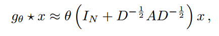
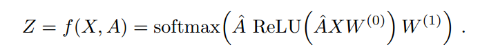
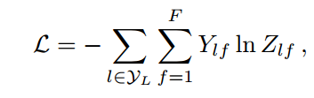

# GCN

> 作者：高铭辰
> 创建时间：2024/11/19
> 最后修改时间：2024/11/20

> 论文题目：SEMI-SUPERVISED CLASSIFICATION WITH GRAPH CONVOLUTIONAL NETWORKS
> 代码地址(TensorFlow)：<https://github.com/tkipf/gcn>
> Pytorch实现：<https://github.com/dragen1860/GCN-PyTorch>

---

## 论文

**解决的问题**：
图节点的半监督分类，给定一些节点的标签和图的结构，预测其他节点的标签

**图正则化的核心**
利用**平滑性假设**（Smoothness Assumption）：
假设：在图中，如果两个节点通过边相连，它们的特征（或者预测值）应该相似。

**本文贡献**
- 为直接在图上运行的神经网络模型引入了一个简单、良好的层向传播规则，并展示了如何从谱图卷积的一阶近似中激发该规则。
- 展示了这种形式的基于图的神经网络模型如何用于对图中节点进行快速、可扩展的半监督分类。

**梯度消失**
- 通过近似方式，
  
  的特征值限制在了0~2之间，重复使用这一算子会引起梯度消失等问题
- 引入重新正则化的技巧

**模型结构**
两层GCN表示为

其中

**损失函数**
计算有标签的节点预测结果的交叉熵

---

### **新方法的核心创新**
1. **图卷积的近似实现：**
   - 提出了基于谱图卷积（Spectral Graph Convolutions）的近似方法，用于直接对图上进行卷积操作。
   - 引入了一种局部化的一阶近似（First-order Approximation），避免了直接计算[图拉普拉斯矩阵](../../GraphLaplacianMatrix/GraphLaplacianMatrix.md)的特征分解，这种计算在大规模图上代价很高。

2. **层级传播规则：**
   - GCN的层级传播规则是：  
     \[
     H^{(l+1)} = \sigma\left(D^{-\frac{1}{2}} \tilde{A} D^{-\frac{1}{2}} H^{(l)} W^{(l)}\right)
     \]
     其中，\(\tilde{A} = A + I\) 是加入了自连接的邻接矩阵，\(D\) 是度矩阵，\(H^{(l)}\) 是第\(l\)层的节点表示，\(W^{(l)}\) 是可学习的权重矩阵，\(\sigma\) 是激活函数（如ReLU）。
   - 这种传播规则通过归一化邻接矩阵，解决了节点度数分布不均的问题。

3. **模型的线性复杂度：**
   - 计算复杂度与图的边数成线性关系（即 \(O(|E|)\)），因此模型可以高效扩展到大规模图数据。

4. **避免显式正则化：**
   - 传统方法通常通过在损失函数中加入图拉普拉斯正则化项（如图平滑）。该方法直接通过图的结构和节点特征训练模型，省略了显式的正则化。

---

### **具体实现细节**
1. **多层结构：**
   - 模型通过堆叠多个GCN层进行深度学习。
   - 每层处理的信息覆盖范围随着层数增加而扩展，从而捕获更大的邻域信息。

2. **半监督设置：**
   - 模型只使用一部分节点的标签进行训练，但通过图结构和节点特征的传播，能够有效地对未标注的节点进行分类。

3. **改进的特征传播：**
   - 引入了“重新归一化技巧”（Renormalization Trick），进一步提高了数值稳定性和模型表现。

---

### **方法的应用与实验**
1. 在多个数据集（如Cora、Citeseer和PubMed的引文网络数据集）上的实验表明，提出的GCN方法在准确性和效率上均超过了现有的半监督学习方法。
2. 使用两层GCN实现的模型通过传播节点特征和结构信息，有效提高了分类性能，同时显著减少了训练时间。

---

### **背景问题**
1. **图数据的特点：**
   - 图中的节点（如文档、用户）可能具有特征向量，但标签信息（如类别）只在一小部分节点中可用。
   - 图的结构（节点之间的边）包含丰富的关联信息，可反映节点之间的潜在关系（如引用关系、社交连接）。

2. **挑战：**
   - **标签稀缺性**：大多数节点没有标签，难以直接训练分类模型。
   - **图的复杂性**：节点和边的关系复杂，传统分类方法（如决策树或线性分类器）无法充分利用图的结构信息。
   - **计算成本高**：现有基于谱图理论的方法需要计算图拉普拉斯矩阵的特征分解，成本随图的规模呈指数增长。

---

### **具体解决的问题**
1. **如何高效地利用图的结构信息：**
   - 将图的结构信息直接嵌入到模型中，而不需要复杂的图正则化步骤。
   - 使用邻接矩阵（加权或二值化）和归一化矩阵表示节点之间的关系，将其作为图卷积操作的一部分。

2. **如何在稀缺标签的条件下进行学习：**
   - 提出了一种半监督学习方法，仅需少量有标签的节点，通过图结构的信息传播（message passing），实现对无标签节点的分类。

3. **如何扩展到大规模图：**
   - 提出的近似图卷积方法避免了谱图卷积的高计算复杂度，使计算复杂度降低到与图边数线性相关（\(O(|E|)\)）。
   - 通过“重新归一化技巧”（Renormalization Trick）解决深度图模型的数值不稳定问题，支持训练更深的模型。

4. **如何集成特征和结构信息：**
   - 方法既利用了节点的特征信息（如文档的词袋模型或用户属性），又结合了图的结构信息（如节点之间的连接），实现更高效的表示学习。

---

### **典型应用场景**
1. **引文网络**：
   - 给定论文的引文关系和部分论文的主题标签，预测其他论文的主题类别。
   - 数据集示例：Cora、Citeseer、PubMed。

2. **知识图谱**：
   - 使用实体和关系的信息进行节点分类或关系预测。
   - 数据集示例：NELL。

3. **社交网络**：
   - 在用户网络中利用用户的特征和连接关系进行兴趣预测或社群检测。