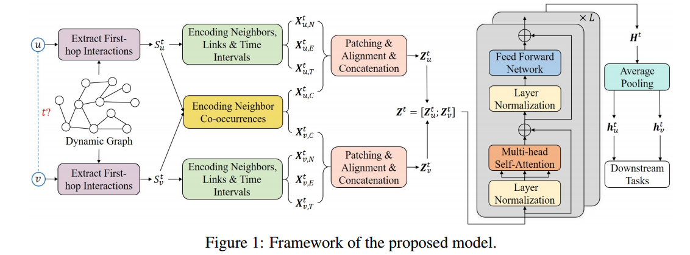

# Towards Better Dynamic Graph Learning: New Architecture and Unified Library

**DyGFormer从节点历史首跳交互序列中学习**

“历史首跳”（historical first-hop interactions）是指动态图中某节点与其直接邻居（即“一跳”距离内的节点）之间的交互记录。这些交互包括节点的源节点（source node）和目标节点（destination node）在过去某段时间内的连接关系以及时间戳。DyGFormer模型从这些交互记录中学习，而不需要考虑更远的多跳邻居关系。

通过仅学习这些首跳交互，DyGFormer将动态图学习问题简化为一个序列学习问题。这种方法相比于依赖多跳交互的方法（例如DyRep、TGAT等），计算量更小，同时避免了采样策略和复杂模块带来的计算开销问题。

这种设计的关键在于模型通过“邻居共现编码方案”（neighbor co-occurrence encoding scheme）探索源节点和目标节点之间的相关性，并通过“分片技术”（patching technique）进一步高效地捕获长期的时间依赖性。

---

## DyGFormer
### 要解决的问题
- 节点相关性捕捉不足：
    现有的方法大多独立计算节点的时间表示，未能有效利用节点之间的相关性，这对于预测未来交互至关重要。
- 长期时序依赖处理不佳：
    许多方法只能处理较短的交互历史，面对较长的交互历史时，需要采样策略，这可能导致信息的丢失。

### 模型结构

### 1. **基本概念**
- **输入数据**：DyGFormer接收动态图的交互数据，表示为时间序列的节点交互（如：源节点、目标节点、时间戳）。
- **历史交互**：模型仅关注节点的历史一跳交互数据，简化了学习过程。

### 2. **关键组成部分**
- **邻居共现编码方案**：
  - 通过统计邻居在交互序列中的出现频率，来捕捉源节点和目标节点之间的相关性。
  - 这种编码方式认为，节点之间更频繁的共现表明它们未来交互的可能性更高。

- **分patch技术**：
  - 将每个节点的交互序列分割为多个非重叠的patch，以保持局部时序接近性，并减小计算复杂度。
  - 这种方法允许模型有效利用更长的历史信息，同时保持计算成本恒定。

### 3. **模型架构**
- **输入编码**：
  - 对于每个节点，DyGFormer提取其历史一跳交互，生成多个编码序列，包括邻居编码、链接编码和时间间隔编码。
  - 将这些编码分割成patch，并输入到Transformer中。

- **Transformer编码器**：
  - 使用多层自注意力机制（Multi-head Self-Attention）和前馈网络（Feed-Forward Network）来捕捉时序依赖。
  - 通过堆叠多个注意力层，DyGFormer能够学习节点之间和时间序列内的复杂关系。

### 4. **输出生成**
- **时间感知节点表示**：
  - 最终，模型通过平均Transformer输出的相关表示，生成每个节点在特定时间戳的时间感知表示。
  - 这些表示可以用于后续的任务，如动态链接预测和动态节点分类。

### 5. **优点**
- **高效性**：DyGFormer通过简单的输入设计和创新的编码方法，能够处理长时间历史数据而不增加计算负担。
- **准确性**：通过捕捉节点间的相关性和长期依赖，模型在多个数据集上实现了最先进的性能。

### 总结
DyGFormer架构的设计旨在解决动态图学习中的主要挑战，通过邻居共现编码和分patch技术，有效提升了模型在捕捉节点相关性和长期时序依赖方面的能力。