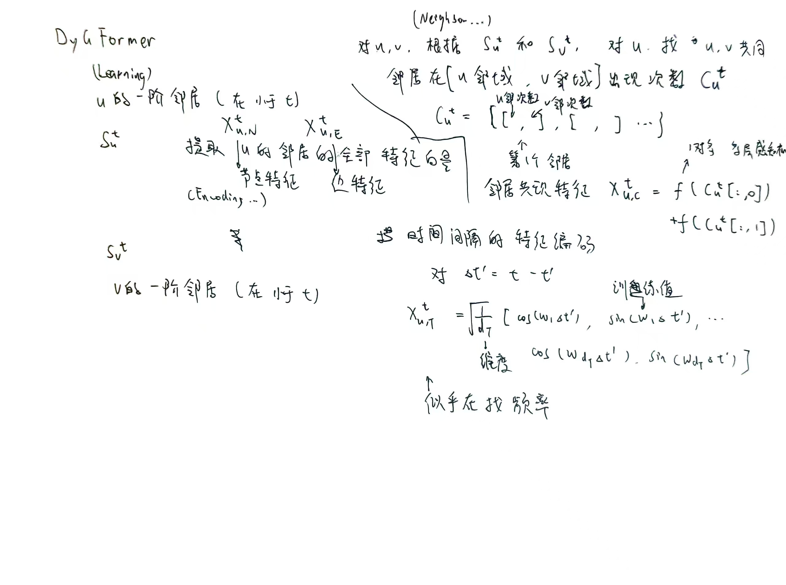

# Towards Better Dynamic Graph Learning: New Architecture and Unified Library

**setting**

1. **动态图定义与问题形式化**：
   - 动态图表示为一系列带有时间戳的交互（节点和链接），并用特征描述节点和交互。
   - 问题涉及在给定时间点上基于历史交互学习节点的时间感知表示。

2. **模型评价任务与指标**：
   - 动态链接预测：预测两个节点在某一时间点是否有链接（分为 transductive 和 inductive 两种情境）。
   - 动态节点分类：预测给定节点在某次交互中的状态。
   - 使用 AP 和 AUC-ROC 作为评价指标。

3. **数据集与实验**：
   - 使用13个来源多样的数据集（如 Wikipedia, Reddit, Flights 等）。
   - 基线模型包括多种图神经网络和时间序列建模方法。
   - 实验在统一框架（DyGLib）中进行，以确保不同方法之间的公平比较。

4. **实验设置**：
   - 对模型超参数进行网格搜索。
   - 序列长度范围从 32 到 4096，对应不同的 patch size。
   - 使用一致的优化器（Adam）和早停策略，运行五次实验取平均值。

总的来说，本文的 setting 描述了在动态图学习领域中使用特定的任务、数据、方法和工具进行研究和评估的环境。

---

在论文中，\((u', v', t')\) 表示的是动态图中过去发生的节点交互，而 \(u, v\) 则是当前研究的源节点和目标节点。因此，它们的关系可以总结如下：

### 1. **\(u'\) 和 \(v'\) 是 \(u\) 和 \(v\) 的邻居**  
在定义中，\((u', v', t')\) 是指时间点 \(t' < t\) 时的历史交互，这意味着 \(u'\) 和 \(v'\) 是某一历史时间 \(t'\) 下发生交互的节点对：
- \(u'\) 可以是与 \(u\) 发生过交互的邻居节点。
- \(v'\) 可以是与 \(v\) 发生过交互的邻居节点。

具体来看：
- 对于源节点 \(u\)，它的历史交互序列是：
  \[
  S^t_u = \{(u, u', t') \mid t' < t\} \cup \{(u', u, t') \mid t' < t\}
  \]
  其中 \(u'\) 表示在历史时间 \(t'\) 与 \(u\) 发生交互的节点。
  
- 对于目标节点 \(v\)，它的历史交互序列是：
  \[
  S^t_v = \{(v, v', t') \mid t' < t\} \cup \{(v', v, t') \mid t' < t\}
  \]
  类似地，\(v'\) 是历史时间 \(t'\) 与 \(v\) 发生交互的节点。

因此，\(u'\) 和 \(v'\) 通常是 \(u\) 和 \(v\) 的**一跳邻居**。

---

### 2. **\(u'\) 和 \(v'\) 与 \(u, v\) 不是固定对应关系**  
虽然 \(u'\) 和 \(v'\) 是 \(u\) 和 \(v\) 的邻居，但它们不是固定的，而是从历史交互数据中动态变化的。换句话说，不同时间点 \(t'\) 下，\(u'\) 和 \(v'\) 可以是不同的节点。

---

### 3. **是否可能包含 \(u, v\) 自身？**  
- 如果在历史交互中，\(u\) 或 \(v\) 与自己发生了交互（如自环），那么 \(u'\) 或 \(v'\) 可能等于 \(u\) 或 \(v\) 本身。
- 一般情况下，历史交互中 \(u'\) 和 \(v'\) 是不同于 \(u, v\) 的，但算法设计中并没有明确排除这种可能性。

---

### 4. **总结**  
\((u', v', t')\) 表示的是图中历史时间 \(t' < t\) 下的交互对，\(u'\) 和 \(v'\) 是动态图中与 \(u, v\) 相关的历史交互节点，具体关系是：
- \(u'\) 和 \(v'\) 是 \(u, v\) 的一跳邻居。
- 它们从历史交互中动态变化，不是固定的。
- 在特定情况下可能包含 \(u, v\) 本身（例如自环）。

通过历史交互序列 \(S^t_u\) 和 \(S^t_v\)，可以用这些邻居信息构建模型输入，进一步学习节点的时间感知表示。

