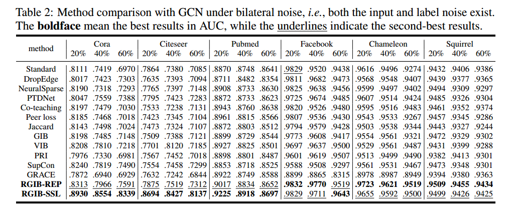
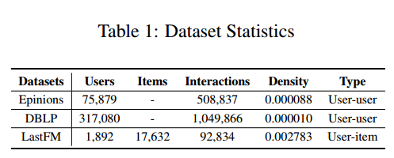
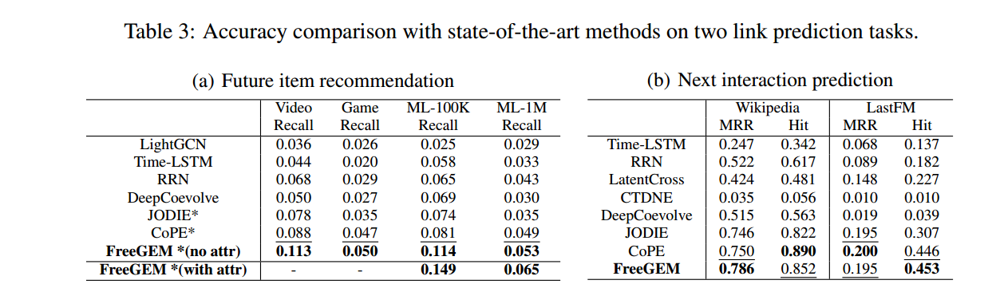
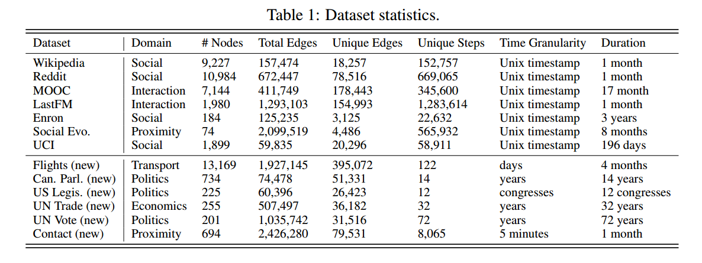
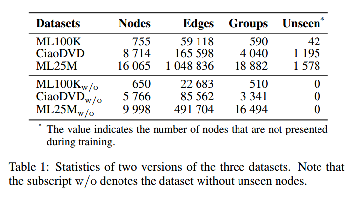

## NeurIPS 2023
1. [Evaluating Graph Neural Networks for Link Prediction: Current Pitfalls and New Benchmarking Juanhui Li, Harry Shomer, Haitao Mao, Shenglai Zeng, Yao Ma, Neil Shah, Jiliang Tang, Dawei Yin](EvaluatingGraphNeuralNetworksforLinkPrediction.md)
   - 解决GNN在链路预测任务中的评价不足，包括模型性能低于实际表现、缺乏统一的数据划分和评价指标，以及不切实际的评价设置，使用简单的负样本进行评估
   - 提出了一种新的评价设置，称为启发式相关采样技术（HeaRT），该方法通过为每个正样本定制负样本
2. [A Theory of Link Prediction via Relational Weisfeiler-Leman on Knowledge Graphs Xingyue Huang, Miguel Romero, Ismail Ceylan, Pablo Barceló](ATheoryofLinkPredictionviaRelationalWeisfeiler-LemanonKnowledgeGraphs.md)
   - 知识图谱
3. [Combating Bilateral Edge Noise for Robust Link Prediction Zhanke Zhou, Jiangchao Yao, Jiaxu Liu, Xiawei Guo, Quanming Yao, LI He, Liang Wang, Bo Zheng, Bo Han](CombatingBilateralEdgeNoiseforRobustLinkPrediction.md)
   - 解决GNNs在链接预测任务中对边噪声的鲁棒性问题
   - 提出了一种基于信息论的原则，即鲁棒图信息瓶颈（RGIB），及两种具体实现
   - 
4. [Cross-links Matter for Link Prediction: Rethinking the Debiased GNN from a Data Perspective Zihan Luo, Hong Huang, Jianxun Lian, Xiran Song, Xing Xie, Hai Jin](Cross-linksMatterforLinkPredictionRethinkingtheDebiasedGNNfromaDataPerspective.md)
   - 关注GNN在链接预测中的偏差问题，特别是内部链接（同一社区内的链接）与交叉链接（不同社区间的链接）之间的偏差
   - 提出了一种双结构框架，通过监督增强、双GNN模型和嵌入融合模块来缓解内部链接与交叉链接之间的偏差
   - 

> 查“Graph Neural Networks”能查到48个

## NeurIPS 2022
1. [OOD Link Prediction Generalization Capabilities of Message-Passing GNNs in Larger Test Graphs Yangze Zhou, Gitta Kutyniok, Bruno Ribeiro](OODLinkPredictionGeneralizationCapabilitiesofMessage-PassingGNNsinLargerTestGraphs.md)
   - 证明基于gMPNNs生成的结构节点嵌入在测试图变大时如何会趋近于随机猜测
   - 提出了一种新的gMPNN模型，输出结构性成对（2节点）嵌入
2. [Parameter-free Dynamic Graph Embedding for Link Prediction Jiahao Liu, Dongsheng Li, Hansu Gu, Tun Lu, Peng Zhang, Ning Gu](Parameter-freeDynamicGraphEmbeddingforLinkPrediction.md)
   - 动态图
   - 解决动态链接预测中的用户之间的协作关系和用户个性化交互模式的建模问题
   - 提出FreeGEM的无参数动态图嵌入方法
   - 
3. [Towards Better Evaluation for Dynamic Link Prediction Farimah Poursafaei, Shenyang Huang, Kellin Pelrine, Reihaneh Rabbany](TowardsBetterEvaluationforDynamicLinkPrediction.md)
   - 动态图
   - 解决动态链接预测中的评估问题
   - 新的基线方法EdgeBank
   - 

> 查“Graph Neural Networks”能查到26个

## IJCAI 2024

> 无“Link Prediction”
> 查“Graph Neural Networks”能查到13个，“GNN”6个

## IJCAI 2023
1. [Dynamic Group Link Prediction in Continuous-Time Interaction Network Shijie Luo, He Li, Jianbin Huang](DynamicGroupLinkPredictioninContinuous-TimeInteractionNetwork.md)
   - 动态图
   - 动态群组链接预测
   - 旨在更准确地预测个体与群组之间在未来某个时间点可能形成的链接
   - 
2. [A Canonicalization-Enhanced Known Fact-Aware Framework For Open Knowledge Graph Link Prediction Yilin Wang, Minghao Hu, Zhen Huang, Dongsheng Li, Wei Luo, Dong Yang, Xicheng Lu](ACanonicalization-EnhancedKnownFact-AwareFrameworkForOpenKnowledgeGraphLinkPrediction.md)
   - 知识图谱
3. [Musical Voice Separation as Link Prediction: Modeling a Musical Perception Task as a Multi-Trajectory Tracking Problem Emmanouil Karystinaios, Francesco Foscarin, Gerhard Widmer](MusicalVoiceSeparationasLinkPredictionModelingaMusicalPerceptionTaskasaMulti-TrajectoryTrackingProblem.md)
   - 在处理音乐上的应用

> 查“Graph Neural Networks”能查到7个，“GNN”2个

## KDD 2024
1. [Co-Neighbor Encoding Schema: A Light-cost Structure Encoding Method for Dynamic Link Prediction](Co-NeighborEncodingSchemaALight-costStructureEncodingMethodforDynamicLinkPrediction.md) Ke Cheng (CCSE Lab, Beihang University); Peng Linzhi (CCSE Lab, Beihang University); Junchen Ye (School of Transportation Science and Engineering, Beihang University); Leilei Sun (CCSE Lab, Beihang University); Bowen Du (Zhongguancun Lab, School of Transportation Science and Engineering, Beihang University)
   - 动态图
   - 解决动态图链接预测中的结构编码效率低和信息损失的问题
   - 提出了“共邻编码方案”，使用哈希表存储邻接矩阵的信息，引入了基于时间的多样化内存，利用GPU并行计算提高效率
2. [Optimizing Long-tailed Link Prediction in Graph Neural Networks through Structure Representation Enhancement](OptimizingLong-tailedLinkPredictioninGraphNeuralNetworksthroughStructureRepresentationEnhancement.md) Yakun Wang (Ant Group); Daixin Wang (Ant Group); Hongrui Liu (Ant Group); Binbin Hu (Ant Group); Yingcui Yan (Ant Group); Qiyang Zhang (Ant Group); Zhiqiang Zhang (Ant Group)
   - 尾节点对的共同邻居较少，导致其性能较差
   - 提出了一种长尾链接预测框架（LTLP），该框架通过两个关键模块增强尾节点对的表现
3. Heuristic Learning with Graph Neural Networks: A Unified Framework for Link Prediction Juzheng Zhang (Department of Electronic Engineering, Tsinghua University); Lanning Wei (Department of Electronic Engineering, Tsinghua University); Zhen Xu (Department of Electronic Engineering, Tsinghua University); Quanming Yao (Department of Electronic Engineering, Tsinghua University)
4. [Conformalized Link Prediction on Graph Neural Networks](ConformalizedLinkPredictiononGraphNeuralNetworks.md) Tianyi Zhao (University of Southern California); Jian Kang (University of Rochester); Lu Cheng (University of Illinois Chicago)
   - 计算可靠的不确定性估计
5. [Causal Subgraph Learning for Generalizable Inductive Relation Prediction](CausalSubgraphLearningforGeneralizableInductiveRelationPrediction.md) Mei Li (Global Institute of Future Technology, Shanghai Jiao Tong University, College of Computer Science, Nankai University); Xiaoguang Liu (College of Computer Science, TMCC, SysNet, DISSec, GTIISC, Nankai University); Hua Ji (Department of Computer Science, Civil Aviation University of China); Shuangjia Zheng (Global Institute of Future Technology, Shanghai Jiao Tong University)
   - 知识图谱
6. [Effective Edge-wise Representation Learning in Edge-Attributed Bipartite Graphs](EffectiveEdge-wiseRepresentationLearninginEdge-AttributedBipartiteGraphs.md) Hewen Wang (National University of Singapore); Renchi Yang (Hong Kong Baptist University); Xiaokui Xiao (National University of Singapore)
   - 解决边属性二部图（EABG）中的边表示学习（ERL）问题

## KDD 2023
1. DotHash: Estimating Set Similarity Metrics for Link Prediction and Document Deduplication Igor Nunes (University of California, Irvine), Mike Heddes (University of California, Irvine), Pere Vergés (University of California, Irvine), Danny Abraham (University of California, Irvine), Alex Veidenbaum (University of California, Irvine), Alex Nicolau (University of California, Irvine), Tony Givargis (University of California, Irvine)