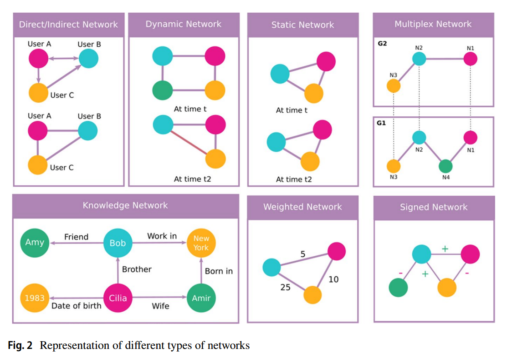
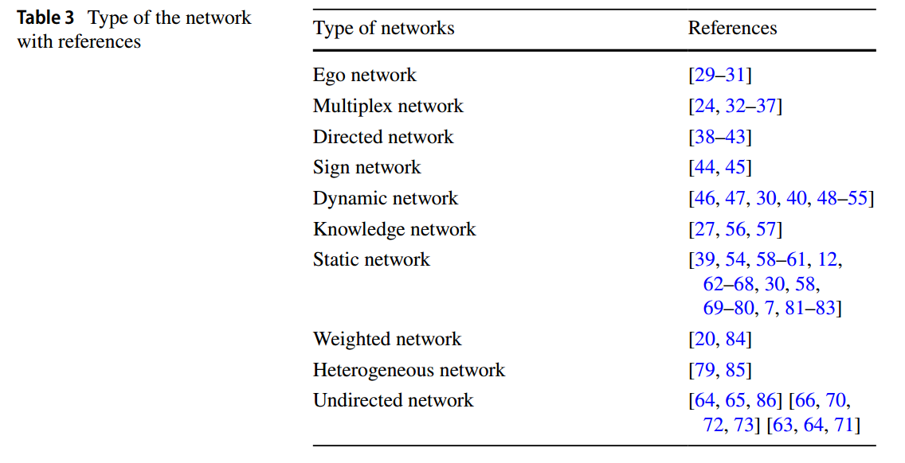

# 最新链接预测综述

> A comprehensive survey of link prediction methods
> 发表时间 2023-8-17

## 分类
- Similarity-based methods
  - Community detection-based approaches
  - Random walk-based approaches
- Dimensionality reduction-based methods
  - Embedding-based methods
  - Matrix factorization-based methods
- Machine learning technique-based methods
  - Supervised learning approaches
  - Unsupervised learning approaches
  - Deep learning techniques
  - Graph neural network-based methods
  - Reinforcement learning
- Other methods

## 文章结构
- 在第 2 节中，我们介绍了链接预测问题、数据集、网络类型以及链接预测算法的评估指标。
- 在第 3 节中，我们将深入探讨链接预测过程并研究各种方法，探讨它们的优势和局限性。 
- 在第 5 节中，我们将讨论链接预测的趋势和差距。
- 在第 6 节中，给出结论。

## 2 Link Prediction

### 2.1 定义  
链接预测旨在基于现有网络的结构和节点属性，估算未来可能出现的连接（链接）的概率。  
- 形式化地：在图 \( G(V, E) \) 中，节点集合 \( V \) 和边集合 \( E \) 描述了网络中的关系。链接预测尝试预测那些尚未存在于 \( E \) 中的边。
- 示例：通过分析共同邻居关系预测节点间潜在链接。

---

### 2.2 网络类型  
用于链接预测的网络种类多样，具体方法依赖于网络类型及关系的性质，常见网络包括：
1. **静态网络**：网络拓扑保持不变，例如节点和边固定的社交网络。  
2. **动态网络**：随着时间演化的网络，例如社交网络中的用户互动，涉及时间依赖的链接预测方法。
3. **有向和无向网络**：例如，Twitter是一个有向网络（用户可以单向关注），而Facebook是无向网络。
4. **加权网络**：边权重代表关系强度，例如航空网络中航班数量。
5. **多层网络（Multiplex）**：包含多个层次，每层表示一种不同的关系，例如社交网络中的好友关系与商务合作。
6. **知识网络**：由实体和关系构成，例如知识图谱，用于推断节点间新的关系。
7. **符号网络（Signed Network）**：边可以表示正负关系，如表示友好或敌对关系的社交网络。
8. **自我中心网络（Ego Network）**：集中在某个核心节点及其直接邻居的网络。
9. **异构网络**：节点和边类型多样化的网络，例如学术引用网络，涉及多种实体（如作者、论文）和关系。

**使用了不同网络的文章列表**

---

### 2.3 流行数据集  
文中列举了链接预测研究中的常用数据集，这些数据集覆盖社交网络、生物网络及引文网络等领域。  
- **示例数据集**：
  - Zachary's Karate Club：一个社交网络，描述了34名空手道俱乐部成员的关系。
  - Dolphin Social Network：描述新西兰某地62只海豚之间的互动。
  - Facebook NIPS：一个社交网络数据集，展示用户之间的友谊。
  - Yeast：包含酵母中蛋白质-蛋白质交互的信息。
  - Email-Eu-core：描述欧洲某研究机构成员之间的电子邮件互动。

---

### 2.4 评价指标  
文中列出了链接预测方法的常用评价指标，这些指标因方法及数据集的不同而异，某些评估指标可能更适合某些方法或数据集：
1. **AUC（ROC曲线下的面积）**：衡量模型区分正负链接的能力。
2. **准确率**：正确预测的链接占总预测的比例。
3. **精确率（Precision）**：预测为正链接中真正为正的比例。
4. **召回率（Recall）**：所有实际正链接中正确预测的比例。
5. **F1分数**：精确率与召回率的加权调和平均值，用于平衡两者之间的权衡。

## 3 Methods for Link Prediction

### **3.1 基于相似性的预测方法**  
相似性方法是最早应用于链接预测的技术，通过评估节点之间的相似性来预测潜在链接。这些方法通常基于以下三类索引：
1. **局部索引**：仅使用邻域内的信息。
   - 典型方法：共通邻居（Common Neighbours）、Jaccard系数、Adamic-Adar指数等。
2. **全局索引**：利用整个网络的拓扑信息。
   - 典型方法：Katz指数、随机游走（Random Walk）、SimRank等。
3. **混合索引**：结合局部与全局信息。
   - 典型方法：局部路径指数（Local Path Index）、局部随机游走等。

文章指出，这些方法具有计算成本低、实现简单的优点，但在处理复杂网络时可能表现有限。

---

### **3.2 机器学习方法**  
机器学习方法已经成为链接预测的主流，分为以下几类：
#### **3.2.1 有监督学习**  
- **特点**：将链接预测问题转化为分类问题，输入节点对的特征并预测链接的存在与否。
- **常用技术**：支持向量机（SVM）、随机森林、逻辑回归等。
- **应用**：例如在多层网络中，通过构建节点特征向量并结合分类模型，取得了显著提升。

#### **3.2.2 无监督学习**  
- **特点**：无需标签数据，通过图嵌入等技术生成节点特征并进行聚类或降维。
- **常用方法**：K均值、图自编码器（Graph Autoencoder）、DeepWalk等。

#### **3.2.3 深度学习**  
- **特点**：通过神经网络自动学习网络的结构和特征，适应复杂、非线性的问题。
- **关键技术**：
  - 图神经网络（GNN）：如SEAL、CPAGCN、TGGDN等，结合节点特征和图结构信息，性能出色。
  - 编码器-解码器框架：结合时间序列信息，处理动态网络。
  - 模型实例：Weisfeiler-Lehman Neural Machine (WLNM)，通过局部子图预测链接。

#### **3.2.4 强化学习**  
- **特点**：通过模拟代理与网络的交互，学习最优的链接预测策略。
- **优势**：能动态适应网络变化，逐步优化性能。

---

### **3.3 基于降维的方法**  
这类方法通过将高维网络数据映射到低维空间，提取节点特征来预测链接。  
- **嵌入方法**：节点嵌入（Node Embedding）和图嵌入（Graph Embedding）技术，例如DeepWalk、Node2Vec。
- **矩阵分解**：利用网络的邻接矩阵进行分解，如SVD、非负矩阵分解。

---

### **3.4 其他方法**  
文章还提到了一些独特的链接预测方法，包括：  
1. **基于随机游走**：通过计算节点间的路径概率预测链接。
2. **基于社区检测**：通过识别网络中的社区结构，推测社区内节点之间的潜在链接。

---

### **优劣分析**  
文章总结了不同方法的优缺点：  
- 相似性方法效率高但适应性差。
- 机器学习方法具有强大的学习能力，但依赖于特征工程和高质量的标签数据。
- 深度学习模型在处理复杂网络时表现出色，但需要大量计算资源。
- 降维方法简化了数据复杂性，但可能丢失关键信息。

---

### **总结**  
这一部分全面分类并详细分析了链接预测的方法，特别是近年来在深度学习和图神经网络领域的最新进展，为研究人员选择适合的技术提供了详尽的参考框架，同时也指出了当前方法的局限性和未来改进方向。